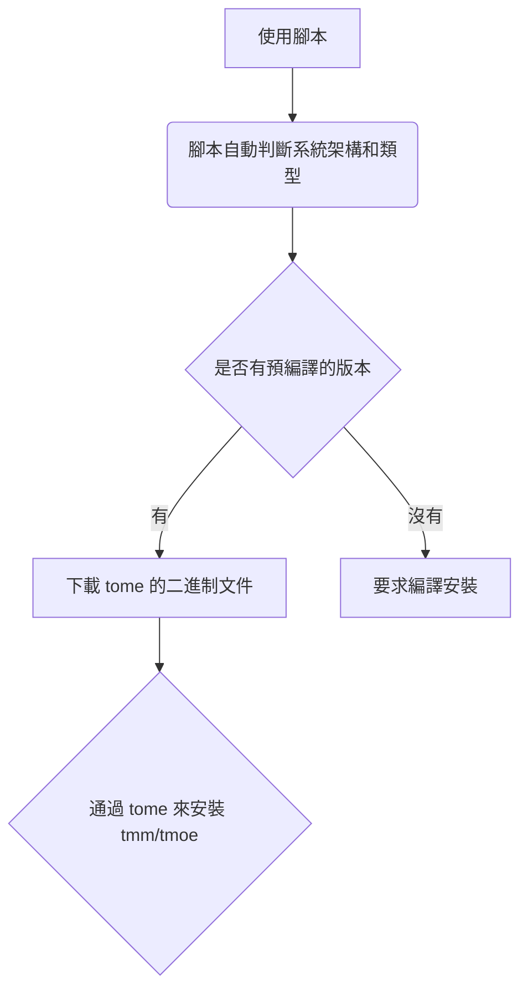

# 序章後篇

## 1. 目錄

[首頁](../../../Readme.md)

<!-- ✓ -->

### 1.1. 主要

| 章節                  | 簡介                                               | 文件      |
| --------------------- | -------------------------------------------------- | --------- |
| [序章前篇](./lite.md) | \*                                                 | lite.md   |
| 序章後篇：歷史與發展  | 瞭解不同版本之間的區別，並對序章前篇的內容進行拓展 | readme.md |
| [第一章](./1.md)      | \*                                                 | 1.md      |
| [第二章](./2.md)      | \*                                                 | 2.md      |
| [第三章](./3.md)      | \*                                                 | 3.md      |

### 1.2. 本章

中文 | [English](../en/readme.md)

- [1. 目錄](#1-目錄)
  - [1.1. 主要](#11-主要)
  - [1.2. 本章](#12-本章)
- [2. 版本説明](#2-版本説明)
  - [2.1. 2019](#21-2019)
  - [2.2. 2020](#22-2020)
  - [2.3. 2021](#23-2021)
    - [2.3.1. 2021 版使用指南](#231-2021-版使用指南)
  - [2.4. 2022（未發佈）](#24-2022未發佈)
    - [2.4.1. 兩個小功能](#241-兩個小功能)
      - [2.4.1.1. 設置同步](#2411-設置同步)
      - [2.4.1.2. 更佳的本地化體驗](#2412-更佳的本地化體驗)
  - [2.5. 細節對比](#25-細節對比)
    - [2.5.1. 注 1](#251-注-1)
    - [2.5.2. 注 2](#252-注-2)
    - [2.5.3. 注 3](#253-注-3)
  - [2.6. 未來的發展](#26-未來的發展)
- [3. 安裝説明](#3-安裝説明)
  - [3.1. 如何安裝](#31-如何安裝)
  - [3.2. 依賴問題](#32-依賴問題)
    - [3.2.1. 舊版依賴](#321-舊版依賴)
    - [3.2.2. 安裝依賴](#322-安裝依賴)
  - [3.3. 環境變量](#33-環境變量)
  - [3.4. 編譯安裝](#34-編譯安裝)
- [4. 翻頁](#4-翻頁)

## 2. 版本説明

準確來説，我們接下來要討論的是版次（edition），而不是版本（version）。  
考慮到天萌幾乎每年都會有一個幅度比較大的更新，因此將其混為一談，倒也沒什麼不妥。

### 2.1. 2019

沒什麼人用的版本 QaQ

| 版本 | 生命週期        |
| ---- | --------------- |
| 2019 | 2020-03-22 之前 |

在這個版本中，我帶來了兩個小夥伴："debian" 和 "debian-i"  
~~一開口就是兩個“老古董”了。~~ 此處指的是"debian"命令，而非"debian"發行版。  
在該版本中，天萌只支持 debian 系列的發行版。

| 作用                  | 命令     |
| --------------------- | -------- |
| 啓動默認的容器        | debian   |
| 啓動天萌工具箱/管理器 | debian-i |

在 2022 版本中，它們成為了可選（非必須）的命令。

### 2.2. 2020

| 版本 | 生命週期                     |
| ---- | ---------------------------- |
| 2020 | 2020-03 下旬 ～ 2020-10 上旬 |

開發者在此期間，為本項目加入了大量的新功能，幾乎每週都有一些新功能。  
~~開發者已經成為了無情的加功能機器了。~~  
注：後來有蠻多功能都被砍掉了。

### 2.3. 2021

| 版本 | 生命週期                     |
| ---- | ---------------------------- |
| 2021 | 2020-10 中旬 ～ ~~2022-01~~? |

如果説 2020 版加強的是 gnu/linux 環境的生態的話，那麼 2021 版加強的就是容器本身的生態了。

在 2021 年 1 月份的時候，開發者上線了一個里程碑式的新功能： **Weekly builds**。  
您可以直接下載包含 GUI 的鏡像，並且每週都能下載到最新版。  
理論上對所有支持的發行版都能做到自動構建，但是呢！  
這得要付出大量的時間、精力和資金去維護。  
開發者當初僅測試了三百次左右的自動構建任務，就花掉了半個月的時間。

> 您可能不知道的冷知識：  
> 在自動構建過程中，最經常出錯的發行版是 **fedora-rawhide**

#### 2.3.1. 2021 版使用指南

[2021-guide](../../../share/old-version/share/container/README.md)  
注：2021 版的用法與 2022 版不太相同。

### 2.4. 2022（未發佈）

本次更新可以説是天萌自開發以來變化最大的一次，也是難度最大的一次。  
開發者將使用神奇且強大的 rust 來重寫一些功能，有些功能可能需要理解深層次的實現原理才能搞定。  
本次更新將完全不兼容舊版本，對於舊版本，您需要使用天萌內置的版本遷移工具進行操作。

#### 2.4.1. 兩個小功能

偷偷透露 2022 版可能會實現的功能。

##### 2.4.1.1. 設置同步

在不同平台間同步配置。

|               |
| ------------- |
| save 保存     |
| load 讀取     |
| settings 設置 |

載入存檔 1，保存到存檔 4, 相當於將 存檔 1 複製到 存檔 4。

| savedata           | time             |
| ------------------ | ---------------- |
| 1: linux(current)  | 2021-10-21 12:25 |
| 2: wsl             | empty            |
| 3: mac             | empty            |
| 4: bsd             | empty            |
| 5: nix             | empty            |
| 6: guix            | empty            |
| 7: redox           | empty            |
| 8: 路由器(openwrt) | empty            |
| 9: 路由器(entware) | empty            |
| 10: 手錶(android)  | empty            |
| 99..               | \*               |

注: 2022 版的 tmoe & tmm 不支持 MacOS, 但是 tome & zsh-i 可能會適配 MacOS。  
同時，2022 版還有可能會適配 nixos 等非標準的 linux 發行版。

##### 2.4.1.2. 更佳的本地化體驗

比如説 ：

**zh-HK**: *菠*蘿  
**zh-SG**: *黃*梨  
**zh-TW**: *鳳*梨

2022 版將優化 **zh-TW** 和 **zh-HK**，但可能不會優化 **zh-SG**

抱歉了，新加坡的朋友們。

注：在 2021 版中，繁體在大部分情況下都會自動回調為簡體。  
真的非常抱歉，2022 版就不會這樣子啦！

### 2.5. 細節對比

由於新版尚未發佈，因此開發者將結合舊版存在的兩個特性，並與新版進行對比，帶您一睹為快。

| 介紹           | 2019~2020 版 | 2021 版                 | 2022 版                         |
| -------------- | ------------ | ----------------------- | ------------------------------- |
| 配置文件的地位 | 低           | 中等[(注 1)](#251-注-1) | 佔據主導地位[(注 2)](#252-注-2) |
| 錯誤處理機制   | 隨便糊的     | 只比隨便糊好一點點      | 精心設計，詳見[第 2 章](./2.md) |

對注 1 和注 2 的內容進行分析，詳見[(注 3)](#253-注-3)

#### 2.5.1. 注 1

在 2021 版中，基本上絕大多數重要的功能都可以通過配置文件進行修改。  
比如説 `startvnc` 和 容器的基礎配置。  
此前的版本雖然也行，但是並沒有像該版本一樣突出了重點。  
開發者在細節方面做了很多工作，目的是讓配置文件變得更直觀、更全面。  
而此前的版本更強調在 TUI 裏進行修改，您基本上不需要了解配置原理。

#### 2.5.2. 注 2

2022 版將擴展配置文件的覆蓋範圍。  
從存儲基本程序配置，到數據索引，再到一些特殊的數據內容。

> 開發者感覺自己拿配置文件做了數據庫應該做的事情。

新版的很多功能都將取消掉動態獲取的方式，而是轉為以配置文件為主導的靜態獲取方式。

在此前的版本中，為了保證獲取到的鏈接始終都為最新的，開發者使用了動態獲取的方式。  
簡單來説，就是先爬取網站數據，再對數據進行分析，最後提取出數據。  
動態獲取存在很多弊端，比如説分析可能會出錯，鏈接可能會失效，維護起來可能會不開心 (ಥ﹏ಥ)。  
~~錘桌！！！（好孩子不要學）~~  
從表面上來看，使用配置文件來靜態獲取的方式與動態獲取沒什麼不同，都需要先存儲數據，再分析數據，最後提取數據。  
但是呢？重點在分析上。  
第三方網站的數據可能經常發生改動，開發者自己寫的數據結構也可能經常改動。  
區別在於：第三方網站的數據發生改動是難以預測的，而自己寫的數據結構在自己的掌控範圍內。  
在這種情況下，數據分析工作的內容就截然不同了。

#### 2.5.3. 注 3

其實在 2021 版中就引入了[(注 2)](#252-注-2)中的靜態獲取的相關概念，只不過 2022 版覆蓋的範圍更廣，範圍從**Weekly builds** 擴展到基礎容器。

在 2021 版本的 **Weekly builds** 中，您每次獲取資源前，都會自動更新相應版本的索引信息。  
一方面是為了檢測源服務器是否正常連接，另一方面是為了保證獲取到信息是最新的。  
2022 版將不再是這種完全自動化更新的策略了，您可以自定義更新週期，也可以不更新。

但是長時間不更新的話，可是會出問題的。

在天萌管理器中，容器按更新頻率可以分為六類，分別是每日、每週、每半月、每月、每年和不定時。

> “每年？應該不是我吧？”  
> 一個叫做 “riscv64” 的小可愛在空無一人的小角落裏探頭探腦地自問道。

在您完成上面的閲讀之後，不妨去思考一下，在天萌的 2022 版中，超過一週時間沒有更新索引數據會發生什麼事。

### 2.6. 未來的發展

經常有人拿某知名項目和天萌做對比。

實際上，天萌的設計思路並不會比它差啊！  
舉個例子：  
在 2020 年 8~9 月份，天萌開發者對於某問題設計並完成了新的解決方案，而那個知名項目到 2021 年才實現了與天萌類似的做法。

天萌現階段不需要比別人做得更好，只需要做好自己就可以了。  
開發者現在已經在規劃新版本了哦！相信未來一定會變得更好的。

> 您可能不知道的冷知識：  
> 在 2021 年 2 月至 9 月份，天萌在德國地區的所歡迎程度，遠超過美國和中國。

## 3. 安裝説明

### 3.1. 如何安裝

詳見 [序章前篇](./lite.md)

### 3.2. 依賴問題

#### 3.2.1. 舊版依賴

對於 2021 及其之前的版本（以下簡稱：舊版），看一下 **~/.local/share/tmoe-linux/MANAGER_DEPENDENCIES.txt** 或者是 **/usr/local/etc/tmoe-linux/TOOL_DEPENDENCIES.txt**。  
txt 文件裏面包含了安裝過程中需要的一些依賴信息。  
有些功能在沒有相關依賴的情況下是不能運行的。  
舉個例子：  
比如説您要運行 zsh，所以您裝了 zsh。  
您想要某個插件正常運行，所以您裝了個某個插件的相關依賴。  
在沒有外部依賴的情況下，有兩種解決方法，一是自己手動實現，二是不啓用相關功能。  
舊版的依賴確實很多，關於這點我要向所有天萌的用户道歉。

新版就不會這樣子了。  
比如説：`git` 依賴  
~~開發者可以調用 `git2-rs` 來手動實現一個簡化版的 `git`的客户端，這樣子就不需要安裝原系統的 git 了。~~  
當然更簡單的做法是直接靜態編譯原版的`git`。

後期注：為了不引入 `openssl-dev` 作為編譯時依賴，故 2022 版可能不會包含用 rust 實現的 git 客户端。

#### 3.2.2. 安裝依賴

2021 及其之前的版本需要 curl

您如果在安裝過程中，遇到了系統沒有 curl 的問題，那就看舊版的 readme 吧！

### 3.3. 環境變量

請注意：2022 版的 tmm/tmoe 的可執行文件的本體不是腳本，而是編譯好的二進制文件。

對於不同架構 & 不同平台來説，所需的二進制文件是不一樣的。  
因此 2022 版將保留腳本安裝的方式。

當您使用腳本來安裝時，大致的流程為：



注：使用支持 **mermaid** 的 markdown 編輯器 可以渲染出流程圖。

<details>  
  <summary>如果渲染不出來的話，那就點擊 ▶️ 預覽。</summary>


</details>

在執行腳本前，您可以設置三個臨時環境變量，也可以跳過。

```shell
# 臨時的緩存目錄。 若未設置，則默認值為 $TMPDIR/tmp/tmm
# 第一次安裝 tmm 時，tome 的二進制文件會緩存到臨時目錄。
TMM_TMP=~/.cache/tmm

# 當該變量的值為有效字符串（語言-區域）時，會跳過語言選擇界面。
# 當您從 github 的 beta 分支安裝時，默認為 en-US
# 當您從 gitee 的 2 分支安裝時，默認為 zh-CN
TMM_LANG=zh-CN

# 可選值為"jscdn", "cfcdn", "gitee", "us", "lu", "sg", "github", "kr", "jp"
# 下載緩存文件時，首選的鏡像站/節點。
# 當 TMM_MIRROR 和 TMM_LANG 的值都為空時，默認為 github
# 當 TMM_LANG 的值為 zh-CN 時, 默認為 gitee
# us 為美國節點，sg為 新加坡節點，kr為韓國節點, lu 為盧森堡節點
TMM_MIRROR=gitee

export TMM_TMP TMM_MIRROR TMM_LANG
```

還有一個永久的變量 **TMOE_HOME**

用於設置 tmoe 系列軟件的數據文件所在的目錄

該變量需要寫入當前用户的默認 shell 的配置文件

| default shell | file       |
| ------------- | ---------- |
| zsh           | ~/.zshenv  |
| bash          | ~/.profile |

2022 版 tmoe 默認是為當前用户安裝,而不是為所有用户安裝.

因此請不要將其寫入到 /etc/profile 或 /etc/zsh/zshenv (全局配置)

對於 Linux 用户, 該變量保持默認即可.

```shell
TMOE_HOME="${HOME}/.local/share/tmoe"
```

對於 Mac OS 用户,您可以將該值修改為 **"${HOME}/Library/Application Support/tmoe"**

### 3.4. 編譯安裝

僅限 2022 及以上的版本  
由於開發者還在咕咕咕，所以您得要等好久咯！

## 4. 翻頁

| 章節                | 簡介                                      | 文件    |
| ------------------- | ----------------------------------------- | ------- |
| [上一章](./lite.md) | 一些簡短的説明，方便您快速上手            | lite.md |
| [下一章](./1.md)    | 結合本章第 2 節，進一步揭開 2022 版的面紗 | 1.md    |
