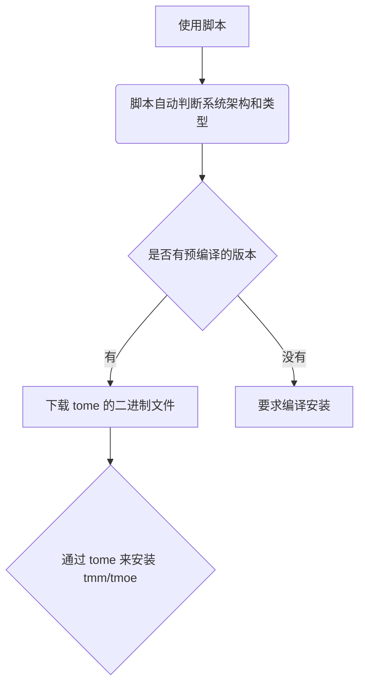

# 序章后篇

## 1. 目录

[首页](../../../Readme.md)

<!-- ✓ -->

### 1.1. 主要

| 章节                  | 简介                                               | 文件      |
| --------------------- | -------------------------------------------------- | --------- |
| [序章前篇](./lite.md) | \*                                                 | lite.md   |
| 序章后篇：历史与发展  | 了解不同版本之间的区别，并对序章前篇的内容进行拓展 | readme.md |
| [第一章](./1.md)      | \*                                                 | 1.md      |
| [第二章](./2.md)      | \*                                                 | 2.md      |
| [第三章](./3.md)      | \*                                                 | 3.md      |

### 1.2. 本章

中文 | [English](../en/readme.md)

- [1. 目录](#1-目录)
  - [1.1. 主要](#11-主要)
  - [1.2. 本章](#12-本章)
- [2. 版本说明](#2-版本说明)
  - [2.1. 2019](#21-2019)
  - [2.2. 2020](#22-2020)
  - [2.3. 2021](#23-2021)
    - [2.3.1. 2021 版使用指南](#231-2021-版使用指南)
  - [2.4. 2022（未发布）](#24-2022未发布)
    - [2.4.1. 两个小功能](#241-两个小功能)
      - [2.4.1.1. 设置同步](#2411-设置同步)
      - [2.4.1.2. 更佳的本地化体验](#2412-更佳的本地化体验)
  - [2.5. 细节对比](#25-细节对比)
    - [2.5.1. 注 1](#251-注-1)
    - [2.5.2. 注 2](#252-注-2)
    - [2.5.3. 注 3](#253-注-3)
  - [2.6. 未来的发展](#26-未来的发展)
- [3. 安装说明](#3-安装说明)
  - [3.1. 如何安装](#31-如何安装)
  - [3.2. 依赖问题](#32-依赖问题)
    - [3.2.1. 旧版依赖](#321-旧版依赖)
    - [3.2.2. 安装依赖](#322-安装依赖)
  - [3.3. 环境变量](#33-环境变量)
  - [3.4. 编译安装](#34-编译安装)
- [4. 翻页](#4-翻页)

## 2. 版本说明

准确来说，我们接下来要讨论的是版次（edition），而不是版本（version）。  
考虑到天萌几乎每年都会有一个幅度比较大的更新，因此将其混为一谈，倒也没什么不妥。

### 2.1. 2019

没什么人用的版本 QaQ

| 版本 | 生命周期        |
| ---- | --------------- |
| 2019 | 2020-03-22 之前 |

在这个版本中，我带来了两个小伙伴："debian" 和 "debian-i"  
~~一开口就是两个“老古董”了。~~ 此处指的是"debian"命令，而非"debian"发行版。  
在该版本中，天萌只支持 debian 系列的发行版。

| 作用                  | 命令     |
| --------------------- | -------- |
| 启动默认的容器        | debian   |
| 启动天萌工具箱/管理器 | debian-i |

在 2022 版本中，它们成为了可选（非必须）的命令。

### 2.2. 2020

| 版本 | 生命周期                     |
| ---- | ---------------------------- |
| 2020 | 2020-03 下旬 ～ 2020-10 上旬 |

开发者在此期间，为本项目加入了大量的新功能，几乎每周都有一些新功能。  
~~开发者已经成为了无情的加功能机器了。~~  
注：后来有蛮多功能都被砍掉了。

### 2.3. 2021

| 版本 | 生命周期                     |
| ---- | ---------------------------- |
| 2021 | 2020-10 中旬 ～ ~~2022-01~~? |

如果说 2020 版加强的是 gnu/linux 环境的生态的话，那么 2021 版加强的就是容器本身的生态了。

在 2021 年 1 月份的时候，开发者上线了一个里程碑式的新功能： **Weekly builds**。  
您可以直接下载包含 GUI 的镜像，并且每周都能下载到最新版。  
理论上对所有支持的发行版都能做到自动构建，但是呢！  
这得要付出大量的时间、精力和资金去维护。  
开发者当初仅测试了三百次左右的自动构建任务，就花掉了半个月的时间。

> 您可能不知道的冷知识：  
> 在自动构建过程中，最经常出错的发行版是 **fedora-rawhide**

#### 2.3.1. 2021 版使用指南

[2021-guide](../../../share/old-version/share/container/README.md)  
注：2021 版的用法与 2022 版不太相同。

### 2.4. 2022（未发布）

本次更新可以说是天萌自开发以来变化最大的一次，也是难度最大的一次。  
开发者将使用神奇且强大的 rust 来重写一些功能，有些功能可能需要理解深层次的实现原理才能搞定。  
本次更新将完全不兼容旧版本，对于旧版本，您需要使用天萌内置的版本迁移工具进行操作。

#### 2.4.1. 两个小功能

偷偷透露 2022 版可能会实现的功能。

##### 2.4.1.1. 设置同步

在不同平台间同步配置。

|               |
| ------------- |
| save 保存     |
| load 读取     |
| settings 设置 |

载入存档 1，保存到存档 4, 相当于将 存档 1 复制到 存档 4。

| savedata           | time             |
| ------------------ | ---------------- |
| 1: linux(current)  | 2021-10-21 12:25 |
| 2: wsl             | empty            |
| 3: mac             | empty            |
| 4: bsd             | empty            |
| 5: nix             | empty            |
| 6: guix            | empty            |
| 7: redox           | empty            |
| 8: 路由器(openwrt) | empty            |
| 9: 路由器(entware) | empty            |
| 10: 手表(android)  | empty            |
| 99..               | \*               |

注: 2022 版的 tmoe & tmm 不支持 MacOS, 但是 tome & zsh-i 可能会适配 MacOS。  
同时，2022 版还有可能会适配 nixos 等非标准的 linux 发行版。

##### 2.4.1.2. 更佳的本地化体验

比如说 ：

**zh-HK**: *菠*蘿  
**zh-SG**: *黄*梨  
**zh-TW**: *鳳*梨

2022 版将优化 **zh-TW** 和 **zh-HK**，但可能不会优化 **zh-SG**

抱歉了，新加坡的朋友们。

注：在 2021 版中，繁体在大部分情况下都会自动回调为简体。  
真的非常抱歉，2022 版就不会酱子啦！

### 2.5. 细节对比

由于新版尚未发布，因此开发者将结合旧版存在的两个特性，并与新版进行对比，带您一睹为快。

| 介绍           | 2019~2020 版 | 2021 版                 | 2022 版                         |
| -------------- | ------------ | ----------------------- | ------------------------------- |
| 配置文件的地位 | 低           | 中等[(注 1)](#251-注-1) | 占据主导地位[(注 2)](#252-注-2) |
| 错误处理机制   | 随便糊的     | 只比随便糊好一点点      | 精心设计，详见[第 2 章](./2.md) |

对注 1 和注 2 的内容进行分析，详见[(注 3)](#253-注-3)

#### 2.5.1. 注 1

在 2021 版中，基本上绝大多数重要的功能都可以通过配置文件进行修改。  
比如说 `startvnc` 和 容器的基础配置。  
此前的版本虽然也行，但是并没有像该版本一样突出了重点。  
开发者在细节方面做了很多工作，目的是让配置文件变得更直观、更全面。  
而此前的版本更强调在 TUI 里进行修改，您基本上不需要了解配置原理。

#### 2.5.2. 注 2

2022 版将扩展配置文件的覆盖范围。  
从存储基本程序配置，到数据索引，再到一些特殊的数据内容。

> 开发者感觉自己拿配置文件做了数据库应该做的事情。

新版的很多功能都将取消掉动态获取的方式，而是转为以配置文件为主导的静态获取方式。

在此前的版本中，为了保证获取到的链接始终都为最新的，开发者使用了动态获取的方式。  
简单来说，就是先爬取网站数据，再对数据进行分析，最后提取出数据。  
动态获取存在很多弊端，比如说分析可能会出错，链接可能会失效，维护起来可能会不开心 (ಥ﹏ಥ)。  
~~锤桌！！！（好孩子不要学）~~  
从表面上来看，使用配置文件来静态获取的方式与动态获取没什么不同，都需要先存储数据，再分析数据，最后提取数据。  
但是呢？重点在分析上。  
第三方网站的数据可能经常发生改动，开发者自己写的数据结构也可能经常改动。  
区别在于：第三方网站的数据发生改动是难以预测的，而自己写的数据结构在自己的掌控范围内。  
在这种情况下，数据分析工作的内容就截然不同了。

#### 2.5.3. 注 3

其实在 2021 版中就引入了[(注 2)](#252-注-2)中的静态获取的相关概念，只不过 2022 版覆盖的范围更广，范围从**Weekly builds** 扩展到基础容器。

在 2021 版本的 **Weekly builds** 中，您每次获取资源前，都会自动更新相应版本的索引信息。  
一方面是为了检测源服务器是否正常连接，另一方面是为了保证获取到信息是最新的。  
2022 版将不再是这种完全自动化更新的策略了，您可以自定义更新周期，也可以不更新。

但是长时间不更新的话，可是会出问题的。

在天萌管理器中，容器按更新频率可以分为六类，分别是每日、每周、每半月、每月、每年和不定时。

> “每年？应该不是我吧？”  
> 一个叫做 “riscv64” 的小可爱在空无一人的小角落里探头探脑地自问道。

在您完成上面的阅读之后，不妨去思考一下，在天萌的 2022 版中，超过一周时间没有更新索引数据会发生什么事。

### 2.6. 未来的发展

经常有人拿某知名项目和天萌做对比。

实际上，天萌的设计思路并不会比它差啊！  
举个例子：  
在 2020 年 8~9 月份，天萌开发者对于某问题设计并完成了新的解决方案，而那个知名项目到 2021 年才实现了与天萌类似的做法。

天萌现阶段不需要比别人做得更好，只需要做好自己就可以了。  
开发者现在已经在规划新版本了哦！相信未来一定会变得更好的。

> 您可能不知道的冷知识：  
> 在 2021 年 2 月至 9 月份，天萌在德国地区的所欢迎程度，远超过美国和中国。

## 3. 安装说明

### 3.1. 如何安装

详见 [序章前篇](./lite.md)

### 3.2. 依赖问题

#### 3.2.1. 旧版依赖

对于 2021 及其之前的版本（以下简称：旧版），看一下 **~/.local/share/tmoe-linux/MANAGER_DEPENDENCIES.txt** 或者是 **/usr/local/etc/tmoe-linux/TOOL_DEPENDENCIES.txt**。  
txt 文件里面包含了安装过程中需要的一些依赖信息。  
有些功能在没有相关依赖的情况下是不能运行的。  
举个例子：  
比如说您要运行 zsh，所以您装了 zsh。  
您想要某个插件正常运行，所以您装了个某个插件的相关依赖。  
在没有外部依赖的情况下，有两种解决方法，一是自己手动实现，二是不启用相关功能。  
旧版的依赖确实很多，关于这点我要向所有天萌的用户道歉。

新版就不会这样子了。  
比如说：`git` 依赖  
~~开发者可以调用 `git2-rs` 来手动实现一个简化版的 `git`的客户端，这样子就不需要安装原系统的 git 了。~~  
当然更简单的做法是直接静态编译原版的`git`。

后期注：为了不引入 `openssl-dev` 作为编译时依赖，故 2022 版可能不会包含用 rust 实现的 git 客户端。

#### 3.2.2. 安装依赖

2021 及其之前的版本需要 curl

您如果在安装过程中，遇到了系统没有 curl 的问题，那就看旧版的 readme 吧！

### 3.3. 环境变量

请注意：2022 版的 tmm/tmoe 的可执行文件的本体不是脚本，而是编译好的二进制文件。

对于不同架构 & 不同平台来说，所需的二进制文件是不一样的。  
因此 2022 版将保留脚本安装的方式。

当您使用脚本来安装时，大致的流程为：



注：使用支持 **mermaid** 的 markdown 编辑器 可以渲染出流程图。

<details>  
  <summary>如果渲染不出来的话，那就点击 ▶️ 预览。</summary>


</details>

在执行脚本前，您可以设置三个临时环境变量，也可以跳过。

```shell
# 临时的缓存目录。 若未设置，则默认值为 $TMPDIR/tmp/tmm
# 第一次安装 tmm 时，tome 的二进制文件会缓存到临时目录。
TMM_TMP=~/.cache/tmm

# 当该变量的值为有效字符串（语言-区域）时，会跳过语言选择界面。
# 当您从 github 的 beta 分支安装时，默认为 en-US
# 当您从 gitee 的 2 分支安装时，默认为 zh-CN
TMM_LANG=zh-CN

# 可选值为"jscdn", "cfcdn", "gitee", "us", "lu", "sg", "github", "kr", "jp"
# 下载缓存文件时，首选的镜像站/节点。
# 当 TMM_MIRROR 和 TMM_LANG 的值都为空时，默认为 github
# 当 TMM_LANG 的值为 zh-CN 时, 默认为 gitee
# us 为美国节点，sg为 新加坡节点，kr为韩国节点, lu 为卢森堡节点
TMM_MIRROR=gitee

export TMM_TMP TMM_MIRROR TMM_LANG
```

还有一个永久的变量 **TMOE_HOME**

用于设置 tmoe 系列软件的数据文件所在的目录

该变量需要写入当前用户的默认 shell 的配置文件

| default shell | file       |
| ------------- | ---------- |
| zsh           | ~/.zshenv  |
| bash          | ~/.profile |

2022 版 tmoe 默认是为当前用户安装,而不是为所有用户安装.

因此请不要将其写入到 /etc/profile 或 /etc/zsh/zshenv (全局配置)

对于 Linux 用户, 该变量保持默认即可.

```shell
TMOE_HOME="${HOME}/.local/share/tmoe"
```

对于 Mac OS 用户,您可以将该值修改为 **"${HOME}/Library/Application Support/tmoe"**

### 3.4. 编译安装

仅限 2022 及以上的版本  
由于开发者还在咕咕咕，所以您得要等好久咯！

## 4. 翻页

| 章节                | 简介                                      | 文件    |
| ------------------- | ----------------------------------------- | ------- |
| [上一章](./lite.md) | 一些简短的说明，方便您快速上手            | lite.md |
| [下一章](./1.md)    | 结合本章第 2 节，进一步揭开 2022 版的面纱 | 1.md    |
