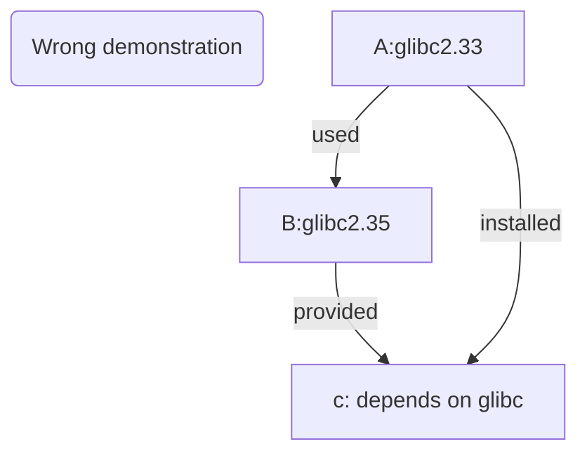

# Add repo

- [1. Debian-based (ubuntu, mint, kali)](#1-debian-based-ubuntu-mint-kali)
  - [1.1. What you may not need to know](#11-what-you-may-not-need-to-know)
  - [1.2. Common](#12-common)
    - [1.2.1. Brief](#121-brief)
    - [1.2.2. Details](#122-details)
    - [1.2.3. neko-repo Package Details](#123-neko-repo-package-details)
    - [1.2.4. Update the public key](#124-update-the-public-key)
    - [1.2.5. new-neko](#125-new-neko)
  - [1.3. toy-repo](#13-toy-repo)
    - [1.3.1. Quick Installation](#131-quick-installation)
    - [1.3.2. Details](#132-details)
  - [1.4. uuu-repo](#14-uuu-repo)
    - [1.4.1. Installation](#141-installation)
- [2. termux](#2-termux)
  - [2.1. tinor-repo](#21-tinor-repo)
    - [2.1.1. Installation](#211-installation)
    - [2.1.2. Detailed explanation](#212-detailed-explanation)
    - [2.1.3. Update the public key](#213-update-the-public-key)
- [3. Other Distributions](#3-other-distributions)

---

The repositories that need to be added are different for different distributions.  
When the time is right, "2moe" will rewrite the previous "little script" so that it automatically adds different repositories for different distributions.  
If you don't know the "little script", that's fine, just read this chapter.

## 1. Debian-based (ubuntu, mint, kali)

In theory, it is not a good idea to mix Debian and Ubuntu repositories.  
This would break the system's dependencies.

If you've done this before, you should know more about Debian.  
"2moe" strongly recommends you to read [_The Debian Reference (by Osamu Aoki)_](https://www.debian.org/doc/manuals/debian-reference/)

### 1.1. What you may not need to know

<div style="display:none">

</div>


If you must mix software sources, use lower-version sources on a higher-version system.

Otherwise, the following scenario will unfold.

System A, for example, has glibc version 2.33 and System B has 2.35.

glibc is used by some software on B.

If you use B's repo on A and then install b, glibc may have been updated to 2.35.

A slew of system-related software on A will either be upgraded or become unpredictably 'unstable' at that point.

If you want to make one system completely resemble another, you must do the opposite, as shown in the flowchart above.

This is equivalent to upgrading from a lower version to a higher version.

For example, if you want to replace debian with a kali source, you should use the lower debian buster to add the higher kali rolling source, not the higher debian sid.

> The highs and lows are relative.

Your system is now kali after updating all packages with `apt dist-upgrade`.  
There is no going back without a snapshot or backup.

### 1.2. Common

Why does "tmoe" still have a generic repository if the problem of mixing sources is so serious?

The answer is static compilation, low version dependencies, and "all" architecture packages.

In fact, "2moe" creates distinct repositories for packages that are not common.

The "tmoe" common repository is known as "neko" in Debian-based distros.

#### 1.2.1. Brief

```sh
curl -LO l.tmoe.me/neko.deb
sudo apt install ./neko.deb
sudo apt update
```

#### 1.2.2. Details

The following examples will use `curl`.  
You can also use other download tools such as `wget2` or `aria2`  
as long as it's a download tool that supports **https**  
For debian 9(stretch) & ubuntu 16.04(xenial), `apt-transport-https` and `ca-certificates` must be present on the system.  
For debian 10 (cluster), ubuntu 18.04 (bionic) and newer, only "ca-certificates" is required.  
For some download tools, "ca-certificates" is recommended by default.  
Suppose your system is a lite environment (e.g. a lite container) with no ca-certificates and no download tools and slow access to official sources.  
In this extreme case, you might consider using the source change tool.
First change the source and then install the download tool.

> In fact, tmoe's neko repository contains deb packages for mirrored sources.  
> However, tmoe's website forces a redirect from **http** to **https**.

If you want to use the mirror source package from the neko repository, you have to make your system support **https** (including ca-certificates).  
But the official source is too slow and you want to change the source first and then install the ca-certificates.

This situation turned into the "buy a mask" problem of years ago.

<div style="display:none">

</div>



In the "Mirror Sources" section of this book, "2moe" will briefly explain ~~how to get a mask~~, how to use the "mirror source deb" package without **https** support

In general, you can just use the official source to install curl, no need to bother with that.

The reason why you don't add `sudo` is that the new version of tmoe doesn't force dependency on `sudo` anymore.  
You can use other tools similar to `sudo` (e.g. `doas`)

> The following content can be edited directly

```sh,editable
apt update
apt install -y curl

# Download and install neko repository
curl -LO https://l.tmoe.me/neko.deb
apt install ./neko.deb
# What does this deb package do to your system?
# The source file was created in the "/etc/apt/sources.list.d/" directory.
# neko-repo.sources (permission: 644, owner:  0:0)
# This format is described in the source exchange section of this book
# And the OpenPGP (GnuPG) public key.
# /usr/share/keyrings/tmoe-archive-keyring.gpg (same permissions as above)
# And the package priority is adjusted in /etc/apt/preferences.d/50-neko-repository

# Delete the deb package
rm -fv ./neko.deb
# Update the index
apt update
```

#### 1.2.3. neko-repo Package Details

Let's take a look at what `neko-repo` provides.

```sh
apt show neko-repo
```

```yaml
Package: neko-repo
Version: 0.0.1-12
Priority: standard
Section: misc
Maintainer: Moe Master <m@tmoe.me>
Installed-Size: 30.7 kB
Provides: set-src-list, update-neko-key
Depends: apt (>= 1.1.0)
Recommends: ca-certificates
Suggests: curl | wget
Homepage: https://packages.tmoe.me/deb/dists/neko/
Download-Size: 5,232 B
APT-Manual-Installed: yes
APT-Sources: https://packages.tmoe.me/deb neko/main amd64 Packages
Description: Neko repository, QwQ
  It includes some useful packages.
  The minimum supported version of this repository is debian 9 (Stretch),
  you should not install it on debian 8 (Jessie).
```

The first one is `set-src-list`, which we will cover in the source change-related content, so we are not in a hurry to talk about it now.  
The second `update-neko-key` is what we need to focus on this time.

#### 1.2.4. Update the public key

The OpenPGP public key for the neko repository may become invalid in extremely rare circumstances.  
In this case, you cannot use `apt-get install` to update the keyring of the neko repository; instead, use one of the commands included with `neko-repo`.

Run

```sh
update-neko-key
```

It will output the following

```sh
It can update the OpenPGP pub keyring: "/usr/share/keyrings/tmoe-archive-keyring.gpg"

-d | --downloader: You can specify the downloader.

For example, you can run "update-neko-key -d curl" to use curl.
Run "update-neko-key -d wget" to use wget.
```

In short, you need to specify a downloader manually.  
Right now only `curl`, `wget`, `wget2` and `aria2c` are supported.  
After "2moe" you may implement a simple downloader with rust and then have it call that downloader.  
This is simple, run `update-neko-key -d curl` as root.  
If it doesn't have root privileges, then it won't be able to modify `/usr/share/keyrings/tmoe-archive-keyring.gpg`.

The logic of this tool is very simple.  
If your system already has `gnupg` installed, it will get the [OpenPGP public key in ascii format](https://salsa.debian.org/mm/repo/-/blob/master/src/deb/debian/repo/) from tmoe's debian salas repository, convert it to binary format, and finally overwrite tmoe's original public key.  
If your system does not have `gnupg` installed, or if the conversion process goes wrong, it will get the public key in binary format directly from tmoe's website.  
If nothing else, you may not need to call this command to update tmoe's public key for a decade.  
Whether "2moe" can be maintained for "tmoe" for ten years is another matter.

#### 1.2.5. new-neko

This section is an idea written by "2moe" while designing neko-repo, and is for reference only as it has not yet been implemented.

The neko repository contains various ~~cats~~, ah, no, various extra repositories, and various packages that are not updated all the time.  
The packages in the neko repository are basically maintained manually, except for the non-free Component packages, all other (main and contrib) packages that go into the repository have been rigorously tested.  
The packages in the lihuacat repository are partly imported automatically via CI/CD and partly maintained manually.  
The pallascat repository packages are mostly imported automatically.  
As for the black-footed-cat repository, do not use this repository unless you want to.

In terms of frequency of updates and package versions, you can understand tmoe's repositories in the following table.

| suite        | repo             |
| ------------ | ---------------- |
| old-stable   | neko             |
| stable       | lihuacat         |
| unstable     | pallascat        |
| experimental | black-footed-cat |

Since some tmoe repositories are out of packages, you need to use them with neko and other repositories at this stage.  
For normal distributions, mixing stable + unstable may break system dependencies.  
But for tmoe repositories, it should not.  
This is because tmoe does not use cat repositories for certain packages for some distributions.  
For example, the repository for packages that can only be used for ubuntu 22.04, that is jammy-repo;  
for ubuntu 22.10, that would be kinetic-repo.

### 1.3. toy-repo

Unlike **neko-repo**, **toy-repo** is not completely common.
It can only be used for **debian**, not **ubuntu**.

#### 1.3.1. Quick Installation

> The following is editable

```sh,editable
sudo apt update
sudo apt install toy-repo
sudo apt update
```

#### 1.3.2. Details

```sh
apt show toy-repo
```

```yaml
Package: toy-repo
Version: 0.0.1-4
Priority: optional
Section: misc
Maintainer: Moe Master <m@tmoe.me>
Installed-Size: 19.5 kB
Depends: apt (>= 1.1.0), neko-repo
Suggests: ca-certificates
Homepage: https://packages.tmoe.me/deb/dists/toy
Download-Size: 2,484 B
APT-Manual-Installed: yes
APT-Sources: https://packages.tmoe.me/deb neko/main amd64 Packages
Description: A repository for debian only
  Toy is a wonderful thing.
  Let's keep our childishness and optimism!
  Go after the good things in the toy-repo!
  The source file will be placed in "/etc/apt/sources.list.d/toy-repo.sources"
```

Unfortunately, toy-repo isn't particularly useful on its own.

The useful stuff is in the repository, and to install the toy of your choice, run `apt install` as root.

Toys are wonderful, and 2moe named it **toy** without the connotation of being a "toy project".

Like the code name for Debian's Toy Story series.

It is critical to maintain a childlike and positive attitude.

**Toy** also represents the developer's desire for a better life.

The world is very complex and it is a wonderful thing to pursue simple pleasures as a child.

If 2moe ever created a Linux distribution, it would most likely be called **toy**.

### 1.4. uuu-repo

Unlike **neko-repo** and **toy-repo**.  
The uuu repository is just for **ubuntu**, not **debian**.

#### 1.4.1. Installation

> The following is editable

```sh,editable
sudo apt update
sudo apt install uuu-repo
sudo apt update
```

The uuu repository is common for ubuntu.

Following that, there may be repositories such as "focal-repo" that can only be used for single releases.

## 2. termux

### 2.1. tinor-repo

TINOR Is Not Official Repository.

#### 2.1.1. Installation

```sh
curl -LO l.tmoe.me/tinor.deb
apt install ./tinor.deb
apt update
```

#### 2.1.2. Detailed explanation

Take the package and look inside to see what's inside!

```tree,editable
├── control
│   ├── conffiles
│   ├── control
│   ├── md5sums
│   ├── postinst
│   └── postrm
└── data
    └── data
        └── data
            └── com.termux
                └── files
                    └── usr
                        ├── bin
                        │   ├── set-src-list
                        │   └── update-tinor-key
                        ├── etc
                        │   └── tmoe
                        │       └── repo
                        │           └── apt
                        │               ├── preferences.d
                        │               │   └── 50-tinor
                        │               └── sources.list.d
                        │                   └── tinor.sources
                        └── share
                            ├── doc
                            │   └── tinor-repo
                            │       ├── changelog.Debian
                            │       └── copyright
                            └── keyrings
                                └── tmoe-archive-keyring.gpg
```

When installing deb packages and executing the **configure** phase of `postinst`, `postinst` creates the symbolic links associated with **tinor** at `$PREFIX/etc/apt/sources.list.d` and `$PREFIX/etc/apt/preferences.d`; when uninstalling packages and executing the **purge** or **remove** phase of `postrm`, `postrm` automatically deletes the symbolic links. symbolic links; when uninstalling a package, `postrm` automatically deletes the symbolic links when executing the **purge** or **remove** phase of `postrm`.

As you can see, its structure is very similar to that of `neko-repo`, except that the path is different.

#### 2.1.3. Update the public key

To update the public key, use `update-tinor-key`.
Its usage is similar to that of debian's `update-neko-key`, but with slightly less functionality.

## 3. Other Distributions

Although "tmoe" has users of arch and manjaro, to be honest, "2moe" has little incentive to pack packages other than deb.  
In fact, the arch repository has been built before, just need to write a few PKGBUILD, pack a few packages, and finally put it inside the repository.

Then there is NixOS.  
Although it is very good, the "tmoe" edition 2021 philosophy does not fit it.  
For some reason, maybe one day, "tmoe" edition 2022 will go to support it.

Although "2moe" says that the best way to distribute software is to use the distribution's respective package manager, it is still a bit overwhelmed by the variety of distributions.

Conclusion: For other distributions, 2moe don't want to go packing for now.  
Let's hold off for a while!  
"2moe" would like to have more time to enjoy the good things in life, instead of testing different distributions every day.

"2moe" is already old, no longer like the young like to toss a variety of new and exciting things every day.

"2moe" once said in the _issue_ of "tmoe":  
"Time is precious. If you can get pleasure from it, it is worth it. If it's just a waste of time, it's not worth it."  
If you are reading this book and feel that your time is being wasted, then "2moe" would like to apologize.

You may be using "tmoe" and find something so simple that you turn your nose up at it.  
In fact, there are some simple little features that have a lot of trouble behind them.  
"2moe" feels that it is not worth it to pay so much for "tmoe".

Adapting to a single series of distributions alone is already physically and mentally exhausting for "2moe".  
This can really wear out "2moe" if Tmoe has to adapt to a different system.
