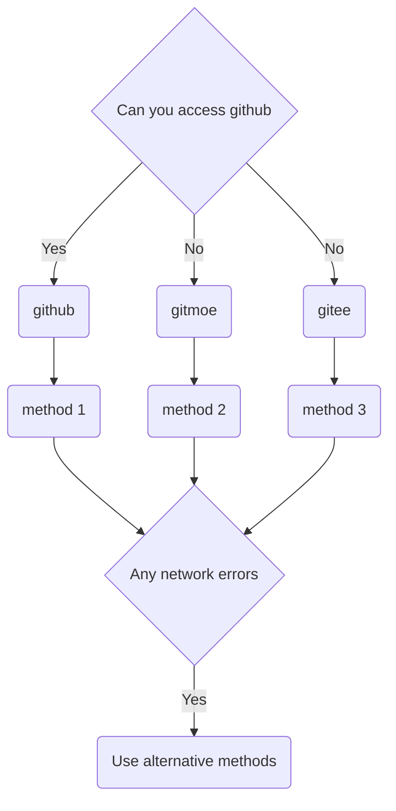

# android

- [1. About docker](#1-about-docker)
- [2. Tmoe Manager](#2-tmoe-manager)
- [3. About the container environment](#3-about-the-container-environment)
  - [3.1. Configuration & Environment](#31-configuration--environment)
    - [3.1.1. Some minor issues with rootless](#311-some-minor-issues-with-rootless)
  - [3.1. proot](#31-proot)
  - [3.2. chroot/unshare](#32-chrootunshare)
- [4. Command](#4-command)
  - [4.1. In host environment](#41-in-host-environment)
    - [4.1.1. For GUI containers](#411-for-gui-containers)
    - [4.1.2. noGUI](#412-nogui)
  - [4.2. In container environment](#42-in-container-environment)
    - [4.2.1. For debian-based distros](#421-for-debian-based-distros)

---

Tmoe is divided into two parts, the "Manager" and the "Tools".  
For android, you can use the "Tmoe Manager".

## 1. About docker

Actually, android can also run docker.  
If you want to use native docker, you need to manually compile the kernel with some of the features required for docker.  
If your kernel is not open source, or if your device is not bootloader unlocked, then you may need to use docker indirectly through a virtual machine.

In this chapter, we do not cover the following.

- How to recompile the kernel for android
- How to run docker on android

## 2. Tmoe Manager

If you want to use the "Tmoe Manager", then you can install it using the script.

> In edition 2022, the "Tmoe manager" is called `tmm`.  
> At this stage, most of Tmoe's content is still in edition 2021  
> For compatibility with older versions, the developers will keep the `tmoe` command for android

For android, you can run the following script with [termux](https://github.com/termux/termux-app/actions).  
Afterwards "2moe" may make a deb package of the content, or it may adapt it to other terminals.

> The reason why `curl` is used is that termux pre-installs it.  
> If it is not pre-installed, then you need to install it with `apt update; apt install -y curl`

<div style="display:none">



</div>


- method 1
  - tool: curl
  - platform: github
  - condition: You have `curl` installed, and can access **github**
  - choose any one of the following commands
    - cmd 1
      - `. <(curl -L l.tmoe.me/hub/sh)`
    - cmd 2
      - `. <(curl -L git.io/linux.sh)`
    - cmd 3
      - `curl -LO l.tmoe.me/hub/sh; sh sh`
    - cmd 4
      - `curl -LO git.io/linux.sh; sh linux.sh`
    - note：[Git.io deprecation](https://github.blog/changelog/2022-04-25-git-io-deprecation)
- method 2
  - tool: curl
  - platform: gitmoe
  - condition: You cannot access **github**
  - choose any one of the following commands
    - cmd 1
      - `. <(curl -L l.tmoe.me/m/sh)`
    - cmd 2
      - `curl -LO l.tmoe.me/ee/sh; sh sh`
- method 3
  - tool: curl
  - platform: gitee
  - condition：None of the above methods work
  - choose any one of the following commands
    - cmd 1
      - `curl -LO l.tmoe.me/ee/sh; sh sh`
    - cmd 2
      - `curl -LO gitee.com/mo2/linux/raw/2/2; sh 2`

## 3. About the container environment

Tmoe manager provides a fairly extensive set of configuration options.

If you find it has more problems than other "better managers", it's probably a configuration issue.

Tmoe Manager may not have fewer configuration options than other projects and you will need to configure it properly to get the best out of it.

### 3.1. Configuration & Environment

We have extracted the configuration of `unshare` here

```sh
# The unshare command creates new namespaces and then executes the specified program.
# By default, a new namespace persists only as long as it has member processes.
# A new namespace can be mad e persistent even when it has no member processes by bind mounting /proc/pid/ns/type files to a filesystem path.
# A namespace that has been made persistent in this way can subsequently be entered with nsenter even after the program terminates
# (except PID namespaces where a permanently running init process is required).
# Once a persistent namespace is no longer needed, it can be unpersisted by using umount to remove the bind mount.
UNSHARE_ENABLED=true

# Unshare the IPC namespace. Default is false.
# IPC namespace: The process will have an independent namespace for POSIX
# message queues as well as System V message queues, semaphore sets and shared memory segments.
UNSHARE_IPC=false

# Unshare the PID namespace. Default is false.
# PID namespace: Children will have a distinct set of PID-to-process mappings from their parent.
UNSHARE_PID=false

# Unshare the UTS namespace. Default is false.
# UTS namespace: Setting hostname or domainname will not affect the rest of the system.
UNSHARE_UTS=false

# Unshare the mount namespace. Default is false.
# mount namespace: Mounting and unmounting filesystems will not affect the rest of the system, except for filesystems which are explicitly marked as shared.
UNSHARE_MOUNT=false

# When unshare terminates, have signame be sent to the forked child process. Combined with --pid this allows for an easy and reliable killing of the entire process tree below unshare. This option implies --fork.
# When the value is true and SIGNAME=SIGKILL, the process in the container cannot be terminated with ctrl+c.
# see this issue: https://github.com/2moe/tmoe/issues/44
KILL_CHILD=false
KILL_CHILD_SIGNAME="SIGKILL"

# Default is true.
# Just before running the program, mount the proc filesystem at mountpoint (default is /proc).  This is useful when creating a new PID namespace.  It also implies creating a new mount  namespace  since  the  /proc  mount would otherwise mess up existing programs on the system.  The new proc filesystem is explicitly mounted as private (with MS_PRIVATE|MS_REC).
SHARE_PROC=true
```

Then you could say, "What exactly is an IPC namespace?
Should I enable the relevant options?"

In some cases, leaving the default configuration alone is sufficient.

> There is a book called "_UNIX Network Programming,Vovum 2: Interprocess Communications_", which covers IPC-related topics.

There aren't many minor issues in rootful environments, and the default configuration is always used without incident.

However, in rootless environments, you may need to use different configurations for different environments.

#### 3.1.1. Some minor issues with rootless

If you don't care for the Tmoe Manager, you can try the following with "the Better Manager".

- Run _.NET SDK 6.0.202_ in a rootless environment
- Run `gnome-shell` in a rootless environment.

You may encounter problems such as getting stuck or crashing while using the rootless GUI container.  
In general, this is related to the limitations of the android system itself.  
You may need to enable background run and boot permissions for the appropriate terminal, or open a small hover window.  
Or you can use `adb` to adjust the system's resource scheduling and background management mechanisms.

> For android 12+, if the container crashes, then please select the `fix android 12(signal 9) option` to fix it

Secondly, it has to do with the services inside the container. Something related to "power-manager" for example, it will try to call the host itself, and in some cases this can cause the whole container process to crash.  
Finally it has to do with resource usage, if some of the system resources are already full or can't be called, then it will get stuck.

If you get stuck when starting a gui environment, or if the gui environment is particularly unstable.  
Then what is it related to?

The answer is D-Bus.

Q: Is it better to turn off D-Bus?  
A: On the contrary, for some desktop environments, it is better to leave dbus-daemon running.  
For example, for ubuntu 18.04 + gnome, turning on dbus-daemon will allow you to run gnome-shell in a rootless environment.

Q: How do I turn it off?  
A: There are three locations related to D-Bus.

- The configuration of the container. You can disable `fake cap_last_cap` in the "user, env var & login item".
- The configuration of the session. Change the value of `DBUS_CMD` in **/etc/X11/xinit/Xsession** to blank.
- The configuration of startvnc or other vnc servers. Change the value of `AUTO_START_DBUS` to `false`.

For example, if something related to "resource monitoring" crashes, it is most likely related to something related to "/proc".

Please disable some of the `fake proc` stuff manually in the `edit script` option.

Note: By default, it will only falsify and mount automatically if your system does not have the right to read the file in question.  
For performance optimization, only the container initialization process is automatically detected.

There are many, many options in Tmoe, and you may want to spray it if you can't understand what's involved.

> If it has some problems, you should give feedback as soon as possible, it's a bad idea to spray it all the time! (╯°□°)╯︵ ┻━┻

The solution is simple, for android, if the kernel supports docker, then you can use docker directly.  
If the kernel does not support docker, then you can consider using the `unshare` container of the Tmoe manager.

### 3.1. proot

| problem                                 | note                                                                           |
| --------------------------------------- | ------------------------------------------------------------------------------ |
| Unable to bind ports between 0 and 1023 | see this [issue](https://github.com/2moe/tmoe/issues?q=is%3Aissue+is%3Aclosed) |

### 3.2. chroot/unshare

Before you use Tmoe to install unshare container on android, it will ask you to select "share/mount sd directory".  
For miui, please do not select the whole "/data/media/0" or "/sdcard"  
 Please select a specific subdirectory, such as "/data/media/0/Download".  
Mounting the whole internal sd may cause it to be unmounted together when `umount`.

[issue1](https://gitee.com/mo2/linux/issues/I5488U)  
[issue2](https://github.com/2moe/tmoe/discussions/166)

If you insist, perform a little manual test before mounting the whole internal sd.

```sh,editable
cd $TMPDIR
mkdir -pv sd
su -c "/system/bin/mount -o bind /sdcard $PWD/sd"
sudo ls sd
su -c "/system/bin/umount -lvf $PWD/sd"
ls /sdcard
```

See what's going on?

## 4. Command

### 4.1. In host environment

#### 4.1.1. For GUI containers

- `startvnc`
  - Prerequisite: You need to install vnc viewer or other vnc client first
  - For android, only vnc viewer will be started "simultaneously"
  - Function: Start the default vnc server (usually tigervnc)
- `startx11vnc`
  - Prerequisite: same conditions as above
  - Function: Start x11vnc server
- `stopvnc`
  - This command makes it simple to kill the rootless container (its vnc server process)
  - For the chroot/unshare (rootful) container, you must stop the container process separately.
- `startxsdl`
  - Prerequisite: You must first install the xserver application in your host environment.
  - Function: Start Xorg
- `novnc`
  - Prerequisite: you don't need to install a regular vnc client, just a browser is enough
  - Function: Start the host browser, and the novnc inside the container

#### 4.1.2. noGUI

For edition 2020:

- `debian`
  - Automatically detects the default container name, type, and architecture. Start the container after the detection is complete.

For edition 2021：

- `tmoe ls`
  - Automatically determine the default container type and list the containers
- `tmoe p`
  - Start the default proot container
- `tmoe c`
  - Start the default chroot/unshare container
- `tmoe` 或 `tmoe m`
  - Start tmoe manager

For edition 2022：

- `tmm r <Container name>`
  - For example, `tmm r uuu`
- `tmm`
  - start tmoe manager

### 4.2. In container environment

If the host supports "simultaneous" startup, then you do not need to start the vnc server in the container

- `tmoe` 或 `tmoe t`
  - start tmoe tools
- `startvnc`
  - Start the default vnc server (usually tigervnc)
- `startx11vnc`
  - start x11vnc server
- `stopvnc`
  - stop vnc server
- `startxsdl`
  - start xorg
- `novnc`
  - start novnc

#### 4.2.1. For debian-based distros

- `tigervnc`
  - start tigervnc server
- `tightvnc`
  - start tightvnc server
