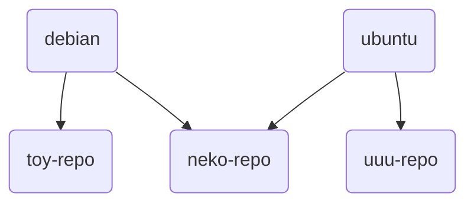

# Mirror sources

- [1. Development History](#1-development-history)
  - [1.1. Beginning](#11-beginning)
  - [1.2. Collation and analysis of sources](#12-collation-and-analysis-of-sources)
  - [1.3. Follow up](#13-follow-up)
  - [1.4. Result](#14-result)
- [2. debian-based mirror sources](#2-debian-based-mirror-sources)
  - [2.1. Quick Start](#21-quick-start)
  - [2.2. Detailed Explanation](#22-detailed-explanation)
    - [2.2.1. set-src-list](#221-set-src-list)
    - [2.2.2. region-code-repo](#222-region-code-repo)
    - [2.2.3. Package Details](#223-package-details)
    - [2.2.4. set-src-link](#224-set-src-link)
      - [2.2.4.1. region & link](#2241-region--link)
      - [2.2.4.2. unlink](#2242-unlink)
    - [2.2.5. Source file](#225-source-file)
    - [2.2.6. Manual installation](#226-manual-installation)

---

"2moe" had a lot of fun designing the "new" tagline for "Tmoe" before writing this little feature.

TMOE, More Optional Environments.

```rust,editable
pub enum Option<T> {
    Some(T),
    None,
}
```

> The above code is a very classic definition from the rust standard library

A few days later, "2moe" completed the feature in an entirely different form than expected, and then silently deleted the rust code.

## 1. Development History

### 1.1. Beginning

Someone long ago requested that "Tmoe" support this feature: manually configuring software sources prior to container initialization.

Initially, 2moe stated: "You can leave it if you only add an option for ustc sources.
You must change it if you want to include mirror sources from Germany, France, and the United Kingdom."

In this case, "change" refers to a shift in logic.

2moe originally intended to create a new source change feature.

### 1.2. Collation and analysis of sources

2moe was intended to be written in rust at first.
No matter what language you write in, you must have a list of sources at the start.  
For example, the [worldwide mirror list](https://www.debian.org/mirror/list) for debian.

However, the official Debian source list is insufficient; there should be more sources.

So, 2moe happily set out on a journey to collect and organize software sources from various countries and regions around the world, ~~and never returned!~~  
~~(Do you want my prize? You can have it all! People were overwhelmed by this; 2moe also set out on a journey, and the world entered a new era.)~~

Isn't it true that such a simple task would just take a few hours to complete?

But it wasn't that simple.

2moe can only tell you that it took a long time and a lot of effort.

If a site provides a debian mirror source, it does not necessarily have a debian-security mirror source.  
If a site provides an ubuntu mirror, it does not necessarily have a debian mirror.  
If a site supports http, it doesn't necessarily support https.  
2moe simply gives a few examples, doesn't that make the job of data analysis a pain in the ass?

### 1.3. Follow up

Since 2moe has already done all the dirty work, the rest is easy.  
2moe can write a TUI tool in rust: a tool that replaces the source by parsing the external **source.toml**.

This tool should also support CLI for greater applicability.

But 2moe was already tired and didn't want to do any extra work.

During the source change process, you may need to create symbolic links to the software source files.

```rust
use std::os::unix::fs;

fn main() -> std::io::Result<()> {
    fs::symlink("/etc/tmoe/repo/src/debian/xxyy.source", "/etc/apt/sources.list.d/mirror.source")?;
    Ok(())
}
```

If it were just the CLI, would it really be more efficient and safer to create symbolic links like the above than `ln -s`?

> Actually, rust can call the system's `ln`

But that's not the point; the point is to utilize separate packages for different architectures.

In extreme circumstances, this is not a good thing.

> What's the extreme circumstances?  
> You may read about the "get a mask problem" in the book.

2moe considered it and concluded that this has become rust for the sake of rust.  
Language is merely a tool, and we should examine its application before employing it.

### 1.4. Result

2moe has a package for each source, and each source relies on a small script written in dash (`set-src-link`).

> For applications that can only be used for debian-based, scripting in dash is fine.  
> 2moe used a debian-based distribution with only `dash` and no `bash` a long time ago.  
> `dash` is faster than `bash`, but not for interactive operations  
> TUI and CLI don't conflict, so maybe someday 2moe will write a front-end for this little feature again.

2moe stores the debian and ubuntu common source deb packages in the neko repository.

<div style="display:none">

</div>


## 2. debian-based mirror sources

After installing `neko-repo`, you can use `apt` to install the debian mirror source.

Kali and mint can also use this feature.  
However, not all mirrors are compatible with them.  
Sites that provide Ubuntu mirrors do not always provide mint sources.

> If you are using another debian-based distribution, please notify "2moe," and "2moe" will adapt it for you.

### 2.1. Quick Start

Please do not run the following commands directly if you do not understand their exact meaning.  
We'll go over it in more detail in the following section.

```sh
sudo set-src-list dis
sudo apt update
sudo apt install xtom-us-repo
sudo apt update
```

### 2.2. Detailed Explanation

#### 2.2.1. set-src-list

> `set-src-list` provided by `neko-repo`

First, run `set-src-list`  
It outputs the following

```sh
-d | dis | disable: disable src list
-e | en | enable: enable src list

Note: This is a dangerous operation.
If you run "set-src-list dis", then it will move your "/etc/apt/sources.list" to "/etc/apt/sources.list.bak"
If you run "set-src-list en", then it will move your "sources.list.bak" to "sources.list"
```

This tool is so simple that you may wonder if it even qualifies as a "tool."

Execute `set-src-list dis` as root, which renames "sources.list" in the **/etc/apt/** directory to "sources.list.bak".  
`set-src-list en` does the opposite of the above.

> Function: Disable the original software source before changing the source.

#### 2.2.2. region-code-repo

> Specific region codes are included in the appendix.

Use `apt` to search for mirror repositories in your region.

"United States": US

```sh
apt search us-repo$
```

"Germany": DE

```sh
apt search de-repo$
```

"China": CN

```sh
apt search cn-repo$
```

```log,editable
rochester-institute-of-technology-us-repo/neko 0.0.1-2 all
  Rochester Institute of Technology(United States)

siena-college-us-repo/neko 0.0.1-2 all
  Siena College(United States)

sonic-net-inc-us-repo/neko 0.0.1-2 all
  Sonic.net, Inc.(United States)

steadfast-networks-us-repo/neko 0.0.1-2 all
  Steadfast Networks(United States)

syringa-networks-us-repo/neko 0.0.1-2 all
  Syringa Networks(United States)

teraswitch-inc-us-repo/neko 0.0.1-2 all
  TeraSwitch Inc.(United States)

university-of-arizona-us-repo/neko 0.0.1-2 all
  University of Arizona(United States)

virginia-tech-us-repo/neko 0.0.1-2 all
  Virginia Tech(United States)

washington-state-university-us-repo/neko 0.0.1-2 all
  Washington State University(United States)

wikimedia-foundation-us-repo/neko 0.0.1-2 all
  Wikimedia Foundation(United States)

xmission-us-repo/neko 0.0.1-2 all
  Xmission(United States)

xtom-us-repo/neko 0.0.1-2 all
  xTom(United States)
```

The package is then installed using apt as root

```sh
apt install xtom-us-repo
```

#### 2.2.3. Package Details

Take it apart first to see

```log,editable
├── control
│   ├── conffiles
│   ├── control
│   ├── md5sums
│   ├── postinst
│   └── postrm
└── data
    ├── etc
    │   └── tmoe
    │       └── repo
    │           └── src
    │               ├── debian
    │               │   ├── xtom-us-repo_old.sources
    │               │   ├── xtom-us-repo_sid.sources
    │               │   └── xtom-us-repo_stable.sources
    │               └── ubuntu
    │                   ├── xtom-us-repo_ports.sources
    │                   └── xtom-us-repo.sources
    └── usr
        └── share
            └── doc
                └── xtom-us-repo
                    └── changelog.Debian.gz
```

`postinst` calls `set-src-link` to create a symbolic link.  
`postrm` calls the `unlink` subcommand of `set-src-link` to remove symbolic links.  
If your system is ubuntu jammy (amd64), it will modify **xtom-us-repo.sources** to be the source of jammy and symbolically link it to "/etc/apt/sources.list.d/us-mirror.sources".  
If you are using linuxmint vanessa, then it will automatically merge the sources of ubuntu and vanessa and symbolically link the sources to "/etc/apt/sources.list.d/us-mirror.sources".

If you are using de-repo, instead of us-repo, then it will symbolically link the sources to "/etc/apt/sources.list.d/de-mirror.sources".

Mirror packages from the same region will be overwritten by the last installed package, not from a different region.

For example, if you have installed `mirrors-bfsu-edu-cn-repo`, then the cn source is now bfsu.  
You then install `shanghai-jiaotong-university-cn-repo`, and the cn source becomes sjtu.  
If you install `xtom-de-repo`, **/etc/apt/sources.list.d/** there will be an additional de source, which does not conflict with the cn source.

In general, you only need to install the mirror source for the region where your server/pc is located.  
Do not install mirrors from different regions on one device unless you have a good reason to do so.

#### 2.2.4. set-src-link

In the previous section, we mentioned `set-src-link`, and in this section, we will go deeper into it.

`set-src-link` is called automatically when you install or uninstall the deb package of the image source, so you don't have to call it manually.

In short, `set-src-link` does only two things.

- 1. Create symbolic links
  - Before creating it, it will automatically determine your distribution. For ubuntu, it will also determine your architecture.
- 2. Remove symbolic links

Run `set-src-link -h`  
The output will be:

```sh,editable
set-src-link 0.0.1
Set the symbolic link for the mirror source.

Usage:
 set-src-link [flags]<string>
 set-src-link [flags] [flags]
 set-src-link <subcommand> [flags]<string>

Flags:
 -n, --name <mirror-name>      set the mirror name
 -r, --region <iso-code>       set the region <ISO 3166-1 Alpha-2 code>

 -h, --help                    display help information
 -V, --version                 display version

Subcommand:
    unlink

Example:
 set-src-link -n -h
 set-src-link --region --help
 set-src-link unlink -r us
```

> `set-src-link` needs to be run as root, otherwise you will not have permission to modify `/etc/apt/sources.list.d/*-mirror.sources`

##### 2.2.4.1. region & link

Get help information for region

```sh
set-src-link -r -h
```

`-n` is followed by the package name of the deb package.

Creating symbolic link

```sh
set-src-link -r es -n xtom-us-repo
# os: debian
# code: sid
# '/etc/apt/sources.list.d/es-mirror.sources' -> '/etc/tmoe/repo/src/debian/xtom-us-repo_sid.sources'

set-src-link -r us -n xtom-us-repo
# os: debian
# code: sid
# '/etc/apt/sources.list.d/us-mirror.sources' -> '/etc/tmoe/repo/src/debian/xtom-us-repo_sid.sources'
```

##### 2.2.4.2. unlink

```sh
set-src-link unlink
```

The following is output

```sh
Error, you should add "--region" to specify your region
```

Simply designate the "--region" and you're done.

```sh
set-src-link unlink -r cn
# unlink /etc/apt/sources.list.d/cn-mirror.sources

set-src-link unlink -r de
# unlink /etc/apt/sources.list.d/de-mirror.sources

set-src-link unlink -r us
# unlink /etc/apt/sources.list.d/us-mirror.sources
```

#### 2.2.5. Source file

If you've ever manually changed debian/ubuntu sources, you should be familiar with debian's classic one-line source format.

```list
deb http://mirrors.bfsu.edu.cn/debian/ sid main non-free contrib
```

Unlike the traditional one-line-style, Tmoe uses the more modern deb822-style.  
This style requires apt version >= 1.1.0.  
Therefore it is not compatible with debian 8 (Jessie) by default.

Let's see what's in it!

Take debian buster (old-stable) as an example.  
In fact, there is a difference between the suites of buster and bullseye.  
In addition to the difference in security sources, backports should also use different sources.  
You cannot simply replace "stable-backports" with "old-stabe-backports"

If the mirror source does not contain a "debian-security" mirror, then it will enable the official security source by default, and disable the mirror security source.  
If it does not support https, then the uris shows a uri starting with **http://**.  
In the case of deb packages with neko-repo's mirror source, you don't need to manually determine if it supports things like `https`.

These are just minor details.

```sh
cat /etc/apt/sources.list.d/cn-mirror.sources
```

```yaml
name: Debian
# yes or no
enabled: yes
# types: deb deb-src
types: deb
uris: https://mirrors.bfsu.edu.cn/debian/
suites: buster
components: main contrib non-free
# architectures: amd64 arm64 armhf i386 ppc64el s390x mipsel mips64el
# --------------------------------

name: Debian updates
enabled: yes
# types: deb deb-src
types: deb
uris: https://mirrors.bfsu.edu.cn/debian/
suites: buster-updates
components: main contrib non-free
# --------------------------------

name: Debian backports
enabled: yes
# types: deb deb-src
types: deb
uris: https://mirrors.bfsu.edu.cn/debian/
# For debian old-stable, you should use "old-stable-backports-sloppy", instead of "old-stable-backports".
# https://backports.debian.org/Instructions/#:~:text=Old-stable-sloppy
# suites: buster-backports
suites: buster-backports-sloppy
components: main contrib non-free
# --------------------------------

name: Debian security
enabled: yes
# types: deb deb-src
types: deb
uris: https://mirrors.bfsu.edu.cn/debian-security/
suites: buster/updates
components: main contrib non-free
# --------------------------------

name: Official security
enabled: no
# types: deb deb-src
types: deb
uris: https://deb.debian.org/debian-security/
suites: buster/updates
components: main contrib non-free
# --------------------------------

name: Proposed updates
enabled: no
# types: deb deb-src
types: deb
uris: https://mirrors.bfsu.edu.cn/debian/
suites: buster-proposed-updates
components: main contrib non-free
# --------------------------------
```

`enabled`: whether this source needs to be enabled. You can choose yes or no  
`types`: type, normally **deb**, or **deb deb-src** if there is a requirement to get the source code

In addition to what is described above, deb822-style also supports other keys.

For example:

Use signed-by to specify the OpenPGP public key.

```yaml
signed-by: /usr/share/keyrings/tmoe-archive-keyring.gpg
```

#### 2.2.6. Manual installation

This applies to extreme situations.  
Manual installation is only required if your environment meets all three of the following conditions

- No https support (no ca-certificates)
- No regular download tool(e.g. wget, curl)
- Access to official sources is slow

First, on a device with neko-repo already installed, manually download the relevant deb package.

> You can replace xtom-us-repo with another repository

```sh
apt download set-src-link
apt download neko-repo
apt download xtom-us-repo
```

Then figure out how to get these three deb packages to a device in a "extreme" environment.  
Then run in that environment.

```sh
apt install --no-install-recommends ./neko*.deb
set-src-list dis
apt install ./set-src-link*.deb
apt install ./xtom-us-repo*.deb
apt purge -y neko-repo
apt update
```

In what kind of environment do you encounter this extreme situation?  
You're using several ultra-lightweight containers： kali ,mint, lmde, ubuntu focal, ubuntu jammmy , debian 9, 10, 11, 12 & sid。  
You can easily use `docker -v` to bind to the directory where the host's deb package is located.

To be honest, this manual installation approach is excessively time-consuming, and "2moe" does not advocate it at all.

---

This is the end of the "repo" section.  
If you've never used "Tmoe" before, this should suffice.  
If you are a user of "tmoe", you can continue reading the following sections.  
Stay tuned because this is an ongoing project!
