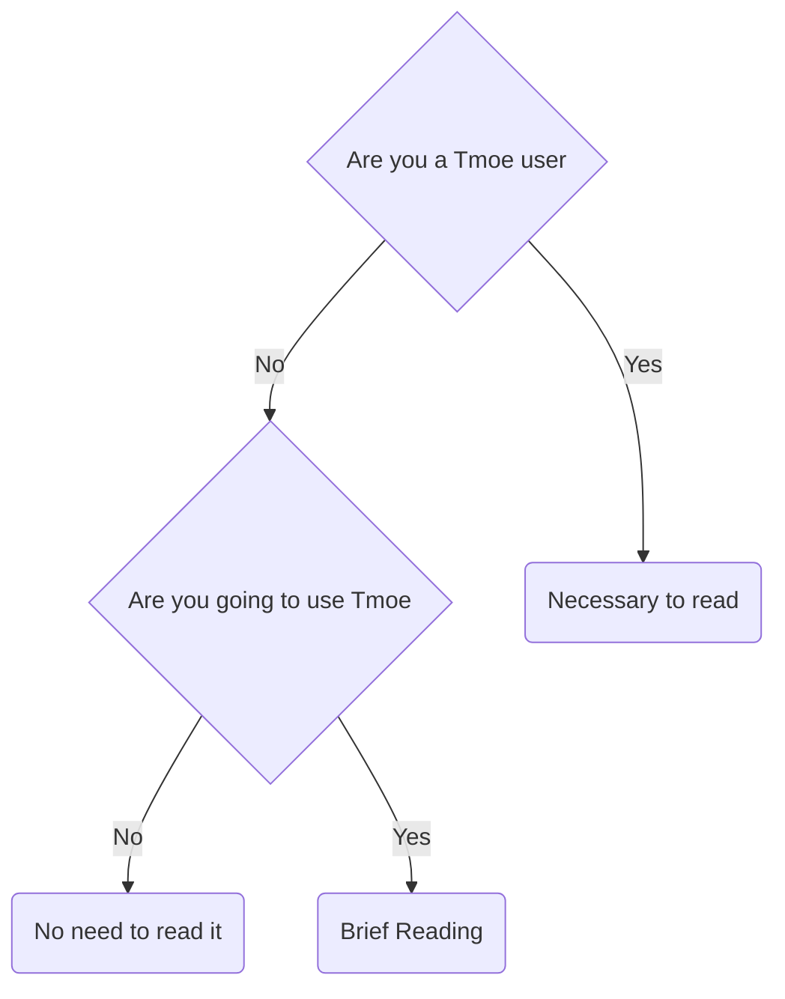
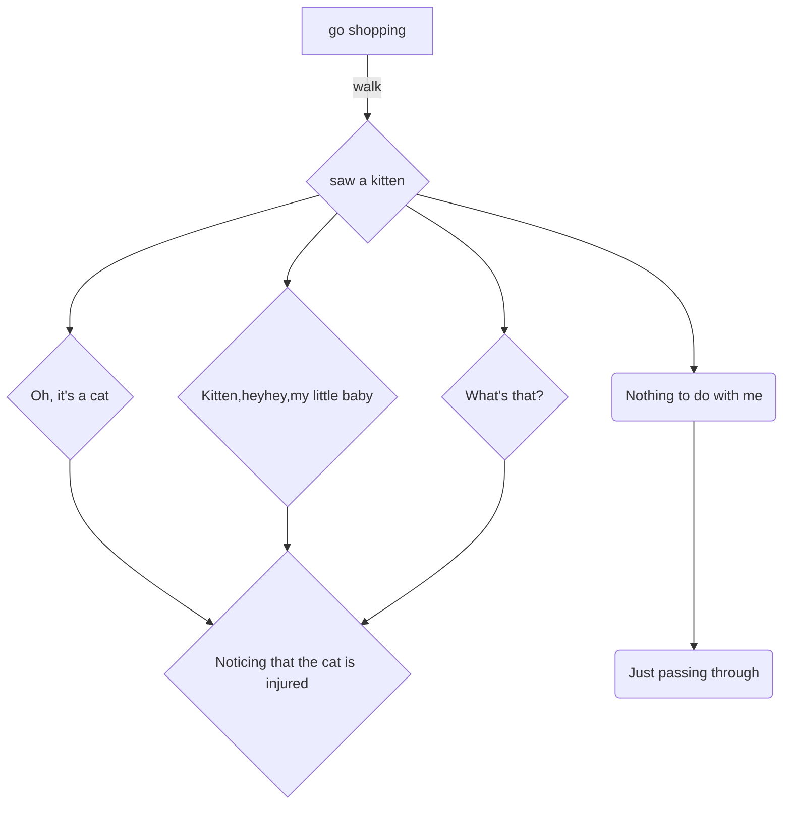

# Prologue

- [Q & A](#q--a)
  - [Should I read this book](#should-i-read-this-book)
  - [How to read this book](#how-to-read-this-book)
- [About tmoe usage](#about-tmoe-usage)
- [Statement](#statement)
  - [License](#license)
- [Communication and Discussion](#communication-and-discussion)
  - [Feedback](#feedback)

## Q & A

### Should I read this book

### How to read this book

What you should know before reading this book.

- The three bars in the upper left corner "≡"
  - To open the table of contents, click "≡".
- The section at the bottom of the page for comments
  - Log in with your github account to have your posts synchronized with "github discussions." Similarly, if you find the current chapter's discussion page in discussions and post something there, it will be synced to the comments section below.
- Brush "🖌️" in the upper left corner
  - Click the brush first, then the theme, and finally switch.
- In the lower left corner, there is a "<" symbol.
  - To return to the previous page, click "<".
- The ">" symbol in the bottom right corner
  - To go to the next page, click ">".

> If your page (screen) is wide enough, the "<" and ">" will be in the middle, not below.

## About tmoe usage

As of version 2022, 2moe who do not package it (e.g. deb packages) and do not parse it in detail in this book for particular features or tools.

These functionalities should only be used in a container, not in a host environment.

> For all features of edition 2021, "2moe" is only recommended for use in containers.  
> For some features of edition 2021 that cannot be used in a container, you can test them in a virtual machine.

Will you use a feature if you don't understand it well enough?

Most likely, but you won't believe it.

It's the same with "Tmoe", as some say, "it just a third-party script, it's a miracle it doesn't have problems."  
This comment made "2moe" so upset that it was on the verge of crying.

Edition 2022 is here, although in a limited capacity, but it may not be in the shape you think.

"2moe" will describe in depth what some of the small features accomplish in the book's repo part.

It is entirely up to you whether or not you use it and whether or not it has any value.

In any case, "2moe" expects that you would use it only once you have thoroughly understood the feature in question, rather than naively.

As a preview, this book will introduce a little feature in the repository that may be useful for Debian and Ubuntu.  
You may utilize this small functionality, but you may not realize that "2moe" has broken it down into hundreds of deb packages.

## Statement

There are no registered trademarks for "2moe" or anything connected to "tmoe."
If you believe the name or content in question violates your rights, please contact "2moe" to get it changed.

### License

"Tmoe" is a minor open source project, and "2moe" lacks the financial resources and mental will to accept legal responsibility for "infringement."

> "Tmoe" is a project, "2moe" is a living entity.  
> "2moe" is not a grass, nor is it an extraterrestrial creature. "2moe" will be quite upset if you go too far.

Previously, Tmoe employed such a tight license because 2moe was concerned about different legal difficulties.

"2moe" changed the license of "Tmoe" to "Apache-2.0" on 2022-05-12, and eliminated the previous Private License and "GPL-2.0+."

If there is a conflicting license for an external project called by Tmoe, "2moe" will split it into external packages.

"CC-BY-4.0" is used for "documentation," and "Apache-2.0" is used for "non-doc  
The licenses for the external projects utilized by "Tmoe" are mentioned in the "Copyright" file in the project root directory.

You can use "Tmoe" in commercial projects if there is no conflict with the relevant license.  
~~2moe is very poor, if you make money with Tmoe, I hope you can give a little to 2moe or other developers of Tmoe!~~

## Communication and Discussion

If you have any suggestions, please leave them in the comments section or submit an issue.

There is one exception.

If you want to add an upstream system that is almost out of maintenance to Tmoe's container list, 2moe is unlikely to accept a PR even if you submit it directly.
(Other PRs are delighted to accept it.)

"A package can't have so many bugs that we refuse to maintain it", a guy once said.  
"2moe" has no idea who said it, but it makes sense.

### Feedback

Let's start with a flow chart

If no one knew the cat was injured, or if everyone knew but didn't want to bother with it, it will probably go to "Planet Meow" in a few days.  
(In reality, this cat is from another planet, and its injury is merely a disguise for its true purpose, which is to lurk on Earth and carry out some classified missions. QwQ)

It is also possible that the cat, by virtue of its own tenacity, has healed itself.

Let's say that you are very caring and want to save the cat.  
You want to get close to the cat, but it won't let strangers get close.  
So you buy a cage and go to a lot of trouble to catch the cat.  
Finally you take the cat to a nearby hospital or a small clinic.  
Some large hospitals may have a vet, or veterinary medicine.  
But the one you went to just didn't have any.  
And there is neither a pet rescue nor a veterinary hospital nearby.  
So what can you do?  
Can I register the cat at a human hospital?

> This is a completely fictitious narrative, and any parallels are entirely coincidental.

Once upon a time, no matter what question you posed in the issue section of "Tmoe", "2moe" would always find a way to respond and rarely failed to do so.

But "2moe" has changed and no longer wants to answer questions.

You can put topics unrelated to this project in the "discussions", but "2moe" may not even be able to cure a minor "cat illness".
