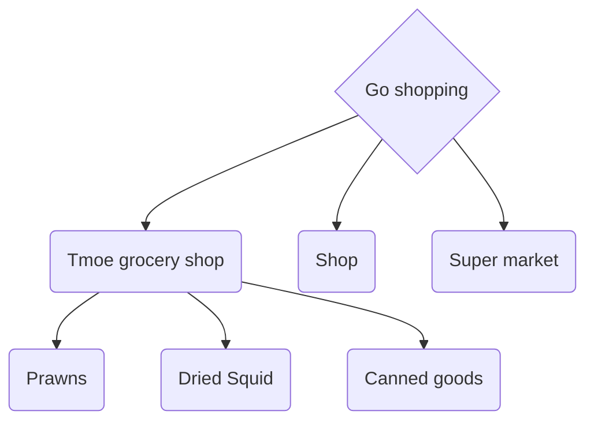

# Software distribution

## Software package access

How do I go about getting a software package?

Manual compilation may be necessary for some persons.  
Because they must be highly adaptable and customisable.

> "2moe" has seen some individuals utilize compiled installations for the sake of vanity.  
> In fact, it's probably not the best choice.

In the absence of high-performance servers or PCs, "2moe" argues that a package manager based on "binary distribution" is the best solution for the average user.

Container/sandbox solutions are also useful for some specific software.

## software repository

 -->

"Tmoe" will be available as a software repository from edition 2022.  
The developers may later migrate edition 2021 to the repository as well.

In this section, ~~we will explain how to go to Tmoe's grocery shop and what good snacks are available there!😋~~

We'll go through how to install Tmoe's software repository and go over some of the packages and their functions.
