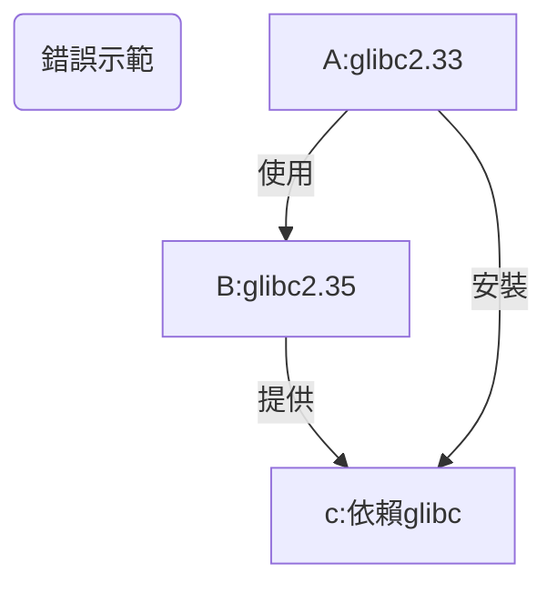
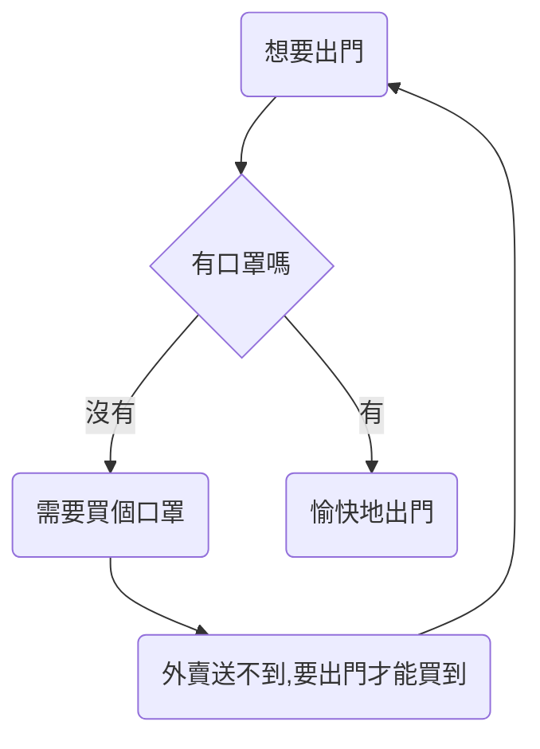

# 添加倉庫

- [1. debian-based (ubuntu, mint, kali)](#1-debian-based-ubuntu-mint-kali)
  - [1.1. 您可能不需要了解的知識](#11-您可能不需要了解的知識)
  - [1.2. 通用](#12-通用)
    - [1.2.1. 簡單説明](#121-簡單説明)
    - [1.2.2. 詳細説明](#122-詳細説明)
    - [1.2.3. neko-repo 軟件包詳情](#123-neko-repo-軟件包詳情)
    - [1.2.4. 更新公鑰](#124-更新公鑰)
    - [1.2.5. new-neko](#125-new-neko)
  - [1.3. toy-repo](#13-toy-repo)
    - [1.3.1. 快速安裝](#131-快速安裝)
    - [1.3.2. 詳情](#132-詳情)
  - [1.4. uuu-repo](#14-uuu-repo)
    - [1.4.1. 安裝](#141-安裝)
- [2. termux](#2-termux)
  - [2.1. tinor-repo](#21-tinor-repo)
    - [2.1.1. 安裝](#211-安裝)
    - [2.1.2. 詳解](#212-詳解)
    - [2.1.3. 更新公鑰](#213-更新公鑰)
- [3. 其他發行版](#3-其他發行版)

---

不同發行版需要添加的倉庫是不一樣的。  
等到時機成熟的時候，“二萌” 會改寫之前的那個“小腳本”，讓它自動為不同的發行版添加不同的倉庫。  
如果您不知道那個 “小腳本”，那沒有關係，看本章的內容就夠了。

## 1. debian-based (ubuntu, mint, kali)

從理論上説，您不應該混用 debian 和 ubuntu 的軟件源。  
因為這會破壞系統的依賴關係。

您如果之前一直都是這麼幹的，那麼需要多瞭解一下 debian。  
“二萌” 強烈推薦您閲讀 [debian 參考手冊（Osamu Aoki 青木修 著）](https://www.debian.org/doc/manuals/debian-reference/)

### 1.1. 您可能不需要了解的知識

<div style="display:none">

</div>


如果您一定要混用軟件源, 那麼請在高版本系統中使用低版本系統的源。  
否則將出現以下的情況：  
比如系統 A 的 glibc 版本是 2.33，B 是 2.35。  
B 的某個軟件 b 依賴了 glibc。  
如果您在 A 上用了 B 的源，然後又安裝了 b ，那麼 glibc 可能也被升到了 2.35。  
這時候 A 上一大堆系統相關軟件要麼跟着升級，要麼可能會出現不可預料的“不穩定性”。

如果您想要將一個系統完全變成另一個系統的模樣，那麼結論與上面完全相反，您得要像上面那張流程圖那樣做才行。  
這樣做相當於從低版本系統升級到高版本。

比如説您想要將 debian 更換為 kali 源，這時候應該用低版本的 debian buster 添加高版本的 kali rolling 源，而不能用高版本的 debian sid 來添加低版本 kali rolling 源。

> 這裏的高低是相對而言的。

在使用完 `apt dist-upgrade` 更新完所有軟件包後，您的系統的內部就已經變成 kali 的形狀了。  
在沒有快照或備份的情況下，這麼做就已經回不了頭了。

### 1.2. 通用

那麼問題來了。  
既然混用源的問題這麼嚴重，那為什麼“天萌”還是有通用倉庫呢？

答案是：靜態編譯，低版本依賴，以及 "all" 架構的軟件包。  
實際上，對於不能通用的包來説，“二萌”會為它們建立單獨的倉庫。

對於 debian-based 發行版來説，“天萌” 通用的倉庫名為 "neko"。

#### 1.2.1. 簡單説明

```sh
curl -LO l.tmoe.me/neko.deb
sudo apt install ./neko.deb
sudo apt update
```

#### 1.2.2. 詳細説明

以下例子將使用 `curl`  
您也可以換用其他下載工具，例如 `wget2` 或 `aria2`  
只要是個支持 **https** 的下載工具就行了  
對於 debian 9(stretch) & ubuntu 16.04(xenial),系統內必須要有 "apt-transport-https" 和 "ca-certificates"。  
對於 debian 10(buster), ubuntu 18.04 (bionic) 及其以上的系統，只要求有 "ca-certificates"。  
對於部分下載工具，"ca-certificates" 是默認被 recommended 的。  
假設您的系統是一個精簡環境(例如：精簡版容器)，裏面既沒有 ca 證書，也沒有下載工具，而且訪問官方源的速度很慢。  
在這種極端情況下，您可以考慮使用換源工具。
先換源，再安裝下載工具。

> 實際上，天萌的 neko 倉庫裏包含換源的 deb 包。
> 不過天萌的網站會強制將 **http** 重定向為 **https**。

您如果想要用 neko 倉庫的換源包，就必須要讓系統支持 **https** (包含 ca 證書)。
可是官方源太慢了，您想要先換源，再安裝 ca 證書。

這種情況變成了多年前的 “買口罩” 問題。

<div style="display:none">

</div>



埋個伏筆，在本書的“更換鏡像源”的內容中，“二萌”將簡單介紹一下 ~~如何才能買到口罩~~ （不是）  
在沒有 **https** 支持的情況下，如何使用“換源 deb” 包。

在一般情況下，您可以直接用官方源來裝 curl，不需要那麼麻煩。

之所以不加 `sudo` 是因為新版天萌不打算強制依賴 `sudo` 了  
您可以換用其他類似於 `sudo` 的工具（例如 `doas`）

> 以下內容可以直接編輯

```sh,editable
apt update
apt install -y curl

# 下載並安裝 tmoe 的 neko 倉庫
curl -LO https://l.tmoe.me/neko.deb
apt install ./neko.deb
# 這個 deb 包對您的系統做了什麼呢？
# 在 /etc/apt/sources.list.d/ 目錄下創建了源列表：
# neko-repo.sources (權限為644,所屬為0:0)
# 在本書的換源部分將介紹這種格式
# 還有 OpenPGP(GnuPG) 公鑰：
# /usr/share/keyrings/tmoe-archive-keyring.gpg (權限同上)
# 並且在 /etc/apt/preferences.d/50-neko-repository 中調整了軟件包優先級
# 注：此 deb 包不依賴 gnupg(完整版)， 只需要 apt 自身依賴的 gpgv(簡化版gnupg) 就可以了

# 刪除 deb 包
rm -fv ./neko.deb
# 更新索引信息
apt update
```

#### 1.2.3. neko-repo 軟件包詳情

讓我們來看一下 `neko-repo` 提供了什麼東西

```sh
apt show neko-repo
```

```yaml
Package: neko-repo
Version: 0.0.1-12
Priority: standard
Section: misc
Maintainer: Moe Master <m@tmoe.me>
Installed-Size: 30.7 kB
Provides: set-src-list, update-neko-key
Depends: apt (>= 1.1.0)
Recommends: ca-certificates
Suggests: curl | wget
Homepage: https://packages.tmoe.me/deb/dists/neko/
Download-Size: 5,232 B
APT-Manual-Installed: yes
APT-Sources: https://packages.tmoe.me/deb neko/main amd64 Packages
Description: Neko repository, QwQ
  It includes some useful packages.
  The minimum supported version of this repository is debian 9 (Stretch),
  you should not install it on debian 8 (Jessie).
```

第一個是 `set-src-list`，我們會在換源相關的內容中介紹到它，現在不急着説。  
第二個 `update-neko-key` 才是我們本次需要關注的重點。

#### 1.2.4. 更新公鑰

在極其特殊的情況下，neko 倉庫的 OpenPGP 公鑰可能會失效。  
在這種情況下，您就不能用 `apt-get install` 來更新 neko 倉庫的 keyring 了，而要用 `neko-repo` 自帶的一個命令。

運行

```sh
update-neko-key
```

它會輸出以下內容

```sh
It can update the OpenPGP pub keyring: "/usr/share/keyrings/tmoe-archive-keyring.gpg"

-d | --downloader: You can specify the downloader.

For example, you can run "update-neko-key -d curl" to use curl.
Run "update-neko-key -d wget" to use wget.
```

簡單來説，您需要手動指定一個下載器。  
現在只支持`curl`, `wget`, `wget2` 和 `aria2c`。  
“二萌” 之後可能會用 rust 實現一個簡單的下載器，然後讓它調用那個下載器。  
用法很簡單，以 root 身份運行 `update-neko-key -d curl`。  
如果沒有 root 權限，那麼它將無法修改 "/usr/share/keyrings/tmoe-archive-keyring.gpg"。

這個工具的邏輯非常簡單。  
若您的系統已經安裝了 `gnupg`，那麼它將從 天萌的 debian salas 倉庫獲取 [ascii 格式的 OpenPGP 公鑰](https://salsa.debian.org/mm/repo/-/blob/master/src/deb/debian/repo/common/neko-repo/current/tmoe-archive-keyring.asc)，並將其轉換為二進制格式，最後覆蓋天萌原來的公鑰。  
若您的系統沒有安裝 `gnupg`, 或者轉換過程出錯了，那麼它將直接從天萌的網站獲取二進制格式的公鑰。  
如果沒有意外的話，您可能十年都不需要調用這個命令去更新天萌的公鑰。  
至於“二萌”能不能為“天萌”用愛發電十年就是另一回事了。

#### 1.2.5. new-neko

本小節是“二萌”在設計 neko-repo 時寫下的想法，由於還沒有實現，因此本小節內容僅供參考。

您不需要了解的內容：

neko 倉庫裏包含了各種 ~~貓咪~~, 啊，不對，各種額外倉庫，還有各種常年不更新的包。  
neko 倉庫的包基本上是手動維護的，除了 non-free Component 的包外，其它進入該倉庫的(main 和 contrib)包都經過了嚴格的測試。  
lihuacat(狸花貓) 倉庫的包有一部分是通過 CI/CD 自動導入的，另一部分是手動維護的。  
pallascat(兔猻) 倉庫的包大部分是自動導入的。  
至於 black-footed-cat 倉庫，除非您想不開，否則不要用這個倉庫。

從更新頻率以及軟件包版本來看，您可以將 天萌 的軟件倉庫簡單理解為如下表格。

| suite        | repo             |
| ------------ | ---------------- |
| old-stable   | neko             |
| stable       | lihuacat         |
| unstable     | pallascat        |
| experimental | black-footed-cat |

因為 天萌 有些倉庫會缺包，所以現階段您需要搭配 neko 和 其他倉庫使用。  
對於普通發行版來説，混用 stable + unstable 可能會破壞系統依賴關係。  
但是對於 天萌 的倉庫來説，應該不會。  
因為 天萌 對於部分發行版的特定的包，不使用貓咪倉庫。  
比如只能給 ubuntu 22.04 用的包的倉庫，那是 jammy-repo;  
只能給 ubuntu 22.10 用的，那就是 kinetic-repo 了。

“二萌”之所以將 repo 相關的包放進 neko，並把 neko 定義為 old-stable。  
因為有些包是不需要經常更新的。~~才不是因為“二萌”懶呢！~~

### 1.3. toy-repo

與 **neko-repo** 不同，**toy-repo** 並不是完全通用的。
它只能給 **debian** 用，不能給 **ubuntu** 用。

#### 1.3.1. 快速安裝

> 以下內容可編輯

```sh,editable
sudo apt update
sudo apt install toy-repo
sudo apt update
```

#### 1.3.2. 詳情

```sh
apt show toy-repo
```

```yaml
Package: toy-repo
Version: 0.0.1-4
Priority: optional
Section: misc
Maintainer: Moe Master <m@tmoe.me>
Installed-Size: 19.5 kB
Depends: apt (>= 1.1.0), neko-repo
Suggests: ca-certificates
Homepage: https://packages.tmoe.me/deb/dists/toy
Download-Size: 2,484 B
APT-Manual-Installed: yes
APT-Sources: https://packages.tmoe.me/deb neko/main amd64 Packages
Description: A repository for debian only
  Toy is a wonderful thing.
  Let's keep our childishness and optimism!
  Go after the good things in the toy-repo!
  The source file will be placed in "/etc/apt/sources.list.d/toy-repo.sources"
```

遺憾的是，toy-repo(玩具倉庫)自身並沒有什麼有用的東西。  
有用的東西都在倉庫裏面，您需要以 root 身份運行 `apt install` 來安裝您心儀的玩具。

玩具是一個很美好的東西，二萌給它命名為 **toy**，並沒有抱着做“玩具項目” 這種消極的想法。  
與 debian 的 玩具總動員系列的代號類似。  
保持童真，以及積極向上的態度是非常重要的。  
**toy** 這個詞還包含了開發者對美好生活的嚮往。  
這個世界是非常複雜的，像孩童一樣追求着簡簡單單的快樂是一件非常非常幸福的事情。  
如果有一天，二萌要做一個 linux 發行版， 那大概會用 **toy** 作為發行版的名稱。

> 為什麼不叫 tmoe-linux 呢？  
> 首先，tmoe-linux 並不是個發行版，只是個工具箱而已。  
> 其次，等到時機成熟的時候， tmoe-linux 要改名為 tmoe 啦！  
> 冷知識：當年“二萌”在設計 tmoe-linux 的時候，就是按照一個發行版應該有哪些功能，來加功能的。  
> 如果只是在成熟的發行版的基礎上進行美化和配置，那還遠遠不夠。  
> “二萌”在很久很久之前瞭解到自身侷限性後，就完全斷了自己做發行版的念頭了。  
> 上面那個只是隨便説説而已，並不是真的要做。

### 1.4. uuu-repo

與 **neko-repo** 和 **toy-repo** 都不同。  
uuu 倉庫只能給 **ubuntu** 用，不能給 **debian** 用。

#### 1.4.1. 安裝

> 以下內容可編輯

```sh,editable
sudo apt update
sudo apt install uuu-repo
sudo apt update
```

uuu 倉庫對於 ubuntu 來説是通用的。

“天萌”之後可能還有 "focal-repo" 這種只能給單獨的版本使用的倉庫。

## 2. termux

### 2.1. tinor-repo

TINOR Is Not Official Repository.

與 debian & ubuntu 的 neko 倉庫不同， tinor 沒有那麼多額外的 ~~貓貓~~ 倉庫，它只有一個，那就是它自身。

#### 2.1.1. 安裝

```sh
curl -LO l.tmoe.me/tinor.deb
apt install ./tinor.deb
apt update
```

#### 2.1.2. 詳解

把軟件包拆出來，看看裏面有什麼東西吧！

```tree,editable
├── control
│   ├── conffiles
│   ├── control
│   ├── md5sums
│   ├── postinst
│   └── postrm
└── data
    └── data
        └── data
            └── com.termux
                └── files
                    └── usr
                        ├── bin
                        │   ├── set-src-list
                        │   └── update-tinor-key
                        ├── etc
                        │   └── tmoe
                        │       └── repo
                        │           └── apt
                        │               ├── preferences.d
                        │               │   └── 50-tinor
                        │               └── sources.list.d
                        │                   └── tinor.sources
                        └── share
                            ├── doc
                            │   └── tinor-repo
                            │       ├── changelog.Debian
                            │       └── copyright
                            └── keyrings
                                └── tmoe-archive-keyring.gpg
```

在安裝 deb 包，執行 `postinst` 的 **configure** 階段時， `postinst` 會在 `$PREFIX/etc/apt/sources.list.d` 和 `$PREFIX/etc/apt/preferences.d` 處創建與 **tinor** 相關的軟鏈接；卸載軟件包，執行 `postrm` 的 **purge** 或 **remove** 階段時，`postrm` 會自動刪掉軟鏈接。

可以看出來，它的結構與 `neko-repo` 是極其相似的，只是路徑不一樣。

#### 2.1.3. 更新公鑰

您可以用 update-tinor-key 來更新公鑰。  
現階段，它的用法與 debian 的 `update-neko-key` 基本一致，只是功能要少一點。

## 3. 其他發行版

雖然“天萌”有 arch 和 manjaro 的用户，不過説實話，“二萌”沒有什麼動力去打 deb 之外的包。  
其實 arch 倉庫之前就已經搭建好了，只差寫幾個 PKGBUILD，打幾個包，最後放到倉庫裏面。

還有就是， NixOS。  
儘管它非常優秀，不過 “天萌” edition 2021 的理念與它水土不服。  
由於某些原因，或許有一天，“二萌”會主動讓 “天萌” edition 2022 去適配它！

“二萌” 雖然嘴上説，最好的軟件分發方式是用發行版各自的包管理器，但是面對形形色色的發行版，還是有點力不從心的。

總結： 現階段，對於其他發行版, ~~先無限期咕咕咕吧！~~  
先緩一緩吧！  
“二萌” 希望能有更多的時間去享受生活的美好，而不是每天奔波於不同的發行版。  
“二萌” 老了呀！並不像年輕的時候那樣，每天都喜歡折騰千奇百怪的玩意兒。

“二萌” 曾在 “天萌” 的 issue 區裏説過一句很有道理的話：“時間是很寶貴的。如果你能從中收穫到快樂的話，那就是值得的。 如果只是單純浪費時間的話，那就不值得了。”  
如果您在閲讀本書時，覺得自己的時間被浪費掉了，那麼“二萌”得要向您道歉。

您可能在使用“天萌”的過程中，覺得一些東西太簡單了，以至於您對此嗤之以鼻。  
實際上，有些簡單的小功能，它背後的麻煩事非常多。  
“二萌”覺得為“天萌”付出了那麼多，有點不值得了。

單單適配一個系列的發行版就身心俱疲了，“二萌”如果要適配各種各樣的發行版，那真的會累死的呀！
