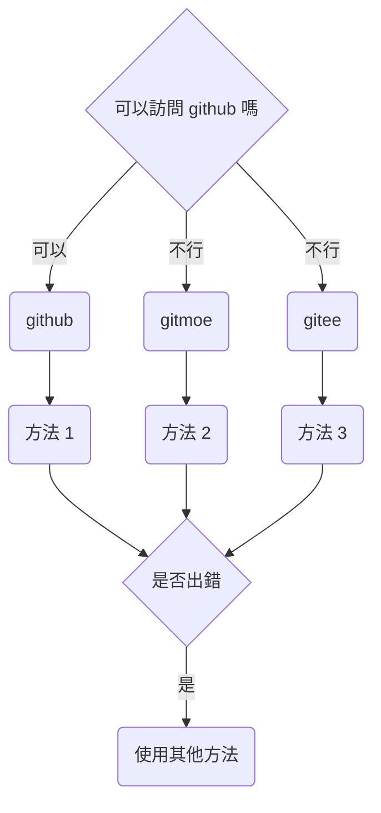

# android

- [1. 關於 docker](#1-關於-docker)
- [2. 管理器](#2-管理器)
- [3. 關於容器環境](#3-關於容器環境)
  - [3.1. 配置與環境](#31-配置與環境)
    - [3.1.1. rootless 環境的一些小問題](#311-rootless-環境的一些小問題)
  - [3.2. proot](#32-proot)
  - [3.3. chroot/unshare](#33-chrootunshare)
- [4. 命令](#4-命令)
  - [4.1. 在宿主環境中](#41-在宿主環境中)
    - [4.1.1. 對於 GUI 容器](#411-對於-gui-容器)
    - [4.1.2. noGUI](#412-nogui)
  - [4.2. 在容器環境中](#42-在容器環境中)
    - [4.2.1. 對於 debian-based 發行版](#421-對於-debian-based-發行版)

---

本項目的本體分為兩個部分，分別是“管理器”和“工具箱”。  
對於 android，您可以使用“管理器”。  
在下文中, rootless 指的是 “無 root 容器環境”，rootful 指的是“有 root 容器環境”。

## 1. 關於 docker

實際上，android 也可以運行 docker。  
您如果想要使用原生 docker，那麼需要手動編譯內核，加上 docker 所需的一些特性。  
如果您的內核沒有開源，或者是您的設備無法解鎖 bootloader, 那麼您可能需要通過虛擬機來間接使用 docker 。

在本章中，我們並不會介紹以下內容：

- 如何為 android 重新編譯內核
- 如何在 android 上運行 docker

## 2. 管理器

如果您想要使用 “管理器”，那麼您可以使用腳本進行安裝。

> 在 edition 2022 中，“天萌管理器” 叫做 `tmm`  
> 現階段，天萌的大部分內容仍處於 edition 2021  
> 為了與舊版本的兼容，開發者之後會為 android 保留 `tmoe` 命令

對於 android, 您可以用 [termux](https://github.com/termux/termux-app/actions) 運行以下腳本。  
之後，開發者可能會將相關內容打成 deb 包，也可能會適配其他的終端。

> 之所以使用`curl`, 是因為 termux 預裝了它。  
> 如果它沒有被預裝的話，那麼您需要使用 `apt update; apt install -y curl` 來安裝。

<div style="display:none">



</div>


- 方法 1

  - 工具: curl
  - 平台: github
  - 條件: 您已經安裝了 `curl`, 並且 ~~記憶力驚人,~~ 可以訪問 **github**
  - 命令:
    - `curl -LO --compressed https://raw.githubusercontent.com/2moe/tmoe/2/2.awk`
    - `awk -f 2.awk`

- 方法 2
  - 工具: curl
  - 平台: gitee
  - 條件: 您無法訪問 **github**
  - 命令
  - `curl -LO https://l.tmoe.me/2.awk; awk -f 2.awk`
- 方法 3
  - 工具: curl
  - 平台: gitee
  - 條件：以上方法都出錯了
  - 命令
    - `curl -LO https://gitee.com/mo2/linux/raw/2/2.awk; awk -f 2.awk`

## 3. 關於容器環境

如果您覺得天萌管理器的問題比其他“更優秀的管理器”更多，那麼大概率是配置的問題。

您需要進行合理的配置，才能更好地使用。

### 3.1. 配置與環境

我們這裏隨便摘出一段 `unshare` 的配置

```sh
# The unshare command creates new namespaces and then executes the specified program.
# By default, a new namespace persists only as long as it has member processes.
# A new namespace can be mad e persistent even when it has no member processes by bind mounting /proc/pid/ns/type files to a filesystem path.
# A namespace that has been made persistent in this way can subsequently be entered with nsenter even after the program terminates
# (except PID namespaces where a permanently running init process is required).
# Once a persistent namespace is no longer needed, it can be unpersisted by using umount to remove the bind mount.
UNSHARE_ENABLED=true

# Unshare the IPC namespace. Default is false.
# IPC namespace: The process will have an independent namespace for POSIX
# message queues as well as System V message queues, semaphore sets and shared memory segments.
UNSHARE_IPC=false

# Unshare the PID namespace. Default is false.
# PID namespace: Children will have a distinct set of PID-to-process mappings from their parent.
UNSHARE_PID=false

# Unshare the UTS namespace. Default is false.
# UTS namespace: Setting hostname or domainname will not affect the rest of the system.
UNSHARE_UTS=false

# Unshare the mount namespace. Default is false.
# mount namespace: Mounting and unmounting filesystems will not affect the rest of the system, except for filesystems which are explicitly marked as shared.
UNSHARE_MOUNT=false

# When unshare terminates, have signame be sent to the forked child process. Combined with --pid this allows for an easy and reliable killing of the entire process tree below unshare. This option implies --fork.
# When the value is true and SIGNAME=SIGKILL, the process in the container cannot be terminated with ctrl+c.
# see this issue: https://github.com/2moe/tmoe/issues/44
KILL_CHILD=false
KILL_CHILD_SIGNAME="SIGKILL"

# Default is true.
# Just before running the program, mount the proc filesystem at mountpoint (default is /proc).  This is useful when creating a new PID namespace.  It also implies creating a new mount  namespace  since  the  /proc  mount would otherwise mess up existing programs on the system.  The new proc filesystem is explicitly mounted as private (with MS_PRIVATE|MS_REC).
SHARE_PROC=true
```

然後您可能會吐嘈：“我不理解 IPC namespace 是什麼? 到底要不要開啓相關的選項？”  
對於默認配置，在有些情況下，保持默認就可以了。

> 有一本書叫做《UNIX 網絡編程 卷 2：進程間通信（UNIX Network Programming,Vovum 2：Interprocess Communications）》，裏面有介紹到 IPC 相關的內容。

對於 rootful 環境，其實小問題沒有那麼多，一直使用默認的配置也不會有太大的問題。  
但對於 rootless 環境，有時候您甚至需要針對不同的環境使用不同的配置。

#### 3.1.1. rootless 環境的一些小問題

您如果對天萌管理器不屑一顧的話，那麼可以嘗試用“更優秀的管理器”執行以下操作。

- 在 rootless 環境下運行 _.NET SDK 6.0.202_
- 在 rootless 環境下，運行 `gnome-shell`。

您可能在使用 rootless GUI 容器的過程中會遇到卡住或崩潰等問題。  
在一般情況下，這與 android 系統本身的限制有關。  
您可能需要開啓相應終端的後台運行與開機自啓的權限，或者是開一個小懸浮窗。  
又或者是通過 `adb` 去調整系統的資源調度與後台管理機制。

> 對於 android 12+，如果容器崩潰了，那請選擇 `fix android 12(signal 9) 選項` 進行修復

其次，這與容器內部的服務有關。 比如説與 "power-manager" 相關的東西，它會嘗試去調用宿主本身的東西，在有些情況下，這可能會導致整個容器進程崩潰。  
最後與資源佔用有關，如果部分系統資源已經被佔滿了，或者是無法被調用，那麼它會變卡。

如果説，您在啓動 gui 環境時卡住了，或者是 gui 環境特別不穩定。  
那麼與什麼東西有關呢?

答案是 D-Bus。

Q: 關掉 D-Bus 會更好嗎？  
A: 恰恰相反，對於部分桌面環境來説，讓它的 daemon 處於運行狀態會更好。  
比如説，對於 gnome，開啓 dbus-daemon 後，您就可以在 rootless 環境下跑 gnome-shell 了。

Q: 如何關閉？  
A: 與 D-Bus 相關的地方分佈在以下三個位置。

- 容器自身的配置。您可以在環境變量與登錄項管理處禁用掉 `fake cap_last_cap`
- session 的配置。將 **/etc/X11/xinit/Xsession** 中的 `DBUS_CMD` 的值修改為空。
- startvnc 或其他 vnc 服務的配置。將 `AUTO_START_DBUS` 的值修改為 `false`

再比如，如果與“資源監控”相關的東西崩潰了，那麼大概率與 "/proc" 相關的東西有關。

請在 `edit script` 選項中，手動禁用掉部分 `偽造proc` 的東西。

注：在默認情況下，只有當您的系統無權讀取相關文件時，它才會自動偽造並掛載。  
為了性能上的優化，只有容器初始化過程才會自動檢測。

天萌裏有很多很多的選項，您如果無法理解相關內容，那麼可能會去噴它。

> 有問題應該儘早反饋，整天想着噴它，可是壞孩子喲！ (╯°□°）╯︵ ┻━┻

解決方法很簡單，對於 android，如果內核支持 docker ,那麼您直接使用 docker 就可以了。  
如果內核不支持 docker， 那麼您可以考慮使用天萌管理器的 `unshare` 容器。

### 3.2. proot

| problem                  | note                                                                           |
| ------------------------ | ------------------------------------------------------------------------------ |
| 無法綁定 1024 以下的端口 | see this [issue](https://github.com/2moe/tmoe/issues?q=is%3Aissue+is%3Aclosed) |

### 3.3. chroot/unshare

您在 android 上使用天萌來安裝 unshare 容器前，它會讓你選擇“共享/掛載 sd 目錄”。  
對於 miui, 請不要選擇整個 "/data/media/0" 或 "/sdcard"  
 請選擇特定的子目錄，例如 "/data/media/0/Download"。  
掛載整個內置 sd 可能會導致它在 `umount` 時被一同卸載。  
[issue1](https://gitee.com/mo2/linux/issues/I5488U)  
[issue2](https://github.com/2moe/tmoe/discussions/166)

如果您堅持要做的話，那麼請在掛載整個內置 sd 前，手動做個小測試。

```sh,editable
cd $TMPDIR
mkdir -pv sd
su -c "/system/bin/mount -o bind /sdcard $PWD/sd"
sudo ls sd
su -c "/system/bin/umount -lvf $PWD/sd"
ls /sdcard
```

看看發生了什麼？

## 4. 命令

### 4.1. 在宿主環境中

#### 4.1.1. 對於 GUI 容器

- `startvnc`
  - 前提：您需要先安裝 vnc viewer 或其他 vnc 客户端
  - 對於 android, 只有 vnc viewer 才會 “連攜”啓動
  - 作用：啓動默認的 vnc 服務（一般是 tigervnc）
  <!-- - 對於 wsl, 只有 tigervnc viewer 才會 -->
- `startx11vnc`
  - 前提：條件同上
  - 作用：啓動 x11vnc
- `stopvnc`
  - 此命令可以方便地幹掉 rootless 容器（包括它的 vnc 服務進程）
  - 對於 chroot/unshare（rootful）容器, 您需要單獨停止容器進程。
- `startxsdl`
  - 前提：您需要先在宿主環境中安裝 xserver app
  - 作用：啓動 xorg
- `novnc`
  - 前提：您無需安裝常規的 vnc 客户端，只需有個瀏覽器就足夠了
  - 作用：同時啓動宿主的瀏覽器和容器內部的服務

#### 4.1.2. noGUI

對於 edition 2020:

- `debian`
  - 自動檢測默認容器名稱、類型和架構。在檢測完成後，啓動容器。

對於 edition 2021：

- `tmoe ls`
  - 自動判斷默認容器類型，並列出容器列表
- `tmoe p`
  - 啓動默認的 proot 容器
- `tmoe c`
  - 啓動默認的 chroot/unshare 容器
- `tmoe` 或 `tmoe m`
  - 啓動 tmoe manager

對於 edition 2022：

- `tmm r <容器名稱>`
  - 例如 `tmm r uuu`
- `tmm`
  - 啓動 tmoe manager

### 4.2. 在容器環境中

如果宿主支持“連攜”啓動，那麼您無需在容器內單獨啓動 vnc 服務

- `tmoe` 或 `tmoe t`
  - 啓動 tmoe tools
- `startvnc`
  - 啓動默認的 vnc 服務（一般是 tigervnc）
- `startx11vnc`
  - 啓動 x11vnc 服務
- `stopvnc`
  - 停止 vnc 服務
- `startxsdl`
  - 啓動 xorg
- `novnc`
  - 啓動 novnc

#### 4.2.1. 對於 debian-based 發行版

- `tigervnc`
  - 啓動 tigervnc 服務
- `tightvnc`
  - 啓動 tightvnc 服務
