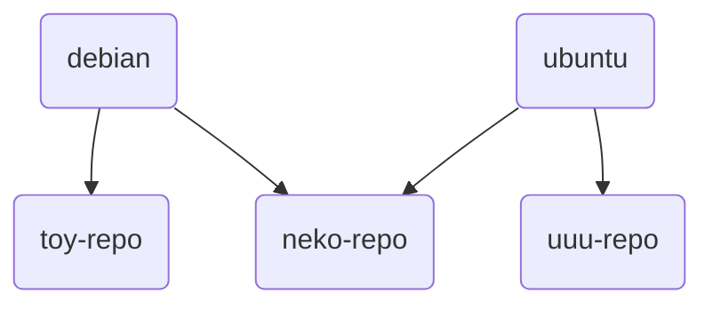

# 鏡像源

- [1. 開發歷程](#1-開發歷程)
  - [1.1. 始端](#11-始端)
  - [1.2. 整理與分析源](#12-整理與分析源)
  - [1.3. 後續工作](#13-後續工作)
  - [1.4. 最終結果](#14-最終結果)
- [2. debian-based 鏡像源](#2-debian-based-鏡像源)
  - [2.1. 快速上手](#21-快速上手)
  - [2.2. 詳細解析](#22-詳細解析)
    - [2.2.1. set-src-list](#221-set-src-list)
    - [2.2.2. region-code-repo](#222-region-code-repo)
    - [2.2.3. 軟件包解析](#223-軟件包解析)
    - [2.2.4. set-src-link](#224-set-src-link)
      - [2.2.4.1. region & link](#2241-region--link)
      - [2.2.4.2. unlink](#2242-unlink)
    - [2.2.5. 源文件解析](#225-源文件解析)
    - [2.2.6. 手動安裝](#226-手動安裝)

---

“二萌”在寫這個小功能前，開心地為“天萌”設計了“新”標語。

TMOE, More Optional Environments.

```rust,editable
pub enum Option<T> {
    Some(T),
    None,
}
```

> 上面那段代碼是 rust 標準庫中很經典的一段定義

“二萌” 在打完之後，暗自感嘆：這段代碼與 **TMOE** 的結合是多麼巧妙呀！

在數日後，“二萌”以與預想完全不同的形式寫完了這個功能，然後默默刪掉了那段 rust 代碼。

求“二萌”的心路歷程？

## 1. 開發歷程

### 1.1. 始端

在很久之前，曾經有人希望“天萌”能支持這個功能：在容器初始化前，手動配置軟件源。  
二萌當初説：“如果只是加個 ustc 源的選項，那麼不改也可以。 如果要考慮到德國、法國和英國等國家的鏡像源，那就得要改了。”  
此處的“改”指的是修改邏輯。  
二萌當初就想要做個新的換源功能了。

### 1.2. 整理與分析源

二萌最開始打算用 rust 來寫。  
不管用什麼語言寫，最開始的時候，都必須要有一份源列表。  
比如説，debian 官方的 [worldwide mirror list](https://www.debian.org/mirror/list)  
不過 debian 官方列表的源太少了，應該還有更多的源吧。  
於是，二萌開開心心地踏上了蒐集和整理世界上各個國家和地區的軟件源的旅途了 ~~,然後一去不復返了~~  
~~(想要我的寶藏嗎？都給你吧！人們對此趨之若騖，二萌也踏上了征程，從此世界進入了新時代。)~~  
這麼簡單的事情只需要幾個小時就能搞定了吧！  
然而，事情並沒有那麼簡單。  
二萌只能告訴您，這件事花了很多天，盡是些髒活和累活。

如果一個源提供了 debian 鏡像，那它不一定有 debian-security 鏡像。  
如果一個源提供了 ubuntu 鏡像，那它不一定有 debian 鏡像。  
如果一個源支持 http， 那它不一定支持 https。  
二萌只是簡單地舉了幾個例子，是不是讓數據分析的工作變得麻煩起來了呢？

### 1.3. 後續工作

因為二萌已經把髒活和累活都幹完了，所以接下來的工作就不難了。  
二萌可以用 rust 寫一個 TUI 換源工具，然後通過解析外部的 **軟件源.toml** 來實現換源， 也可以直接把源列表硬編碼進程序內部。  
為了更廣的適用性，這個工具應該還得要支持 CLI。  
可是二萌那時已經很累了，不想再做太多額外的工作了。

在換源過程中，可能要給軟件源文件創建軟鏈接。

```rust
use std::os::unix::fs;

fn main() -> std::io::Result<()> {
    fs::symlink("/etc/tmoe/repo/src/debian/xxyy.source", "/etc/apt/sources.list.d/mirror.source")?;
    Ok(())
}
```

如果只是 CLI, 使用上面那種方法創建軟鏈接，真的會比 `ln -s` 更高效，更安全嗎？

> 其實 rust 可以直接調用系統的 `ln`

不過這不是關鍵，關鍵是不同架構要用不同的包。  
這在極端情況下有點不太好。

> 什麼是極端情況？  
> 您可以去回顧一下本書的“買口罩問題”。

二萌想了想，覺得這已經變成了為了用 rust 而用 rust 了。  
語言只是工具，我們在使用前應該考慮它的適用範圍。

### 1.4. 最終結果

二萌最後為每一個源都打了一個包，並且每個源都依賴了一個用 dash 寫的小腳本（`set-src-link`）。

> 對於 only for debian-based 的發行版來説，用 dash 寫腳本還是挺好的。  
> 二萌在很久之前曾用過某個只有 `dash` ，沒有 `bash` 的 debian-based 發行版。  
> `dash` 雖然會比 `bash` 更快， 但是不適合交互式操作  
> TUI 和 CLI 並不衝突，或許有一天，二萌會再給這個小功能寫個前端。  
> 嗯，還是 rust, 用 rust 寫 TUI 前端。

對於 debian 和 ubuntu 通用的源的 deb 包，二萌把它們放到了 neko 倉庫。

<div style="display:none">

</div>


## 2. debian-based 鏡像源

對於 debian，您在安裝完 `neko-repo` 後，就可以通過 `apt` 來安裝 debian 的鏡像源了。  
其實這個功能還可以給 kali 和 mint 用。  
但是呢！ 並非所有鏡像源都支持它們。  
提供 ubuntu 鏡像源的網站不一定會同時提供 mint 源。

> 如果您正在使用其他 debian-based 的發行版，請告訴“二萌”，“二萌” 會為它適配。

### 2.1. 快速上手

如果您不明白下面的命令的具體意義，那麼請不要直接運行。  
在下一小節中，我們將會對其進行解析。

```sh
sudo set-src-list dis
sudo apt update
sudo apt install ustc-linux-user-group-cn-repo
sudo apt update
```

### 2.2. 詳細解析

#### 2.2.1. set-src-list

> `set-src-list` 由 `neko-repo` 提供

首先，運行 `set-src-list`  
它輸出的內容為：

```sh
-d | dis | disable: disable src list
-e | en | enable: enable src list

Note: This is a dangerous operation.
If you run "set-src-list dis", then it will move your "/etc/apt/sources.list" to "/etc/apt/sources.list.bak"
If you run "set-src-list en", then it will move your "sources.list.bak" to "sources.list"
```

這個工具非常簡單，簡單到您會懷疑它是否能被稱為“工具”。

以 root 身份執行 `set-src-list dis` , 它將 **/etc/apt/** 目錄下的 "sources.list" 重命名為 "sources.list.bak"。  
`set-src-list en` 與上面執行相反的操作。

> 作用：在換源前禁用原來的軟件源。

#### 2.2.2. region-code-repo

> 如果您不知道具體區域代號是什麼，那麼請翻閲“附錄”中的“區域代號”章節。

使用 `apt` 搜索您所在國家或地區的鏡像倉庫。

"United States": US

```sh
apt search us-repo$
```

"Germany": DE

```sh
apt search de-repo$
```

"China": CN

```sh
apt search cn-repo$
```

```log,editable
opentuna-cn-repo/neko,now 0.0.1-2 all [已安裝]
  OpenTUNA(China)

shanghai-jiaotong-university-cn-repo/neko,now 0.0.1-2 all [已安裝]
  Shanghai Jiaotong University 上海交通大學鏡像源(China)

sohu-cn-repo/neko 0.0.1-2 all
  搜狐鏡像源(China)

tencent-cloud-cn-repo/neko 0.0.1-2 all
  Tencent Cloud 騰訊雲鏡像源(China)

ustc-linux-user-group-cn-repo/neko 0.0.1-2 all
  中國科學技術大學鏡像源(China)
```

> 實際上，0.0.1-4 修復了 debian (old-stable) 的一些小細節問題，這裏還是 0.0.1-2  
> 在下文介紹源文件時，將會提到相關內容，因此不更新也沒關係。

然後我們以 root 權限運行 `apt` 來安裝軟件包。

```sh
apt install opentuna-cn-repo
```

#### 2.2.3. 軟件包解析

先拆開來看看

```log,editable
├── control
│   ├── conffiles
│   ├── control
│   ├── md5sums
│   ├── postinst
│   └── postrm
└── data
    ├── etc
    │   └── tmoe
    │       └── repo
    │           └── src
    │               ├── debian
    │               │   ├── opentuna-cn-repo_old.sources
    │               │   ├── opentuna-cn-repo_sid.sources
    │               │   └── opentuna-cn-repo_stable.sources
    │               └── ubuntu
    │                   ├── opentuna-cn-repo_ports.sources
    │                   └── opentuna-cn-repo.sources
    └── usr
        └── share
            └── doc
                └── opentuna-cn-repo
                    └── changelog.Debian.gz
```

`postinst` 調用了 `set-src-link` 去創建軟鏈接。  
`postrm` 調用了 `set-src-link` 的 `unlink` 子命令去刪除軟鏈接。  
假如您的系統是 ubuntu jammy (amd64), 那麼它會將 **opentuna-cn-repo.sources** 修改為 jammy 的源，並將其軟鏈接到 "/etc/apt/sources.list.d/cn-mirror.sources"。  
如果您用的是 linuxmint vanessa， 那麼它會自動合併 ubuntu 和 vanessa 的源，並將源文件軟鏈接到 "/etc/apt/sources.list.d/cn-mirror.sources"。

如果您使用的是 us-repo, 而不是 cn-repo, 那麼它就會將源文件軟鏈接到 "/etc/apt/sources.list.d/us-mirror.sources"。

相同區域的鏡像包會被上一個安裝的包覆蓋掉，不同區域的不會。

比如説，您現在安裝了 `mirrors-bfsu-edu-cn-repo`， 那麼現在的 cn 源是 bfsu。  
您再安裝了 `shanghai-jiaotong-university-cn-repo`，那麼 cn 源就變成了 sjtu。  
此時，您再安裝了 `xtom-de-repo`，**/etc/apt/sources.list.d/** 會多出一個 de 源，它跟 cn 源並不衝突。

在一般情況下，您只需要安裝您的服務器/pc 所在區域的鏡像源即可。  
除非您有充分的理由，否則請不要在一台設備上安裝不同區域的鏡像源。

#### 2.2.4. set-src-link

在上一小節中，我們提到了 `set-src-link`，在本小節中，我們將對其進行深入解析。

在您安裝或卸載鏡像源 的 deb 包時， `set-src-link` 會被自動調用，您無需手動去調用它。

簡單來説，`set-src-link` 只做兩件事。

- 1.創建軟鏈接
  - 在創建前，它會自動判斷您的發行版。對於 ubuntu, 它還會判斷您的架構。
- 2.刪除軟鏈接

運行 `set-src-link -h`  
輸出的內容是：

```sh,editable
set-src-link 0.0.1
Set the symbolic link for the mirror source.

Usage:
 set-src-link [flags]<string>
 set-src-link [flags] [flags]
 set-src-link <subcommand> [flags]<string>

Flags:
 -n, --name <mirror-name>      set the mirror name
 -r, --region <iso-code>       set the region <ISO 3166-1 Alpha-2 code>

 -h, --help                    display help information
 -V, --version                 display version

Subcommand:
    unlink

Example:
 set-src-link -n -h
 set-src-link --region --help
 set-src-link unlink -r us
```

> `set-src-link` 需要以 root 身份運行，否則將無法修改 `/etc/apt/sources.list.d/*-mirror.sources`

##### 2.2.4.1. region & link

獲取 region 的幫助信息

```sh
set-src-link -r -h
```

`-n` 後面接的是 deb 包的包名。

創建軟鏈接

```sh
set-src-link -r cn -n opentuna-cn-repo
# os: debian
# code: sid
# '/etc/apt/sources.list.d/cn-mirror.sources' -> '/etc/tmoe/repo/src/debian/opentuna-cn-repo_sid.sources'

set-src-link -r us -n opentuna-cn-repo
# os: debian
# code: sid
# '/etc/apt/sources.list.d/us-mirror.sources' -> '/etc/tmoe/repo/src/debian/opentuna-cn-repo_sid.sources'
```

##### 2.2.4.2. unlink

```sh
set-src-link unlink
```

輸出了以下內容

```sh
Error, you should add "--region" to specify your region
```

只要指定區域就能解決了

```sh
set-src-link unlink -r cn
# unlink /etc/apt/sources.list.d/cn-mirror.sources

set-src-link unlink -r de
# unlink /etc/apt/sources.list.d/de-mirror.sources

set-src-link unlink -r us
# unlink /etc/apt/sources.list.d/us-mirror.sources
```

#### 2.2.5. 源文件解析

您如果之前曾有過手動更換 debian/ubuntu 源的經歷，那麼應該會知道 debian 傳統的 one-line-style 源格式。

```list
deb http://mirrors.bfsu.edu.cn/debian/ sid main non-free contrib
```

與傳統的 one-line-style 不同，天萌使用的是更現代化的 deb822-style。  
此格式要求 apt 的版本 >= 1.1.0。  
因此它在默認情況下不兼容 debian 8(Jessie)。

讓我們來看看裏面有什麼吧！

以 debian buster （old-stable）為例。  
實際上，buster 的 suites 和 bullseye 是有區別的。  
除了 security 源的區別外，backports 也應該使用不同的源。  
不能簡單地將 "stable-backports" 替換為 "old-stabe-backports"

此外，如果這個鏡像源不包含 "debian-security" 鏡像，那麼它默認會啓用官方的 security 源，並禁用鏡像 security 源。  
如果它不支持 https, 那麼 uris 那裏顯示的是 **http://** 開頭的 uri 。  
在使用 neko-repo 的鏡像源 deb 包的情況下，您不需要手動去判斷它支不支持 `https` 等東西。

雖然這些只是小細節問題，不過説實話，“天萌”的開發者很羨慕“天萌”的用户。  
您真的很幸福，不需要去了解那些細節，就能用到這麼好用的工具了。

```sh
cat /etc/apt/sources.list.d/cn-mirror.sources
```

```yaml
name: Debian
# yes or no
enabled: yes
# types: deb deb-src
types: deb
uris: https://mirrors.bfsu.edu.cn/debian/
suites: buster
components: main contrib non-free
# architectures: amd64 arm64 armhf i386 ppc64el s390x mipsel mips64el
# --------------------------------

name: Debian updates
enabled: yes
# types: deb deb-src
types: deb
uris: https://mirrors.bfsu.edu.cn/debian/
suites: buster-updates
components: main contrib non-free
# --------------------------------

name: Debian backports
enabled: yes
# types: deb deb-src
types: deb
uris: https://mirrors.bfsu.edu.cn/debian/
# For debian old-stable, you should use "old-stable-backports-sloppy", instead of "old-stable-backports".
# https://backports.debian.org/Instructions/#:~:text=Old-stable-sloppy
# suites: buster-backports
suites: buster-backports-sloppy
components: main contrib non-free
# --------------------------------

name: Debian security
enabled: yes
# types: deb deb-src
types: deb
uris: https://mirrors.bfsu.edu.cn/debian-security/
suites: buster/updates
components: main contrib non-free
# --------------------------------

name: Official security
enabled: no
# types: deb deb-src
types: deb
uris: https://deb.debian.org/debian-security/
suites: buster/updates
components: main contrib non-free
# --------------------------------

name: Proposed updates
enabled: no
# types: deb deb-src
types: deb
uris: https://mirrors.bfsu.edu.cn/debian/
suites: buster-proposed-updates
components: main contrib non-free
# --------------------------------
```

`enabled` ：是否需要啓用這個源，可選 yes 或 no  
`types`: 類型，一般情況下用 **deb**, 若有獲取源代碼的要求，就用 **deb deb-src**

除了上面介紹到的內容外，deb822-style 還支持其他的 key 。

例如:

使用 signed-by 指定 OpenPGP 公鑰。

```yaml
signed-by: /usr/share/keyrings/tmoe-archive-keyring.gpg
```

#### 2.2.6. 手動安裝

這適用於極端情況。  
只有當您的環境同時滿足以下三種情況時，才需要手動安裝。

- 不支持 https（沒有 ca 證書）
- 沒有常規下載工具
- 訪問官方源的速度很慢

首先，在一台已經安裝 neko-repo 的設備上，手動下載相關的 deb 包。

> 您可以將 opentuna-cn-repo 替換為其他倉庫

```sh
apt download set-src-link
apt download neko-repo
apt download opentuna-cn-repo
```

接着想辦法將這三個 deb 包傳輸到處於極端環境下的設備中。  
然後，在那個環境中運行：

```sh
apt install --no-install-recommends ./neko*.deb
set-src-list dis
apt install ./set-src-link*.deb
apt install ./opentuna-cn-repo*.deb
apt purge -y neko-repo
apt update
```

您在哪種環境下會遇到這種極端情況呢？  
您使用了數個超精簡版的容器： kali ,mint, lmde, ubuntu focal, ubuntu jammmy , debian 9, 10, 11, 12 & sid。  
您可以很方便地使用 docker 的 `-v` 綁定宿主的 deb 包所在的目錄。

説實話，這種手動安裝的方法太麻煩了，在一般情況下，“二萌”一點兒都不推薦您這麼做。

---

至此，"repo" 篇正式完結。  
您如果之前從來沒有使用過 “天萌”，那麼看到此處就足夠了。  
對於老用户，您可以繼續看下一篇章。  
由於這是一個持續更新的項目，因此“二萌”之後可能還會續寫，敬請期待吧！
