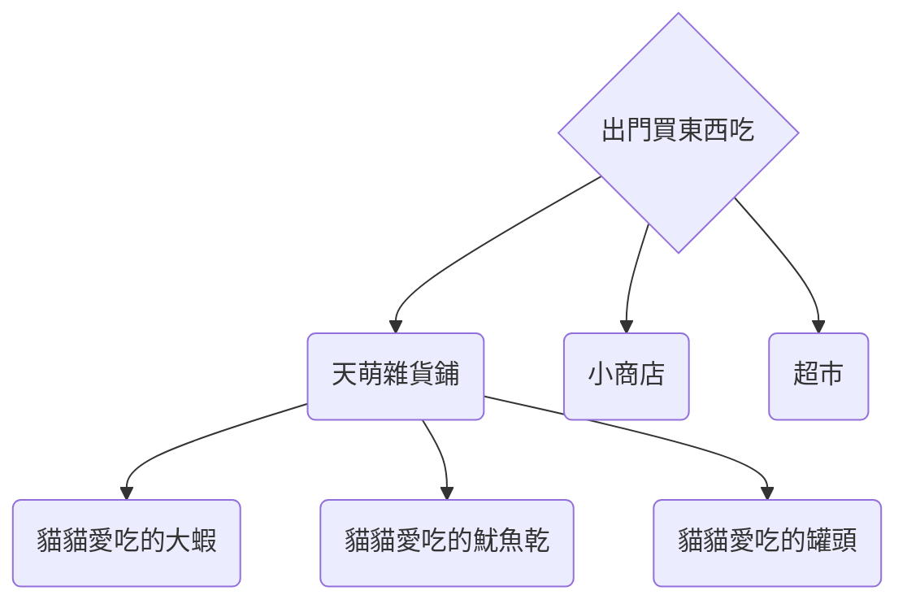

# 軟件的分發

## 獲取軟件包的途徑

獲取軟件包的最佳途徑是什麼？

對於某些人來説，可能是手動編譯。  
因為他們需要高度的可自定義化。

> “二萌”見過有些人用編譯安裝只是為了那所謂的虛榮心。  
> 其實這對它來説可能不是最好的。

在沒有高性能服務器或 pc 的情況下，對普通用户來説，“二萌” 認為使用各個發行版的支持“二進制分發”的包管理器是最佳方案。  
對於一些服務類軟件，或者是特殊軟件，“容器/沙盒化方案”也能在舞台上一展風采。

## 軟件倉庫

 -->

“天萌” 從 edition 2022 開始提供軟件倉庫。  
之後“天萌”的開發者可能會將 edition 2021 也遷移到倉庫內。

在本篇中，我們 ~~將介紹如何來到天萌的雜貨鋪，以及小鋪裏有什麼好吃的小零食。😋~~  
 將介紹如何安裝天萌的倉庫，並介紹一些包，以及它對應的功能。
