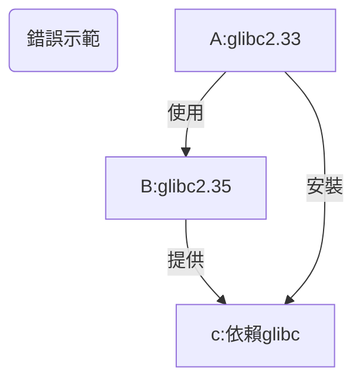

# 新增倉庫

- [1. 快速上手](#1-快速上手)
  - [1.1. apt](#11-apt)
    - [1.1.1. debian](#111-debian)
    - [1.1.2. ubuntu](#112-ubuntu)
    - [1.1.3. termux](#113-termux)
  - [1.2. pacman](#12-pacman)
- [2. Debian-based (ubuntu, mint, kali)](#2-debian-based-ubuntu-mint-kali)
  - [2.1. 通用](#21-通用)
    - [2.1.1. 詳細說明](#211-詳細說明)
    - [2.1.2. neko-repo 詳情](#212-neko-repo-詳情)
    - [2.1.3. 更新公鑰](#213-更新公鑰)
  - [2.2. toy-repo](#22-toy-repo)
    - [2.2.1. 詳情](#221-詳情)
  - [2.3. uuu-repo](#23-uuu-repo)
    - [2.3.1. 說明](#231-說明)
- [3. Android](#3-android)
  - [3.1. termux](#31-termux)
    - [3.1.1. tinor](#311-tinor)
- [4. 題外話](#4-題外話)
  - [4.1. 您可能不需要了解的知識](#41-您可能不需要了解的知識)
  - [4.2. `doas` 與 `sudo`](#42-doas-與-sudo)

## 1. 快速上手

注意：
目前，儘管本專案相關倉庫已經搭建完成，但是絕大多數軟體包仍處於未完成狀態。  
之後，本專案的相關包名將可能會被命名為 `tmoe-2021`, `tmm` 和 `tmoe`

### 1.1. apt

#### 1.1.1. debian


```sh
su -c "apt update; apt install doas curl"
su -c "echo 'permit nopass $(id -un) cmd apt' >> /etc/doas.conf"

curl -LO l.tmoe.me/neko.deb
doas apt install ./neko.deb
rm -v neko.deb
doas apt update
doas apt install toy-repo
```

> 在題外話中，本專案開發者將介紹：為什麼使用 OpenBSD `doas` 而非 `sudo`

#### 1.1.2. ubuntu


```sh
sudo apt update
sudo apt install -y wget
wget l.tmoe.me/neko.deb
sudo apt install ./neko.deb
rm -v neko.deb
sudo apt update
sudo apt install uuu-repo
```

#### 1.1.3. termux


> File: termux.svg  
> License: CC BY-SA 4.0  
> Origin: Termux.com - <https://termux.com/>

```sh
curl -LO l.tmoe.me/tinor.deb
apt install ./tinor.deb
apt update
```

### 1.2. pacman


開發者還在咕咕咕中 ...

## 2. Debian-based (ubuntu, mint, kali)

從理論上說，您不應該混用 debian 和 ubuntu 的軟體源。  
因為這會破壞系統的依賴關係。

您如果之前一直都是這麼幹的，那麼需要多瞭解一下 debian。  
您可以閱讀 [debian 參考手冊（Osamu Aoki 青木修 著）](https://www.debian.org/doc/manuals/debian-reference/)。

### 2.1. 通用

那麼問題來了。  
既然混用源的問題這麼嚴重，那為什麼本專案還是有通用倉庫呢？

答案是：

- 靜態編譯
- 低版本依賴
- 以及 "all" 架構的軟體包。

實際上，對於不能通用的包來說，開發者會為它們建立單獨的倉庫。

對於 debian-based 發行版來說，本專案通用的倉庫名為 "neko"。

#### 2.1.1. 詳細說明

- 要求：

  - 系統版本： debian 9 (stretch) & ubuntu 16.04(xenial)
    - 依賴: `apt-transport-https`, `ca-certificates`
  - 系統版本：debian 10 (buster), ubuntu 18.04 (bionic) 及其以上的系統
    - 依賴: `ca-certificates`

以下例子將使用 `curl`  
您也可以換用其他下載工具，例如 `wget2` 或 `aria2`

> 以下內容可以直接編輯

```sh,editable
apt update
apt install -y curl

# 下載並安裝 tmoe 的 neko 倉庫
curl -LO https://l.tmoe.me/neko.deb
apt install ./neko.deb
# 這個 deb 包對您的系統做了什麼呢？
# 在 /etc/apt/sources.list.d/ 目錄下建立了源列表：
# neko-repo.sources (許可權為644,所屬為0:0)
# 在本書的換源部分將介紹這種格式
# 還有 OpenPGP(GnuPG) 公鑰：
# /usr/share/keyrings/tmoe-archive-keyring.gpg (許可權同上)
# 並且在 /etc/apt/preferences.d/50-neko-repository 中調整了軟體包優先順序
# 注：此 deb 包不依賴 gnupg(完整版)， 只需要 apt 自身依賴的 gpgv(簡化版gnupg) 就可以了

# 刪除 deb 包
rm -fv ./neko.deb
# 更新索引資訊
apt update
```

#### 2.1.2. neko-repo 詳情

```sh
apt show neko-repo
```

```yaml
Package: neko-repo
Version: 0.0.1-12
Priority: standard
Section: misc
Maintainer: Moe Master <m@tmoe.me>
Installed-Size: 30.7 kB
Provides: set-src-list, update-neko-key
Depends: apt (>= 1.1.0)
Recommends: ca-certificates
Suggests: curl | wget
Homepage: https://packages.tmoe.me/deb/dists/neko/
Download-Size: 5,232 B
APT-Manual-Installed: yes
APT-Sources: https://packages.tmoe.me/deb neko/main amd64 Packages
Description: Neko repository, QwQ
  It includes some useful packages.
  The minimum supported version of this repository is debian 9 (Stretch),
  you should not install it on debian 8 (Jessie).
```

讓我們來看一下 `neko-repo` 提供了什麼東西

- `set-src-list`
  - 我們將會在“倉庫/更換映象源”中介紹到它
- `update-neko-key`
  - 用於更新公鑰

#### 2.1.3. 更新公鑰

在極其特殊的情況下，neko 倉庫的 OpenPGP 公鑰可能會失效。  
在這種情況下，您就不能用 `apt-get install` 來更新 neko 倉庫的 keyring 了，而要用 `neko-repo` 自帶的一個命令。

執行

```sh
update-neko-key
```

它會輸出以下內容

```sh
It can update the OpenPGP pub keyring: "/usr/share/keyrings/tmoe-archive-keyring.gpg"

-d | --downloader: You can specify the downloader.

For example, you can run "update-neko-key -d curl" to use curl.
Run "update-neko-key -d wget" to use wget.
```

簡單來說，您需要手動指定一個下載器。  
現在只支援

- `curl`
- `wget`
- `wget2`
- `aria2c`

用法很簡單，以 root 身份執行 `update-neko-key -d curl`。

> 如果沒有 root 許可權，那麼它將無法修改 "/usr/share/keyrings/tmoe-archive-keyring.gpg"。

這個工具的邏輯非常簡單。

- 若您的系統已經安裝了 `gnupg`，那麼它將從相關倉庫獲取 [ascii 格式的 OpenPGP 公鑰](https://salsa.debian.org/mm/repo/-/blob/master/src/deb/debian/repo/common/neko-repo/current/tmoe-archive-keyring.asc)，並將其轉換為二進位制格式，最後覆蓋原來的公鑰。
- 若您的系統沒有安裝 `gnupg`, 或者轉換過程出錯了，那麼它將直接從相關網站獲取二進位制格式的公鑰。

如果沒有意外的話，您可能十年都不需要呼叫此命令去更新公鑰。  
至於開發者能不能為本專案用愛發電十年就是另一回事了。

### 2.2. toy-repo

與 **neko-repo** 不同，**toy-repo** 並非完全通用的。
它只能給 **debian** 用，不能給 **ubuntu** 用。

#### 2.2.1. 詳情

```sh
apt show toy-repo
```

```yaml
Package: toy-repo
Version: 0.0.1-4
Priority: optional
Section: misc
Maintainer: Moe Master <m@tmoe.me>
Installed-Size: 19.5 kB
Depends: apt (>= 1.1.0), neko-repo
Suggests: ca-certificates
Homepage: https://packages.tmoe.me/deb/dists/toy
Download-Size: 2,484 B
APT-Manual-Installed: yes
APT-Sources: https://packages.tmoe.me/deb neko/main amd64 Packages
Description: A repository for debian only
  Toy is a wonderful thing.
  Let's keep our childishness and optimism!
  Go after the good things in the toy-repo!
  The source file will be placed in "/etc/apt/sources.list.d/toy-repo.sources"
```

遺憾的是，toy-repo(玩具倉庫)自身並沒有什麼有用的東西。  
有用的東西都在倉庫裡面，您需要以 root 身份執行 `apt install` 來安裝您心儀的玩具。

玩具是一個很美好的東西，開發者將其命名為 **toy**，並沒有抱著做“玩具專案” 這種消極的想法。  
與 debian 的 玩具總動員系列的代號類似。  
保持童真，以及積極向上的態度是非常重要的。  
**toy** 這個詞還包含了開發者對美好生活的嚮往。  
這個世界是非常複雜的，像孩童一樣追求著簡簡單單的快樂是一件非常非常幸福的事情。

### 2.3. uuu-repo

與 **neko-repo** 和 **toy-repo** 都不同。  
uuu 倉庫只能給 **ubuntu** 用，不能給 **debian** 用。

#### 2.3.1. 說明

uuu 倉庫對於 ubuntu 來說是通用的。

本專案之後可能還會有 "focal-repo" 這種只能給單獨的版本使用的倉庫。

## 3. Android

### 3.1. termux

#### 3.1.1. tinor

TINOR Is Not Official Repository.

把軟體包拆出來，看看裡面有什麼東西吧！

```tree, editable
├── control
│   ├── conffiles
│   ├── control
│   ├── md5sums
│   ├── postinst
│   └── postrm
└── data
    └── data
        └── data
            └── com.termux
                └── files
                    └── usr
                        ├── bin
                        │   ├── set-src-list
                        │   └── update-tinor-key
                        ├── etc
                        │   └── tmoe
                        │       └── repo
                        │           └── apt
                        │               ├── preferences.d
                        │               │   └── 50-tinor
                        │               └── sources.list.d
                        │                   └── tinor.sources
                        └── share
                            ├── doc
                            │   └── tinor-repo
                            │       ├── changelog.Debian
                            │       └── copyright
                            └── keyrings
                                └── tmoe-archive-keyring.gpg
```

在安裝 deb 包，執行 `postinst` 的 **configure** 階段時， `postinst` 會在 `$PREFIX/etc/apt/sources.list.d` 和 `$PREFIX/etc/apt/preferences.d` 處建立與 **tinor** 相關的軟連結；  
解除安裝軟體包，執行 `postrm` 的 **purge** 或 **remove** 階段時，`postrm` 會自動刪掉軟連結。

可以看出來，它的結構與 `neko-repo` 是極其相似的，只是路徑不一樣。

## 4. 題外話

### 4.1. 您可能不需要了解的知識

<div style="display:none">

</div>


如果您一定要混用軟體源, 那麼請在高版本系統中使用低版本系統的源。  
否則將出現以下的情況：  
比如系統 A 的 glibc 版本是 2.33，B 是 2.35。  
B 的某個軟體 b 依賴了 glibc。  
如果您在 A 上用了 B 的源，然後又安裝了 b ，那麼 glibc 可能也被升到了 2.35。  
這時候 A 上一大堆系統相關軟體要麼跟著升級，要麼可能會出現不可預料的“不穩定性”。

如果您想要將一個系統完全變成另一個系統的模樣，那麼結論與上面完全相反，您得要像上面那張流程圖那樣做才行。  
這樣做相當於從低版本系統升級到高版本。

比如說您想要將 debian 更換為 kali 源，這時候應該用低版本的 debian stable 新增高版本的 kali rolling 源，而不能用高版本的 debian sid 來新增低版本 kali rolling 源。

> 這裡的高低是相對而言的。

在使用完 `apt dist-upgrade` 更新完所有軟體包後，您的系統的內部就已經變成 kali 的形狀了。  
在沒有快照或備份的情況下，這麼做就已經回不了頭了。

### 4.2. `doas` 與 `sudo`

Q: 為什麼是 `doas`， 而非 `sudo`?

A: 截至 2022-06-20，相較於 `sudo`, `doas` 的程式碼量更少，出現安全漏洞的頻率也更低。

從客觀的角度來看：因為用的人少，所以安全漏洞被揭露的可能性更低。  
從 2moe 個人（主觀）的角度來看：OpenBSD 那邊對安全問題可能會更走心一點。

> The doas tool was originally written for OpenBSD by Ted Unangst.
