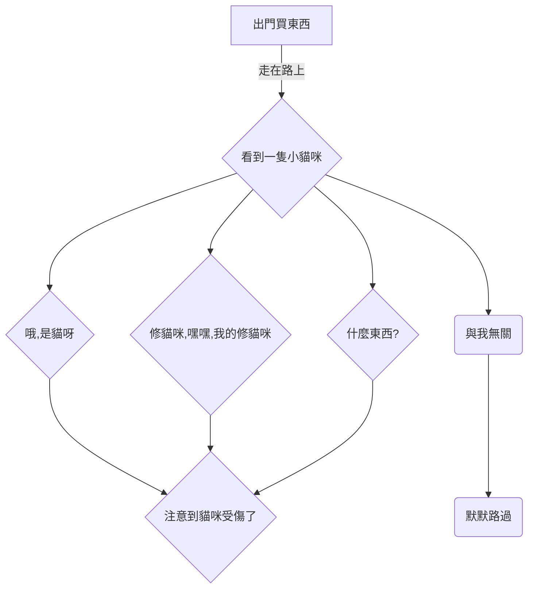

# 序章

中文 | [English](https://doc.tmoe.me/en/prologue.html)

- [宣告](#宣告)
- [如何閱讀這本書](#如何閱讀這本書)
- [使用場景](#使用場景)
  - [有意義與否](#有意義與否)
  - [android 、圖書館與 LaTex](#android-圖書館與-latex)
  - [iOS、旅館與 manjaro+goland](#ios旅館與-manjarogoland)
  - [其他場景](#其他場景)
- [題外話](#題外話)
  - [關於之前的文件](#關於之前的文件)

> 下文將用“本書”來代指“本手冊”。

## 宣告

對於普通使用者來說，本專案自身沒有任何價值。  
本書亦是如此。  
這裡沒有輕小說中“劍與魔法”的奇幻異世界冒險歷程, 更沒有《詩經》中“墮山喬嶽，允猶翕河”般遼闊壯美的風景。  
有的只是無聊透頂的內容。

對於非普通使用者來說，它的價值主要取決於使用場景。

> 在本章的“使用場景”中，我們將簡單介紹相關內容。

若在同一場景下，存在更優的替代品，那麼您不妨敞開胸懷，給本專案多提幾個 issues。  
或許有一天，世界會變得更加美好呢！

<!--
我們在很久之前，就已經知道了：多肽鏈的盤曲、摺疊方式及其形成的空間結構的千差萬別，這是蛋白質多樣性的原因之一。
而結構的多樣性決定了功能的多樣性。
類比本專案，由於本專案在架構設計上的不合理，因此對於 edition 2021，除了 android 外，開發者只建議您在容器環境中使用。
-->

除了 android 外，對於某些功能或工具，本專案的開發者若未將其打成包（例如 deb 包），並且未在本書中對其進行詳細解析，那麼只建議您在容器中使用。  
對於 android, 請翻閱 “容器/android”。

> old-version 的內容會被新版所替代，新版將會放在 dev 分支。  
> Trust us. 未來會更好的!

## 如何閱讀這本書

在閱讀本書時，您需要了解的內容。

> 本頁面由 [mdbook](https://github.com/rust-lang/mdBook) 生成。

- 左上角的三條槓 "≡"
  - 點選三條槓開啟目錄
- 頁面最下方的評論區
  - 您可以使用 github 帳號登入，您發表的內容將與 "github discussions" 保持同步。
  - 同理，如果您在 discussions 中找到當前章節的討論頁面，並在裡面發表內容，那麼相關內容也會同步到下方的評論區。
- 左上角的畫筆 "🖌️"
  - 先點選畫筆，再選擇主題，最後完成切換
- 左下角的 "<" 符號
  - 點選 "<" 跳轉到上一頁
- 右下角的 ">" 符號
  - 點選 ">" 跳轉到下一頁

> 如果您的網頁（螢幕）顯示空間足夠寬，那麼"<" 和 ">" 將位於中間，而不是下方。

## 使用場景

本專案存在的意義:

- 在合適的場景下，您使用本專案去做一些有趣或有意義的事情。

對您來說有意義的事情，對本專案而言，亦是如此。

You can do something interesting or meaningful.

### 有意義與否

有意義與否並非如 `bool` 型別那般非 `true` 即 `false`。  
它是相對的，而非絕對。  
在這裡我們並不想深入去探求哲學問題，簡而言之，這個問題的答案因人而異，沒有絕對的標準。

> 問題：什麼是意義不大的事情呢？

假設存在以下兩個場景：

- 1.您在 arm64 裝置上模擬 x64 環境，然後在上面打！遊！戲！
- 2.您在 arm64 裝置上遠端連線到 x64 windows 裝置，然後執行 windows x64 平臺的遊戲。

前者花了一小時，而後者花了五分鐘。

---

> 主觀回答 1：
> 前者可能是有趣的，但是意義相較於後者而言，可能沒有那麼大。  
> 時間是很寶貴的，我希望大家能把時間花在更有意義的事情上，而不是浪費時間。

---

> 主觀回答 2：
> 我既沒有電腦，也租不起 x64 虛擬專用伺服器，更玩不起雲遊戲，在手機上體驗 windows 遊戲讓我感受到了快樂，我認為這是值得的，並且是有意義的。

---

在下文中，我們將會假設幾個場景，您可以對其進行評價，判斷其是否有意義。

### android 、圖書館與 LaTex

- 地點：圖書館
- 裝置：android 手機/平板 (無 root)
- 條件：無網路，或網路狀態不佳 (網速很慢)


- 描述：您在圖書館裡，帶著 android 手機/平板，在離線環境下，執行 gnome + LaTex 環境（texlive-full） + LaTex 編輯器，在上面用 LaTex 編輯器寫文章/排版。

### iOS、旅館與 manjaro+goland

- 地點：旅館、酒店、餐廳、銀行或電信營業廳（等網路良好的場所）
- 裝置：iPhone/iPad (或其他帶有瀏覽器的裝置)
- 條件：網路環境優秀（至少要良好）
- 描述：您出門在外，只帶了 ios 裝置。可是您做夢都想要用 `idea`, `clion` 和 `goland`。  
  github 的 codespace (線上版 vscode) 可以執行不同的環境，於是您將 tmoe 的 gui 容器直接作為 codespace 的 devcontainer。
  在上面跑 gui (xfce), 再跑 goland。

> 在 vscode 上跑 jetbrains goland, 這何嘗不是一種 PV 呢？關於 PV 的說明，詳見本章的“題外話”。

- 教程：
  - 說明：
    - 截至 2022-06-15, github 官方並沒有提供基於 manjaro 的 xfce 環境（容器映象）。
    - 儘管 github 的 codespace （vscode）外掛自帶了生成配置的功能，但是之後本專案開發者可能會寫個類似功能的小工具。從而讓大家更省心一點。
  - 準備：
    - 您擁有一個支援 codespace 的 github 賬號
    - 若顯示區域不夠寬，則您可能需要將瀏覽器（如 safari）切換為桌面版網站（檢視）
  - 開始：
    - 成功連線到 codespace 後，開啟 vscode 內建終端，並在專案目錄下執行以下操作

```json
mkdir -p .devcontainer
cd .devcontainer
cat >devcontainer.json<<-'EOFJSON'
// For format details, see https://aka.ms/devcontainer.json.
{
    "name": "Manjaro",
    "dockerFile": "Dockerfile",
    "runArgs": [
        "--cap-add=SYS_PTRACE",
        "--security-opt",
        "seccomp=unconfined"
    ],
    // "mounts": [
    //     "source=dind-var-lib-docker,target=/var/lib/docker,type=volume"
    // ],
    "mounts": [
        "source=/var/run/docker.sock,target=/var/run/docker.sock,type=bind"
    ],
    "overrideCommand": false,
    // Configure tool-specific properties.
    "customizations": {
        // Configure properties specific to VS Code.
        "vscode": {
            // Add the IDs of extensions you want installed when the container is created.
            "extensions": [
                // "MS-CEINTL.vscode-language-pack-zh-hans",
                "ms-azuretools.vscode-docker"
            ]
        }
    },
    // Use 'forwardPorts' to make a list of ports inside the container available locally.
    "forwardPorts": [
        5902
    ],
    // Use 'postCreateCommand' to run commands after the container is created.
    // "postCreateCommand": "docker --version",
    // Comment out to connect as root instead. More info: https://aka.ms/vscode-remote/containers/non-root.
    // "build": {
    //     "args": {
    //         "ENABLE_NONROOT_DOCKER": "false"
    //     }
    // },
    "remoteUser": "ddk"
}
EOFJSON

cat > Dockerfile<<-'EOFDKF'
# syntax=docker/dockerfile:1
#---------------------------
# FROM cake233/manjaro-zsh-amd64

FROM cake233/manjaro-xfce-amd64

# set username & group
ARG USERNAME=ddk
ARG GROUPNAME=ddk
# ARG USER_UID=1001
# ARG USER_GID=$USER_UID

# rm cn mirrorlist
RUN sed -e '/bfsu.edu.cn/d' \
    -e '/tuna.tsinghua.edu.cn/d' \
    -e '/opentuna.cn/d' \
    -i /etc/pacman.conf

# install dependencies
# live server: https://docs.microsoft.com/en-us/visualstudio/liveshare/reference/linux#install-linux-prerequisites
RUN pacman -Syu \
    --noconfirm \
    --needed \
    base \
    base-devel \
    git \
    lib32-gcc-libs \
    lib32-glibc \
    gcr \
    liburcu \
    openssl-1.0 \
    krb5 \
    icu \
    zlib \
    gnome-keyring \
    libsecret \
    desktop-file-utils \
    xorg-xprop \
    xdg-utils

# locale: Chinese Simplified (China)
ENV LANG=zh_CN.UTF-8

# add new user
RUN groupadd --force ${GROUPNAME} \
    && useradd --create-home --gid ${GROUPNAME} ${USERNAME} \
    && mkdir -p /etc/sudoers.d \
    && echo "${USERNAME} ALL=(ALL) NOPASSWD:ALL" > /etc/sudoers.d/ddk \
    && chmod 400 /etc/sudoers.d/ddk

WORKDIR ["/home/$USERNAME"]

# clean cache
RUN yes | pacman -Scc; \
    rm -rf /var/cache/pacman/pkg/* \
    /tmp/* \
    2>/dev/null

# command: sleep infinity
CMD [ "sleep", "inf" ]
EOFDKF
```

rebuild：

- 1.按下 F1 或 Ctrl+Shift+P 或 cmd+shift+p
- 2.搜尋 rebuild
- 3.選擇 Codespaces: Rebuild container

> 您也可以手動選擇“遠端資源管理器”，再選擇 Codespace, 最後點選 rebuild container 的 圖示。

上面已經做了 docker in docker 的配置。  
如果需要在裡面跑 docker 的話，那就執行以下操作：

- 安裝 docker： `sudo pacman -Syu docker`
- 將 ddk 使用者加入到 docker 使用者組： `sudo usermod -aG docker ddk`

> `ddk` 可以修改為其他使用者名稱。
> 關於上述命名的來源，詳見“題外話”

關於 vnc

進入了 codespace 環境後，在內建終端裡執行以下操作

- 執行 `tmoe`
- 先選擇語言環境，再選擇 tools
- 接著選 software， 然後選 dev
- 安裝 goland, clion 或其他 IDEs
- 退出 tools

由於此容器映象已經預裝了 xfce, 因此您無需重複安裝。

對於網頁連線的 codespace:

- 執行 `novnc`，設定密碼
- 開啟埠轉發處的 `36080` 對應的 local address

對於本地 vscode 連線的 codespace：

- 執行 `startvnc`
- 開啟 vnc 客戶端，輸入本地 vnc 地址(預設是 127.0.0.1:5902)。

### 其他場景

序章中描述的內容是有限的，更多內容分佈於本書的其他章節。  
對於其他場景，例如：您想要使用 github actions 來編譯不同架構的軟體，那麼可以去看看 “容器/docker”。

## 題外話

注意：  
題外話對您來說，可能是**沒有意義**的，甚至有可能會引起您的**反感**。  
開發者建議您開啟目錄，並跳轉至其他章節。

---

Q: 為什麼是 `ddk`

A: 有個叫 `ddk` 的使用者，給本專案提了個與 `codespace` 相關的 issue, 於是他就“青史留名”了。  
(￣ ▽ ￣)
其實非本專案相關的 Issue 發在 discussions 裡會更好。

Q: 什麼是 `PV`

A: 這是理想氣體狀態方程。
`PV=nTR`

- 解析：
  - P: 壓強
  - V: 氣體體積
  - n: 物質的量
  - T: 熱力學溫度
  - R: 氣體常數

您可能不知道的冷知識：
2moe 之前在某個漫畫網站上，看到過一本漫畫，它的標題是 ~~《wopd ybww bwpy qmbw PV levl, soyi yeyc PV qmbwde nvpgyz》~~

<!-- <font style="background: black"></font> -->

哎呀，這孩子物理應該學得還不錯吧！

> 這只是標題吸引人而已，好孩子不要去看。

### 關於之前的文件

之前的文件使用了下面這種風格來描述。  
現在正在逐步“改進”。

<div style="display:none">

</div>


上述流程圖換成短篇漫畫可能會更好。  
開發者只是希望使用者不要冷眼旁觀，有問題要及時反饋。

咱是知道有人在罵的，可是他並沒有反饋。  
就像是這篇文件，寫得不好也可以改呀！
