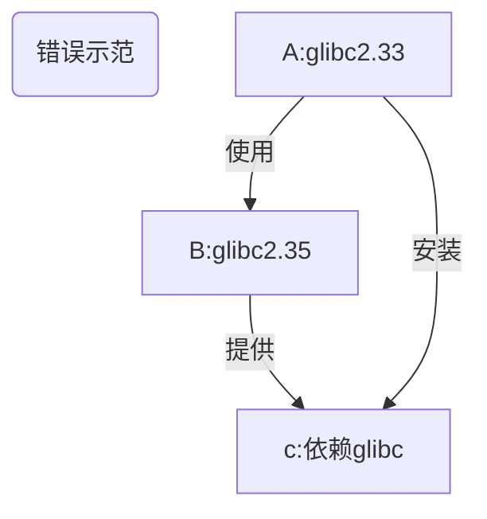
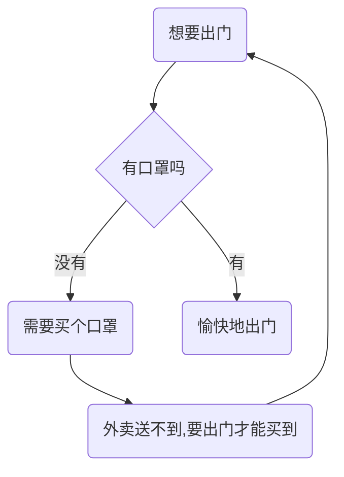

# 添加仓库

- [1. debian-based (ubuntu, mint, kali)](#1-debian-based-ubuntu-mint-kali)
  - [1.1. 您可能不需要了解的知识](#11-您可能不需要了解的知识)
  - [1.2. 通用](#12-通用)
    - [1.2.1. 简单说明](#121-简单说明)
    - [1.2.2. 详细说明](#122-详细说明)
    - [1.2.3. neko-repo 软件包详情](#123-neko-repo-软件包详情)
    - [1.2.4. 更新公钥](#124-更新公钥)
    - [1.2.5. new-neko](#125-new-neko)
  - [1.3. toy-repo](#13-toy-repo)
    - [1.3.1. 快速安装](#131-快速安装)
    - [1.3.2. 详情](#132-详情)
  - [1.4. uuu-repo](#14-uuu-repo)
    - [1.4.1. 安装](#141-安装)
- [2. termux](#2-termux)
  - [2.1. tinor-repo](#21-tinor-repo)
    - [2.1.1. 安装](#211-安装)
    - [2.1.2. 详解](#212-详解)
    - [2.1.3. 更新公钥](#213-更新公钥)
- [3. 其他发行版](#3-其他发行版)

---

不同发行版需要添加的仓库是不一样的。  
等到时机成熟的时候，“二萌” 会改写之前的那个“小脚本”，让它自动为不同的发行版添加不同的仓库。  
如果您不知道那个 “小脚本”，那没有关系，看本章的内容就够了。

## 1. debian-based (ubuntu, mint, kali)

从理论上说，您不应该混用 debian 和 ubuntu 的软件源。  
因为这会破坏系统的依赖关系。

您如果之前一直都是这么干的，那么需要多了解一下 debian。  
“二萌” 强烈推荐您阅读 [debian 参考手册（Osamu Aoki 青木修 著）](https://www.debian.org/doc/manuals/debian-reference/)

### 1.1. 您可能不需要了解的知识

<div style="display:none">

</div>


如果您一定要混用软件源, 那么请在高版本系统中使用低版本系统的源。  
否则将出现以下的情况：  
比如系统 A 的 glibc 版本是 2.33，B 是 2.35。  
B 的某个软件 b 依赖了 glibc。  
如果您在 A 上用了 B 的源，然后又安装了 b ，那么 glibc 可能也被升到了 2.35。  
这时候 A 上一大堆系统相关软件要么跟着升级，要么可能会出现不可预料的“不稳定性”。

如果您想要将一个系统完全变成另一个系统的模样，那么结论与上面完全相反，您得要像上面那张流程图那样做才行。  
这样做相当于从低版本系统升级到高版本。

比如说您想要将 debian 更换为 kali 源，这时候应该用低版本的 debian stable 添加高版本的 kali rolling 源，而不能用高版本的 debian sid 来添加低版本 kali rolling 源。

> 这里的高低是相对而言的。

在使用完 `apt dist-upgrade` 更新完所有软件包后，您的系统的内部就已经变成 kali 的形状了。  
在没有快照或备份的情况下，这么做就已经回不了头了。

### 1.2. 通用

那么问题来了。  
既然混用源的问题这么严重，那为什么“天萌”还是有通用仓库呢？

答案是：静态编译，低版本依赖，以及 "all" 架构的软件包。  
实际上，对于不能通用的包来说，“二萌”会为它们建立单独的仓库。

对于 debian-based 发行版来说，“天萌” 通用的仓库名为 "neko"。

#### 1.2.1. 简单说明

```sh
curl -LO l.tmoe.me/neko.deb
sudo apt install ./neko.deb
sudo apt update
```

#### 1.2.2. 详细说明

以下例子将使用 `curl`  
您也可以换用其他下载工具，例如 `wget2` 或 `aria2`  
只要是个支持 **https** 的下载工具就行了  
对于 debian 9(stretch) & ubuntu 16.04(xenial),系统内必须要有 "apt-transport-https" 和 "ca-certificates"。  
对于 debian 10(buster), ubuntu 18.04 (bionic) 及其以上的系统，只要求有 "ca-certificates"。  
对于部分下载工具，"ca-certificates" 是默认被 recommended 的。  
假设您的系统是一个精简环境(例如：精简版容器)，里面既没有 ca 证书，也没有下载工具，而且访问官方源的速度很慢。  
在这种极端情况下，您可以考虑使用换源工具。
先换源，再安装下载工具。

> 实际上，天萌的 neko 仓库里包含换源的 deb 包。
> 不过天萌的网站会强制将 **http** 重定向为 **https**。

您如果想要用 neko 仓库的换源包，就必须要让系统支持 **https** (包含 ca 证书)。
可是官方源太慢了，您想要先换源，再安装 ca 证书。

这种情况变成了多年前的 “买口罩” 问题。

<div style="display:none">

</div>


埋个伏笔，在本书的“更换镜像源”的内容中，“二萌”将简单介绍一下 ~~如何才能买到口罩~~ （不是）  
在没有 **https** 支持的情况下，如何使用“换源 deb” 包。

在一般情况下，您可以直接用官方源来装 curl，不需要那么麻烦。

之所以不加 `sudo` 是因为新版天萌不打算强制依赖 `sudo` 了  
您可以换用其他类似于 `sudo` 的工具（例如 `doas`）

> 以下内容可以直接编辑

```sh,editable
apt update
apt install -y curl

# 下载并安装 tmoe 的 neko 仓库
curl -LO https://l.tmoe.me/neko.deb
apt install ./neko.deb
# 这个 deb 包对您的系统做了什么呢？
# 在 /etc/apt/sources.list.d/ 目录下创建了源列表：
# neko-repo.sources (权限为644,所属为0:0)
# 在本书的换源部分将介绍这种格式
# 还有 OpenPGP(GnuPG) 公钥：
# /usr/share/keyrings/tmoe-archive-keyring.gpg (权限同上)
# 并且在 /etc/apt/preferences.d/50-neko-repository 中调整了软件包优先级
# 注：此 deb 包不依赖 gnupg(完整版)， 只需要 apt 自身依赖的 gpgv(简化版gnupg) 就可以了

# 删除 deb 包
rm -fv ./neko.deb
# 更新索引信息
apt update
```

#### 1.2.3. neko-repo 软件包详情

让我们来看一下 `neko-repo` 提供了什么东西

```sh
apt show neko-repo
```

```yaml
Package: neko-repo
Version: 0.0.1-12
Priority: standard
Section: misc
Maintainer: Moe Master <m@tmoe.me>
Installed-Size: 30.7 kB
Provides: set-src-list, update-neko-key
Depends: apt (>= 1.1.0)
Recommends: ca-certificates
Suggests: curl | wget
Homepage: https://packages.tmoe.me/deb/dists/neko/
Download-Size: 5,232 B
APT-Manual-Installed: yes
APT-Sources: https://packages.tmoe.me/deb neko/main amd64 Packages
Description: Neko repository, QwQ
  It includes some useful packages.
  The minimum supported version of this repository is debian 9 (Stretch),
  you should not install it on debian 8 (Jessie).
```

第一个是 `set-src-list`，我们会在换源相关的内容中介绍到它，现在不急着说。  
第二个 `update-neko-key` 才是我们本次需要关注的重点。

#### 1.2.4. 更新公钥

在极其特殊的情況下，neko 仓库的 OpenPGP 公钥可能会失效。  
在这种情况下，您就不能用 `apt-get install` 来更新 neko 仓库的 keyring 了，而要用 `neko-repo` 自带的一个命令。

运行

```sh
update-neko-key
```

它会输出以下内容

```sh
It can update the OpenPGP pub keyring: "/usr/share/keyrings/tmoe-archive-keyring.gpg"

-d | --downloader: You can specify the downloader.

For example, you can run "update-neko-key -d curl" to use curl.
Run "update-neko-key -d wget" to use wget.
```

简单来说，您需要手动指定一个下载器。  
现在只支持`curl`, `wget`, `wget2` 和 `aria2c`。  
“二萌” 之后可能会用 rust 实现一个简单的下载器，然后让它调用那个下载器。  
用法很简单，以 root 身份运行 `update-neko-key -d curl`。  
如果没有 root 权限，那么它将无法修改 "/usr/share/keyrings/tmoe-archive-keyring.gpg"。

这个工具的逻辑非常简单。  
若您的系统已经安装了 `gnupg`，那么它将从 天萌的 debian salas 仓库获取 [ascii 格式的 OpenPGP 公钥](https://salsa.debian.org/mm/repo/-/blob/master/src/deb/debian/repo/common/neko-repo/current/tmoe-archive-keyring.asc)，并将其转换为二进制格式，最后覆盖天萌原来的公钥。  
若您的系统没有安装 `gnupg`, 或者转换过程出错了，那么它将直接从天萌的网站获取二进制格式的公钥。  
如果没有意外的话，您可能十年都不需要调用这个命令去更新天萌的公钥。  
至于“二萌”能不能为“天萌”用爱发电十年就是另一回事了。

#### 1.2.5. new-neko

本小节是“二萌”在设计 neko-repo 时写下的想法，由于还没有实现，因此本小节内容仅供参考。

您不需要了解的内容：

neko 仓库里包含了各种 ~~猫咪~~, 啊，不对，各种额外仓库，还有各种常年不更新的包。  
neko 仓库的包基本上是手动维护的，除了 non-free Component 的包外，其它进入该仓库的(main 和 contrib)包都经过了严格的测试。  
lihuacat(狸花猫) 仓库的包有一部分是通过 CI/CD 自动导入的，另一部分是手动维护的。  
pallascat(兔狲) 仓库的包大部分是自动导入的。  
至于 black-footed-cat 仓库，除非您想不开，否则不要用这个仓库。

从更新频率以及软件包版本来看，您可以将 天萌 的软件仓库简单理解为如下表格。

| suite        | repo             |
| ------------ | ---------------- |
| old-stable   | neko             |
| stable       | lihuacat         |
| unstable     | pallascat        |
| experimental | black-footed-cat |

因为 天萌 有些仓库会缺包，所以现阶段您需要搭配 neko 和 其他仓库使用。  
对于普通发行版来说，混用 stable + unstable 可能会破坏系统依赖关系。  
但是对于 天萌 的仓库来说，应该不会。  
因为 天萌 对于部分发行版的特定的包，不使用猫咪仓库。  
比如只能给 ubuntu 22.04 用的包的仓库，那是 jammy-repo;  
只能给 ubuntu 22.10 用的，那就是 kinetic-repo 了。

“二萌”之所以将 repo 相关的包放进 neko，并把 neko 定义为 old-stable。  
因为有些包是不需要经常更新的。~~才不是因为“二萌”懒呢！~~

### 1.3. toy-repo

与 **neko-repo** 不同，**toy-repo** 并不是完全通用的。
它只能给 **debian** 用，不能给 **ubuntu** 用。

#### 1.3.1. 快速安装

> 以下内容可编辑

```sh,editable
sudo apt update
sudo apt install toy-repo
sudo apt update
```

#### 1.3.2. 详情

```sh
apt show toy-repo
```

```yaml
Package: toy-repo
Version: 0.0.1-4
Priority: optional
Section: misc
Maintainer: Moe Master <m@tmoe.me>
Installed-Size: 19.5 kB
Depends: apt (>= 1.1.0), neko-repo
Suggests: ca-certificates
Homepage: https://packages.tmoe.me/deb/dists/toy
Download-Size: 2,484 B
APT-Manual-Installed: yes
APT-Sources: https://packages.tmoe.me/deb neko/main amd64 Packages
Description: A repository for debian only
  Toy is a wonderful thing.
  Let's keep our childishness and optimism!
  Go after the good things in the toy-repo!
  The source file will be placed in "/etc/apt/sources.list.d/toy-repo.sources"
```

遗憾的是，toy-repo(玩具仓库)自身并没有什么有用的东西。  
有用的东西都在仓库里面，您需要以 root 身份运行 `apt install` 来安装您心仪的玩具。

玩具是一个很美好的东西，二萌给它命名为 **toy**，并没有抱着做“玩具项目” 这种消极的想法。  
与 debian 的 玩具总动员系列的代号类似。  
保持童真，以及积极向上的态度是非常重要的。  
**toy** 这个词还包含了开发者对美好生活的向往。  
这个世界是非常复杂的，像孩童一样追求着简简单单的快乐是一件非常非常幸福的事情。  
如果有一天，二萌要做一个 linux 发行版， 那大概会用 **toy** 作为发行版的名称。

> 为什么不叫 tmoe-linux 呢？  
> 首先，tmoe-linux 并不是个发行版，只是个工具箱而已。  
> 其次，等到时机成熟的时候， tmoe-linux 要改名为 tmoe 啦！  
> 冷知识：当年“二萌”在设计 tmoe-linux 的时候，就是按照一个发行版应该有哪些功能，来加功能的。  
> 如果只是在成熟的发行版的基础上进行美化和配置，那还远远不够。  
> “二萌”在很久很久之前了解到自身局限性后，就完全断了自己做发行版的念头了。  
> 上面那个只是随便说说而已，并不是真的要做。

### 1.4. uuu-repo

与 **neko-repo** 和 **toy-repo** 都不同。  
uuu 仓库只能给 **ubuntu** 用，不能给 **debian** 用。

#### 1.4.1. 安装

> 以下内容可编辑

```sh,editable
sudo apt update
sudo apt install uuu-repo
sudo apt update
```

uuu 仓库对于 ubuntu 来说是通用的。

“天萌”之后可能还有 "focal-repo" 这种只能给单独的版本使用的仓库。

## 2. termux

### 2.1. tinor-repo

TINOR Is Not Official Repository.

与 debian & ubuntu 的 neko 仓库不同， tinor 没有那么多额外的 ~~猫猫~~ 仓库，它只有一个，那就是它自身。

#### 2.1.1. 安装

```sh
curl -LO l.tmoe.me/tinor.deb
apt install ./tinor.deb
apt update
```

#### 2.1.2. 详解

把软件包拆出来，看看里面有什么东西吧！

```tree,editable
├── control
│   ├── conffiles
│   ├── control
│   ├── md5sums
│   ├── postinst
│   └── postrm
└── data
    └── data
        └── data
            └── com.termux
                └── files
                    └── usr
                        ├── bin
                        │   ├── set-src-list
                        │   └── update-tinor-key
                        ├── etc
                        │   └── tmoe
                        │       └── repo
                        │           └── apt
                        │               ├── preferences.d
                        │               │   └── 50-tinor
                        │               └── sources.list.d
                        │                   └── tinor.sources
                        └── share
                            ├── doc
                            │   └── tinor-repo
                            │       ├── changelog.Debian
                            │       └── copyright
                            └── keyrings
                                └── tmoe-archive-keyring.gpg
```

在安装 deb 包，执行 `postinst` 的 **configure** 阶段时， `postinst` 会在 `$PREFIX/etc/apt/sources.list.d` 和 `$PREFIX/etc/apt/preferences.d` 处创建与 **tinor** 相关的软链接；卸载软件包，执行 `postrm` 的 **purge** 或 **remove** 阶段时，`postrm` 会自动删掉软链接。

可以看出来，它的结构与 `neko-repo` 是极其相似的，只是路径不一样。

#### 2.1.3. 更新公钥

您可以用 update-tinor-key 来更新公钥。  
现阶段，它的用法与 debian 的 `update-neko-key` 基本一致，只是功能要少一点。

## 3. 其他发行版

虽然“天萌”有 arch 和 manjaro 的用户，不过说实话，“二萌”没有什么动力去打 deb 之外的包。  
其实 arch 仓库之前就已经搭建好了，只差写几个 PKGBUILD，打几个包，最后放到仓库里面。

还有就是， NixOS。  
尽管它非常优秀，不过 “天萌” edition 2021 的理念与它水土不服。  
由于某些原因，或许有一天，“二萌”会主动让 “天萌” edition 2022 去适配它！

“二萌” 虽然嘴上说，最好的软件分发方式是用发行版各自的包管理器，但是面对形形色色的发行版，还是有点力不从心的。

总结： 现阶段，对于其他发行版, ~~先无限期咕咕咕吧！~~  
先缓一缓吧！  
“二萌” 希望能有更多的时间去享受生活的美好，而不是每天奔波于不同的发行版。  
“二萌” 老了呀！并不像年轻的时候那样，每天都喜欢折腾千奇百怪的玩意儿。

“二萌” 曾在 “天萌” 的 issue 区里说过一句很有道理的话：“时间是很宝贵的。如果你能从中收获到快乐的话，那就是值得的。 如果只是单纯浪费时间的话，那就不值得了。”  
如果您在阅读本书时，觉得自己的时间被浪费掉了，那么“二萌”得要向您道歉。

您可能在使用“天萌”的过程中，觉得一些东西太简单了，以至于您对此嗤之以鼻。  
实际上，有些简单的小功能，它背后的麻烦事非常多。  
“二萌”觉得为“天萌”付出了那么多，有点不值得了。

单单适配一个系列的发行版就身心俱疲了，“二萌”如果要适配各种各样的发行版，那真的会累死的呀！
