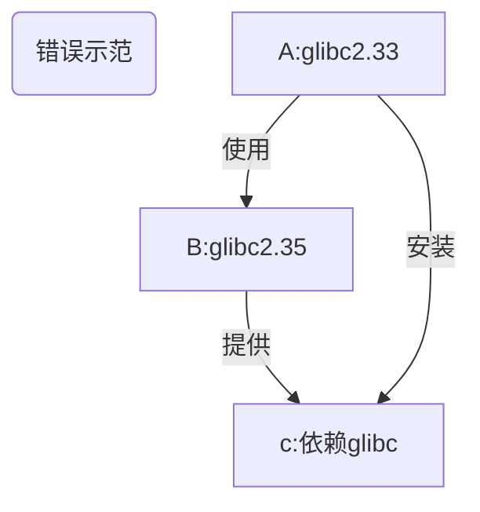

# 添加仓库

- [1. 快速上手](#1-快速上手)
  - [1.1. apt](#11-apt)
    - [1.1.1. debian](#111-debian)
    - [1.1.2. ubuntu](#112-ubuntu)
    - [1.1.3. termux](#113-termux)
  - [1.2. pacman](#12-pacman)
- [2. Debian-based (ubuntu, mint, kali)](#2-debian-based-ubuntu-mint-kali)
  - [2.1. 通用](#21-通用)
    - [2.1.1. 详细说明](#211-详细说明)
    - [2.1.2. neko-repo 详情](#212-neko-repo-详情)
    - [2.1.3. 更新公钥](#213-更新公钥)
  - [2.2. toy-repo](#22-toy-repo)
    - [2.2.1. 详情](#221-详情)
  - [2.3. uuu-repo](#23-uuu-repo)
    - [2.3.1. 说明](#231-说明)
- [3. Android](#3-android)
  - [3.1. termux](#31-termux)
    - [3.1.1. tinor](#311-tinor)
- [4. 题外话](#4-题外话)
  - [4.1. 您可能不需要了解的知识](#41-您可能不需要了解的知识)
  - [4.2. `doas` 与 `sudo`](#42-doas-与-sudo)

## 1. 快速上手

注意：
目前，尽管本项目相关仓库已经搭建完成，但是绝大多数软件包仍处于未完成状态。  
之后，本项目的相关包名将可能会被命名为 `tmoe-2021`, `tmm` 和 `tmoe`

### 1.1. apt

#### 1.1.1. debian


- 要求
  - Debian GNU/Linux
    - 目前支持的最低版本为 Debian 9 Stretch
    - 由于 Stretch 已经 EOL, 之后最低版本可能会升级至 Buster
  - 不支持 Debian GNU/Hurd 和 kFreeBSD

```sh
su -c "apt update; apt install doas curl"
su -c "echo 'permit nopass $(id -un) cmd apt' >> /etc/doas.conf"

curl -LO l.tmoe.me/neko.deb
doas apt install ./neko.deb
rm -v neko.deb
doas apt update
doas apt install toy-repo
```

> 在题外话中，本项目开发者将介绍：为什么是 OpenBSD `doas` 而非 `sudo`

#### 1.1.2. ubuntu


```sh
sudo apt update
sudo apt install -y wget
wget l.tmoe.me/neko.deb
sudo apt install ./neko.deb
rm -v neko.deb
sudo apt update
sudo apt install uuu-repo
```

#### 1.1.3. termux


> File: termux.svg  
> License: CC BY-SA 4.0  
> Origin: Termux.com - <https://termux.com/>

```sh
curl -LO l.tmoe.me/tinor.deb
apt install ./tinor.deb
apt update
```

### 1.2. pacman


开发者还在咕咕咕中 ...

## 2. Debian-based (ubuntu, mint, kali)

从理论上说，您不应该混用 debian 和 ubuntu 的软件源。  
因为这会破坏系统的依赖关系。

您如果之前一直都是这么干的，那么需要多了解一下 debian。  
您可以阅读 [debian 参考手册（Osamu Aoki 青木修 著）](https://www.debian.org/doc/manuals/debian-reference/)。

### 2.1. 通用

那么问题来了。  
既然混用源的问题这么严重，那为什么本项目还是有通用仓库呢？

答案是：

- 静态编译
- 低版本依赖
- 以及 "all" 架构的软件包。

实际上，对于不能通用的包来说，开发者会为它们建立单独的仓库。

对于 debian-based 发行版来说，本项目通用的仓库名为 "neko"。

#### 2.1.1. 详细说明

- 要求：

  - 系统版本： debian 9 (stretch) & ubuntu 16.04(xenial)
    - 依赖: `apt-transport-https`, `ca-certificates`
  - 系统版本：debian 10 (buster), ubuntu 18.04 (bionic) 及其以上的系统
    - 依赖: `ca-certificates`

以下例子将使用 `curl`  
您也可以换用其他下载工具，例如 `wget2` 或 `aria2`

> 以下内容可以直接编辑

```sh,editable
apt update
apt install -y curl

# 下载并安装 tmoe 的 neko 仓库
curl -LO https://l.tmoe.me/neko.deb
apt install ./neko.deb
# 这个 deb 包对您的系统做了什么呢？
# 在 /etc/apt/sources.list.d/ 目录下创建了源列表：
# neko-repo.sources (权限为644,所属为0:0)
# 在本书的换源部分将介绍这种格式
# 还有 OpenPGP(GnuPG) 公钥：
# /usr/share/keyrings/tmoe-archive-keyring.gpg (权限同上)
# 并且在 /etc/apt/preferences.d/50-neko-repository 中调整了软件包优先级
# 注：此 deb 包不依赖 gnupg(完整版)， 只需要 apt 自身依赖的 gpgv(简化版gnupg) 就可以了

# 删除 deb 包
rm -fv ./neko.deb
# 更新索引信息
apt update
```

#### 2.1.2. neko-repo 详情

```sh
apt show neko-repo
```

```yaml
Package: neko-repo
Version: 0.0.1-12
Priority: standard
Section: misc
Maintainer: Moe Master <m@tmoe.me>
Installed-Size: 30.7 kB
Provides: set-src-list, update-neko-key
Depends: apt (>= 1.1.0)
Recommends: ca-certificates
Suggests: curl | wget
Homepage: https://packages.tmoe.me/deb/dists/neko/
Download-Size: 5,232 B
APT-Manual-Installed: yes
APT-Sources: https://packages.tmoe.me/deb neko/main amd64 Packages
Description: Neko repository, QwQ
  It includes some useful packages.
  The minimum supported version of this repository is debian 9 (Stretch),
  you should not install it on debian 8 (Jessie).
```

让我们来看一下 `neko-repo` 提供了什么东西

- `set-src-list`
  - 我们将会在“仓库/更换镜像源”中介绍到它
- `update-neko-key`
  - 用于更新公钥

#### 2.1.3. 更新公钥

在极其特殊的情況下，neko 仓库的 OpenPGP 公钥可能会失效。  
在这种情况下，您就不能用 `apt-get install` 来更新 neko 仓库的 keyring 了，而要用 `neko-repo` 自带的一个命令。

运行

```sh
update-neko-key
```

它会输出以下内容

```sh
It can update the OpenPGP pub keyring: "/usr/share/keyrings/tmoe-archive-keyring.gpg"

-d | --downloader: You can specify the downloader.

For example, you can run "update-neko-key -d curl" to use curl.
Run "update-neko-key -d wget" to use wget.
```

简单来说，您需要手动指定一个下载器。  
现在只支持

- `curl`
- `wget`
- `wget2`
- `aria2c`

用法很简单，以 root 身份运行 `update-neko-key -d curl`。

> 如果没有 root 权限，那么它将无法修改 "/usr/share/keyrings/tmoe-archive-keyring.gpg"。

这个工具的逻辑非常简单。

- 若您的系统已经安装了 `gnupg`，那么它将从相关仓库获取 [ascii 格式的 OpenPGP 公钥](https://salsa.debian.org/mm/repo/-/blob/master/src/deb/debian/repo/common/neko-repo/current/tmoe-archive-keyring.asc)，并将其转换为二进制格式，最后覆盖原来的公钥。
- 若您的系统没有安装 `gnupg`, 或者转换过程出错了，那么它将直接从相关网站获取二进制格式的公钥。

如果没有意外的话，您可能十年都不需要调用此命令去更新公钥。  
至于开发者能不能为本项目用爱发电十年就是另一回事了。

### 2.2. toy-repo

与 **neko-repo** 不同，**toy-repo** 并非完全通用的。
它只能给 **debian** 用，不能给 **ubuntu** 用。

#### 2.2.1. 详情

```sh
apt show toy-repo
```

```yaml
Package: toy-repo
Version: 0.0.1-4
Priority: optional
Section: misc
Maintainer: Moe Master <m@tmoe.me>
Installed-Size: 19.5 kB
Depends: apt (>= 1.1.0), neko-repo
Suggests: ca-certificates
Homepage: https://packages.tmoe.me/deb/dists/toy
Download-Size: 2,484 B
APT-Manual-Installed: yes
APT-Sources: https://packages.tmoe.me/deb neko/main amd64 Packages
Description: A repository for debian only
  Toy is a wonderful thing.
  Let's keep our childishness and optimism!
  Go after the good things in the toy-repo!
  The source file will be placed in "/etc/apt/sources.list.d/toy-repo.sources"
```

遗憾的是，toy-repo(玩具仓库)自身并没有什么有用的东西。  
有用的东西都在仓库里面，您需要以 root 身份运行 `apt install` 来安装您心仪的玩具。

玩具是一个很美好的东西，开发者将其命名为 **toy**，并没有抱着做“玩具项目” 这种消极的想法。  
与 debian 的 玩具总动员系列的代号类似。  
保持童真，以及积极向上的态度是非常重要的。  
**toy** 这个词还包含了开发者对美好生活的向往。  
这个世界是非常复杂的，像孩童一样追求着简简单单的快乐是一件非常非常幸福的事情。

### 2.3. uuu-repo

与 **neko-repo** 和 **toy-repo** 都不同。  
uuu 仓库只能给 **ubuntu** 用，不能给 **debian** 用。

#### 2.3.1. 说明

uuu 仓库对于 ubuntu 来说是通用的。

本项目之后可能还会有 "focal-repo" 这种只能给单独的版本使用的仓库。

## 3. Android

### 3.1. termux

#### 3.1.1. tinor

TINOR Is Not Official Repository.

把软件包拆出来，看看里面有什么东西吧！

```tree, editable
├── control
│   ├── conffiles
│   ├── control
│   ├── md5sums
│   ├── postinst
│   └── postrm
└── data
    └── data
        └── data
            └── com.termux
                └── files
                    └── usr
                        ├── bin
                        │   ├── set-src-list
                        │   └── update-tinor-key
                        ├── etc
                        │   └── tmoe
                        │       └── repo
                        │           └── apt
                        │               ├── preferences.d
                        │               │   └── 50-tinor
                        │               └── sources.list.d
                        │                   └── tinor.sources
                        └── share
                            ├── doc
                            │   └── tinor-repo
                            │       ├── changelog.Debian
                            │       └── copyright
                            └── keyrings
                                └── tmoe-archive-keyring.gpg
```

在安装 deb 包，执行 `postinst` 的 **configure** 阶段时， `postinst` 会在 `$PREFIX/etc/apt/sources.list.d` 和 `$PREFIX/etc/apt/preferences.d` 处创建与 **tinor** 相关的软链接；  
卸载软件包，执行 `postrm` 的 **purge** 或 **remove** 阶段时，`postrm` 会自动删掉软链接。

可以看出来，它的结构与 `neko-repo` 是极其相似的，只是路径不一样。

## 4. 题外话

### 4.1. 您可能不需要了解的知识

<div style="display:none">

</div>



如果您一定要混用软件源, 那么请在高版本系统中使用低版本系统的源。  
否则将出现以下的情况：  
比如系统 A 的 glibc 版本是 2.33，B 是 2.35。  
B 的某个软件 b 依赖了 glibc。  
如果您在 A 上用了 B 的源，然后又安装了 b ，那么 glibc 可能也被升到了 2.35。  
这时候 A 上一大堆系统相关软件要么跟着升级，要么可能会出现不可预料的“不稳定性”。

如果您想要将一个系统完全变成另一个系统的模样，那么结论与上面完全相反，您得要像上面那张流程图那样做才行。  
这样做相当于从低版本系统升级到高版本。

比如说您想要将 debian 更换为 kali 源，这时候应该用低版本的 debian stable 添加高版本的 kali rolling 源，而不能用高版本的 debian sid 来添加低版本 kali rolling 源。

> 这里的高低是相对而言的。

在使用完 `apt dist-upgrade` 更新完所有软件包后，您的系统的内部就已经变成 kali 的形状了。  
在没有快照或备份的情况下，这么做就已经回不了头了。

### 4.2. `doas` 与 `sudo`

Q: 为什么是 `doas`， 而非 `sudo`?

A: 截至 2022-06-20，相较于 `sudo`, `doas` 的代码量更少，出现安全漏洞的频率也更低。

从客观的角度来看：因为用的人少，所以安全漏洞被揭露的可能性更低。  
从 2moe 个人（主观）的角度来看：OpenBSD 那边对安全问题可能会更走心一点。

> The doas tool was originally written for OpenBSD by Ted Unangst.
