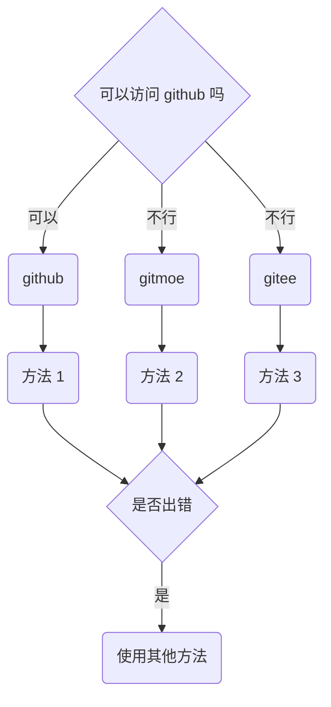

# android

- [1. 关于 docker](#1-关于-docker)
- [2. 管理器](#2-管理器)
- [3. 关于容器环境](#3-关于容器环境)
  - [3.1. 配置与环境](#31-配置与环境)
    - [3.1.1. rootless 环境的一些小问题](#311-rootless-环境的一些小问题)
  - [3.2. proot](#32-proot)
  - [3.3. chroot/unshare](#33-chrootunshare)
- [4. 命令](#4-命令)
  - [4.1. 在宿主环境中](#41-在宿主环境中)
    - [4.1.1. 对于 GUI 容器](#411-对于-gui-容器)
    - [4.1.2. noGUI](#412-nogui)
  - [4.2. 在容器环境中](#42-在容器环境中)
    - [4.2.1. 对于 debian-based 发行版](#421-对于-debian-based-发行版)

---

本项目的本体分为两个部分，分别是“管理器”和“工具箱”。  
对于 android，您可以使用“管理器”。  
在下文中, rootless 指的是 “无 root 容器环境”，rootful 指的是“有 root 容器环境”。

## 1. 关于 docker

实际上，android 也可以运行 docker。  
您如果想要使用原生 docker，那么需要手动编译内核，加上 docker 所需的一些特性。  
如果您的内核没有开源，或者是您的设备无法解锁 bootloader, 那么您可能需要通过虚拟机来间接使用 docker 。

在本章中，我们并不会介绍以下内容：

- 如何为 android 重新编译内核
- 如何在 android 上运行 docker

## 2. 管理器

如果您想要使用 “管理器”，那么您可以使用脚本进行安装。

> 在 edition 2022 中，“天萌管理器” 叫做 `tmm`  
> 现阶段，天萌的大部分内容仍处于 edition 2021  
> 为了与旧版本的兼容，开发者之后会为 android 保留 `tmoe` 命令

对于 android, 您可以用 [termux](https://github.com/termux/termux-app/actions) 运行以下脚本。  
之后，开发者可能会将相关内容打成 deb 包，也可能会适配其他的终端。

> 之所以使用`curl`, 是因为 termux 预装了它。  
> 如果它没有被预装的话，那么您需要使用 `apt update; apt install -y curl` 来安装。

<div style="display:none">



</div>


- 方法 1

  - 工具: curl
  - 平台: github
  - 条件: 您已经安装了 `curl`, 并且 ~~记忆力惊人,~~ 可以访问 **github**
  - 命令:
    - `curl -LO --compressed https://raw.githubusercontent.com/2moe/tmoe/2/2.awk`
    - `awk -f 2.awk`

- 方法 2
  - 工具: curl
  - 平台: gitmoe
  - 条件: 您无法访问 **github**
  - 命令
    - `curl -LO https://l.tmoe.me/2.awk; awk -f 2.awk`
- 方法 3
  - 工具: curl
  - 平台: gitee
  - 条件：以上方法都出错了
  - 命令
    - `curl -LO https://gitee.com/mo2/linux/raw/2/2.awk; awk -f 2.awk`

## 3. 关于容器环境

如果您觉得天萌管理器的问题比其他“更优秀的管理器”更多，那么大概率是配置的问题。

您需要进行合理的配置，才能更好地使用。

### 3.1. 配置与环境

我们这里随便摘出一段 `unshare` 的配置

```sh
# The unshare command creates new namespaces and then executes the specified program.
# By default, a new namespace persists only as long as it has member processes.
# A new namespace can be mad e persistent even when it has no member processes by bind mounting /proc/pid/ns/type files to a filesystem path.
# A namespace that has been made persistent in this way can subsequently be entered with nsenter even after the program terminates
# (except PID namespaces where a permanently running init process is required).
# Once a persistent namespace is no longer needed, it can be unpersisted by using umount to remove the bind mount.
UNSHARE_ENABLED=true

# Unshare the IPC namespace. Default is false.
# IPC namespace: The process will have an independent namespace for POSIX
# message queues as well as System V message queues, semaphore sets and shared memory segments.
UNSHARE_IPC=false

# Unshare the PID namespace. Default is false.
# PID namespace: Children will have a distinct set of PID-to-process mappings from their parent.
UNSHARE_PID=false

# Unshare the UTS namespace. Default is false.
# UTS namespace: Setting hostname or domainname will not affect the rest of the system.
UNSHARE_UTS=false

# Unshare the mount namespace. Default is false.
# mount namespace: Mounting and unmounting filesystems will not affect the rest of the system, except for filesystems which are explicitly marked as shared.
UNSHARE_MOUNT=false

# When unshare terminates, have signame be sent to the forked child process. Combined with --pid this allows for an easy and reliable killing of the entire process tree below unshare. This option implies --fork.
# When the value is true and SIGNAME=SIGKILL, the process in the container cannot be terminated with ctrl+c.
# see this issue: https://github.com/2moe/tmoe/issues/44
KILL_CHILD=false
KILL_CHILD_SIGNAME="SIGKILL"

# Default is true.
# Just before running the program, mount the proc filesystem at mountpoint (default is /proc).  This is useful when creating a new PID namespace.  It also implies creating a new mount  namespace  since  the  /proc  mount would otherwise mess up existing programs on the system.  The new proc filesystem is explicitly mounted as private (with MS_PRIVATE|MS_REC).
SHARE_PROC=true
```

然后您可能会吐嘈：“我不理解 IPC namespace 是什么? 到底要不要开启相关的选项？”  
对于默认配置，在有些情况下，保持默认就可以了。

> 有一本书叫做《UNIX 网络编程 卷 2：进程间通信（UNIX Network Programming,Vovum 2：Interprocess Communications）》，里面有介绍到 IPC 相关的内容。

对于 rootful 环境，其实小问题没有那么多，一直使用默认的配置也不会有太大的问题。  
但对于 rootless 环境，有时候您甚至需要针对不同的环境使用不同的配置。

#### 3.1.1. rootless 环境的一些小问题

您如果对天萌管理器不屑一顾的话，那么可以尝试用“更优秀的管理器”执行以下操作。

- 在 rootless 环境下运行 _.NET SDK 6.0.202_
- 在 rootless 环境下，运行 `gnome-shell`。

您可能在使用 rootless GUI 容器的过程中会遇到卡住或崩溃等问题。  
在一般情况下，这与 android 系统本身的限制有关。  
您可能需要开启相应终端的后台运行与开机自启的权限，或者是开一个小悬浮窗。  
又或者是通过 `adb` 去调整系统的资源调度与后台管理机制。

> 对于 android 12+，如果容器崩溃了，那请选择 `fix android 12(signal 9) 选项` 进行修复

其次，这与容器内部的服务有关。 比如说与 "power-manager" 相关的东西，它会尝试去调用宿主本身的东西，在有些情况下，这可能会导致整个容器进程崩溃。  
最后与资源占用有关，如果部分系统资源已经被占满了，或者是无法被调用，那么它会变卡。

如果说，您在启动 gui 环境时卡住了，或者是 gui 环境特别不稳定。  
那么与什么东西有关呢?

答案是 D-Bus。

Q: 关掉 D-Bus 会更好吗？  
A: 恰恰相反，对于部分桌面环境来说，让它的 daemon 处于运行状态会更好。  
比如说，对于 gnome，开启 dbus-daemon 后，您就可以在 rootless 环境下跑 gnome-shell 了。

Q: 如何关闭？  
A: 与 D-Bus 相关的地方分布在以下三个位置。

- 容器自身的配置。您可以在环境变量与登录项管理处禁用掉 `fake cap_last_cap`
- session 的配置。将 **/etc/X11/xinit/Xsession** 中的 `DBUS_CMD` 的值修改为空。
- startvnc 或其他 vnc 服务的配置。将 `AUTO_START_DBUS` 的值修改为 `false`

再比如，如果与“资源监控”相关的东西崩溃了，那么大概率与 "/proc" 相关的东西有关。

请在 `edit script` 选项中，手动禁用掉部分 `伪造proc` 的东西。

注：在默认情况下，只有当您的系统无权读取相关文件时，它才会自动伪造并挂载。  
为了性能上的优化，只有容器初始化过程才会自动检测。

天萌里有很多很多的选项，您如果无法理解相关内容，那么可能会去喷它。

> 有问题应该尽早反馈，整天想着喷它，可是坏孩子哟！ (╯°□°）╯︵ ┻━┻

解决方法很简单，对于 android，如果内核支持 docker ,那么您直接使用 docker 就可以了。  
如果内核不支持 docker， 那么您可以考虑使用天萌管理器的 `unshare` 容器。

### 3.2. proot

| problem                  | note                                                                           |
| ------------------------ | ------------------------------------------------------------------------------ |
| 无法绑定 1024 以下的端口 | see this [issue](https://github.com/2moe/tmoe/issues?q=is%3Aissue+is%3Aclosed) |

### 3.3. chroot/unshare

您在 android 上使用天萌来安装 unshare 容器前，它会让你选择“共享/挂载 sd 目录”。  
对于 miui, 请不要选择整个 "/data/media/0" 或 "/sdcard"  
 请选择特定的子目录，例如 "/data/media/0/Download"。  
挂载整个内置 sd 可能会导致它在 `umount` 时被一同卸载。  
[issue1](https://gitee.com/mo2/linux/issues/I5488U)  
[issue2](https://github.com/2moe/tmoe/discussions/166)

如果您坚持要做的话，那么请在挂载整个内置 sd 前，手动做个小测试。

```sh,editable
cd $TMPDIR
mkdir -pv sd
su -c "/system/bin/mount -o bind /sdcard $PWD/sd"
sudo ls sd
su -c "/system/bin/umount -lvf $PWD/sd"
ls /sdcard
```

看看发生了什么？

## 4. 命令

### 4.1. 在宿主环境中

#### 4.1.1. 对于 GUI 容器

- `startvnc`
  - 前提：您需要先安装 vnc viewer 或其他 vnc 客户端
  - 对于 android, 只有 vnc viewer 才会 “连携”启动
  - 作用：启动默认的 vnc 服务（一般是 tigervnc）
  <!-- - 对于 wsl, 只有 tigervnc viewer 才会 -->
- `startx11vnc`
  - 前提：条件同上
  - 作用：启动 x11vnc
- `stopvnc`
  - 此命令可以方便地干掉 rootless 容器（包括它的 vnc 服务进程）
  - 对于 chroot/unshare（rootful）容器, 您需要单独停止容器进程。
- `startxsdl`
  - 前提：您需要先在宿主环境中安装 xserver app
  - 作用：启动 xorg
- `novnc`
  - 前提：您无需安装常规的 vnc 客户端，只需有个浏览器就足够了
  - 作用：同时启动宿主的浏览器和容器内部的服务

#### 4.1.2. noGUI

对于 edition 2020:

- `debian`
  - 自动检测默认容器名称、类型和架构。在检测完成后，启动容器。

对于 edition 2021：

- `tmoe ls`
  - 自动判断默认容器类型，并列出容器列表
- `tmoe p`
  - 启动默认的 proot 容器
- `tmoe c`
  - 启动默认的 chroot/unshare 容器
- `tmoe` 或 `tmoe m`
  - 启动 tmoe manager

对于 edition 2022：

- `tmm r <容器名称>`
  - 例如 `tmm r uuu`
- `tmm`
  - 启动 tmoe manager

### 4.2. 在容器环境中

如果宿主支持“连携”启动，那么您无需在容器内单独启动 vnc 服务

- `tmoe` 或 `tmoe t`
  - 启动 tmoe tools
- `startvnc`
  - 启动默认的 vnc 服务（一般是 tigervnc）
- `startx11vnc`
  - 启动 x11vnc 服务
- `stopvnc`
  - 停止 vnc 服务
- `startxsdl`
  - 启动 xorg
- `novnc`
  - 启动 novnc

#### 4.2.1. 对于 debian-based 发行版

- `tigervnc`
  - 启动 tigervnc 服务
- `tightvnc`
  - 启动 tightvnc 服务
