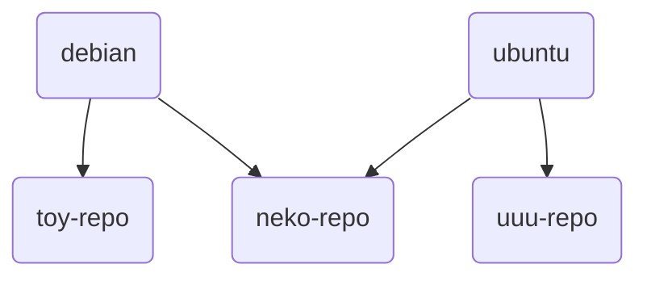

# 镜像源

- [1. debian-based](#1-debian-based)
  - [1.1. 快速上手](#11-快速上手)
  - [1.2. 详细解析](#12-详细解析)
    - [1.2.1. set-src-list](#121-set-src-list)
    - [1.2.2. region-code-repo](#122-region-code-repo)
    - [1.2.3. 软件包解析](#123-软件包解析)
    - [1.2.4. set-src-link](#124-set-src-link)
      - [1.2.4.1. region & link](#1241-region--link)
      - [1.2.4.2. unlink](#1242-unlink)
    - [1.2.5. 源文件解析](#125-源文件解析)

---

您若在使用发行版的官方镜像源时，体验不佳，那不妨试试本项目的“更换发行版镜像源”功能。

## 1. debian-based

开发者为每一个镜像源都打了一个 deb 包。

对于 debian 和 ubuntu 通用的源的 deb 包，开发者把它们放到了 neko 仓库。

<div style="display:none">

</div>


缺陷：

- 尽管您可以在 kali 和 mint 上使用，但是并非所有镜像源都支持它们，提供 ubuntu 镜像源的网站不一定会同时提供 mint 源。
- 目前，由于 debian-ports 的镜像源过于稀少，因此本功能未对 riscv64 等架构进行适配。

### 1.1. 快速上手

如果您不明白下面的命令的具体意义，那么请不要直接运行。  
在下一小节中，我们将会对其进行解析。

```sh
sudo set-src-list dis
sudo apt update
sudo apt install ustc-linux-user-group-cn-repo
sudo apt update
```

### 1.2. 详细解析

#### 1.2.1. set-src-list

> `set-src-list` 由 `neko-repo` 提供

首先，运行 `set-src-list`  
它输出的内容为：

```sh
-d | dis | disable: disable src list
-e | en | enable: enable src list

Note: This is a dangerous operation.
If you run "set-src-list dis", then it will move your "/etc/apt/sources.list" to "/etc/apt/sources.list.bak"
If you run "set-src-list en", then it will move your "sources.list.bak" to "sources.list"
```

这个工具非常简单，简单到您会怀疑它是否能被称为“工具”。

以 root 身份执行 `set-src-list dis` , 它将 **/etc/apt/** 目录下的 "sources.list" 重命名为 "sources.list.bak"。  
`set-src-list en` 与上面执行相反的操作。

> 作用：在换源前禁用原来的软件源。

#### 1.2.2. region-code-repo

> 如果您不知道具体区域代号是什么，那么请翻阅“附录”中的“区域代号”章节。

使用 `apt` 搜索您所在国家或地区的镜像仓库。

"United States": US

```sh
apt search us-repo$
```

"Germany": DE

```sh
apt search de-repo$
```

"China": CN

```sh
apt search "cn-repo|tw-repo|hk-repo"
```

```log,editable
alibaba-cloud-computing-cn-repo/neko 0.0.1-2 all
  阿里云镜像源(China)

bjtu-cn-repo/neko 0.0.1-2 all
  北京交通大学镜像源(China)

blendbyte-inc-tw-repo/neko 0.0.1-2 all
  Blendbyte Inc.(Taiwan)

capital-online-data-service-cn-repo/neko 0.0.1-2 all
  Capital Online Data Service(China)

china-open-source-mirror-alliance-cn-repo/neko 0.0.1-2 all
  China open source mirror Alliance(China)

chongqing-university-cn-repo/neko 0.0.1-2 all
  重庆大学镜像源(China)

cn99-cn-repo/neko 0.0.1-2 all
  CN99(China)

dalian-university-of-technology-cn-repo/neko 0.0.1-2 all
  Dalian University of Technology 大连理工学院镜像源(China)

debian-cs-nctu-edu-tw-repo/toy 0.0.1-3 all
  debian.cs.nctu.edu.tw(Taiwan)

debian-csie-ncku-edu-tw-repo/toy 0.0.1-3 all
  debian.csie.ncku.edu.tw(Taiwan)

debian-csie-ntu-edu-tw-repo/toy 0.0.1-3 all
  debian.csie.ntu.edu.tw(Taiwan)

dongguan-university-of-technology-gnu-linux-association-cn-repo/neko 0.0.1-2 all
  Dongguan University of Technology GNU/Linux Association 东莞理工学院镜像源(China)

escience-center-nanjing-university-cn-repo/neko 0.0.1-2 all
  eScience Center, Nanjing University 南京大学镜像源(China)

ftp-cn-debian-org-cn-repo/neko 0.0.1-2 all
  ftp.cn.debian.org(China)

ftp-hk-debian-org-hk-repo/neko 0.0.1-2 all
  ftp.hk.debian.org(Hong Kong)

ftp-tw-debian-org-tw-repo/neko 0.0.1-2 all
  ftp.tw.debian.org(Taiwan)

harbin-institute-of-technology-cn-repo/neko 0.0.1-2 all
  哈尔滨工业大学镜像源 Harbin Institute of Technology(China)

huawei-cloud-cn-repo/neko 0.0.1-2 all
  Huawei Cloud 华为云镜像源(China)

institute-of-network-development-national-taiwan-ocean-university-tw-repo/neko 0.0.1-2 all
  Institute of Network Development, National Taiwan Ocean University(Taiwan)

lanzhou-university-open-source-society-cn-repo/neko 0.0.1-2 all
  Lanzhou University Open Source Society 兰州大学镜像源(China)

mirrors-163-com-cn-repo/neko 0.0.1-2 all
  网易镜像源(China)

mirrors-bfsu-edu-cn-repo/neko 0.0.1-2 all
  北京外国语大学镜像源(China)

mirrors-neusoft-edu-cn-repo/neko 0.0.1-2 all
  大连东软信息学院镜像源(China)

mirrors-pku-edu-cn-repo/neko 0.0.1-2 all
  北京大学镜像源(China)

mirrors-tuna-tsinghua-edu-cn-repo/neko 0.0.1-2 all
  清华大学镜像源(China)

nchc-taiwan-tw-repo/neko 0.0.1-2 all
  NCHC, Taiwan(Taiwan)

nic-beijing-university-of-posts-and-telecommunications-cn-repo/neko 0.0.1-2 all
  NIC, Beijing University of Posts and Telecommunications 北京邮电大学镜像源(China)

njuptmirrorsgroup-cn-repo/neko 0.0.1-2 all
  南京邮电大学镜像源(China)

opensource-nchc-org-tw-repo/neko 0.0.1-2 all
  opensource.nchc.org.tw(Taiwan)

opentuna-cn-repo/neko 0.0.1-2 all
  OpenTUNA(China)

shanghai-jiaotong-university-cn-repo/neko 0.0.1-2 all
  Shanghai Jiaotong University 上海交通大学镜像源(China)

sohu-cn-repo/neko 0.0.1-2 all
  搜狐镜像源(China)

tencent-cloud-cn-repo/neko 0.0.1-2 all
  Tencent Cloud 腾讯云镜像源(China)

tku-tamkanguniversity-tw-repo/neko 0.0.1-2 all
  TKU-TamKangUniversity(Taiwan)

ustc-linux-user-group-cn-repo/neko 0.0.1-2 all
  中国科学技术大学镜像源(China)

xi-an-jiaotong-university-cn-repo/neko 0.0.1-2 all
  Xi'an Jiaotong University(China)

xtom-hk-repo/neko 0.0.1-2 all
  xTom(Hong Kong)
```

> 实际上，0.0.1-4 修复了 debian (old-stable) 的一些小细节问题，这里还是 0.0.1-2  
> 在下文介绍源文件时，将会提到相关内容，因此不更新也没关系。

然后我们以 root 权限运行 `apt` 来安装软件包。

```sh
apt install opentuna-cn-repo
```

#### 1.2.3. 软件包解析

先拆开来看看

```log,editable
├── control
│   ├── conffiles
│   ├── control
│   ├── md5sums
│   ├── postinst
│   └── postrm
└── data
    ├── etc
    │   └── tmoe
    │       └── repo
    │           └── src
    │               ├── debian
    │               │   ├── opentuna-cn-repo_old.sources
    │               │   ├── opentuna-cn-repo_sid.sources
    │               │   └── opentuna-cn-repo_stable.sources
    │               └── ubuntu
    │                   ├── opentuna-cn-repo_ports.sources
    │                   └── opentuna-cn-repo.sources
    └── usr
        └── share
            └── doc
                └── opentuna-cn-repo
                    └── changelog.Debian.gz
```

`postinst` 调用了 `set-src-link` 去创建软链接。  
`postrm` 调用了 `set-src-link` 的 `unlink` 子命令去删除软链接。  
假如您的系统是 ubuntu jammy (amd64), 那么它会将 **opentuna-cn-repo.sources** 修改为 jammy 的源，并将其软链接到 "/etc/apt/sources.list.d/cn-mirror.sources"。  
如果您用的是 linuxmint vanessa， 那么它会自动合并 ubuntu 和 vanessa 的源，并将源文件软链接到 "/etc/apt/sources.list.d/cn-mirror.sources"。

如果您使用的是 us-repo, 而不是 cn-repo, 那么它就会将源文件软链接到 "/etc/apt/sources.list.d/us-mirror.sources"。

相同区域的镜像包会被上一个安装的包覆盖掉，不同区域的不会。

比如说，您现在安装了 `mirrors-bfsu-edu-cn-repo`， 那么现在的 cn 源是 bfsu。  
您再安装了 `shanghai-jiaotong-university-cn-repo`，那么 cn 源就变成了 sjtu。  
此时，您再安装了 `xtom-de-repo`，**/etc/apt/sources.list.d/** 会多出一个 de 源，它跟 cn 源并不冲突。

在一般情况下，您只需要安装您的服务器/pc 所在区域的镜像源即可。  
除非您有充分的理由，否则请不要在一台设备上安装不同区域的镜像源。

#### 1.2.4. set-src-link

在上一小节中，我们提到了 `set-src-link`，在本小节中，我们将对其进行深入解析。

在您安装或卸载镜像源 的 deb 包时， `set-src-link` 会被自动调用，您无需手动去调用它。

简单来说，`set-src-link` 只做两件事。

- 1.创建软链接
  - 在创建前，它会自动判断您的发行版。对于 ubuntu, 它还会判断您的架构。
- 2.删除软链接

运行 `set-src-link -h`  
输出的内容是：

```sh,editable
set-src-link 0.0.1
Set the symbolic link for the mirror source.

Usage:
 set-src-link [flags]<string>
 set-src-link [flags] [flags]
 set-src-link <subcommand> [flags]<string>

Flags:
 -n, --name <mirror-name>      set the mirror name
 -r, --region <iso-code>       set the region <ISO 3166-1 Alpha-2 code>

 -h, --help                    display help information
 -V, --version                 display version

Subcommand:
    unlink

Example:
 set-src-link -n -h
 set-src-link --region --help
 set-src-link unlink -r us
```

> `set-src-link` 需要以 root 身份运行，否则将无法修改 `/etc/apt/sources.list.d/*-mirror.sources`

##### 1.2.4.1. region & link

获取 region 的帮助信息

```sh
set-src-link -r -h
```

`-n` 后面接的是 deb 包的包名。

创建软链接

```sh
set-src-link -r cn -n opentuna-cn-repo
# os: debian
# code: sid
# '/etc/apt/sources.list.d/cn-mirror.sources' -> '/etc/tmoe/repo/src/debian/opentuna-cn-repo_sid.sources'

set-src-link -r us -n opentuna-cn-repo
# os: debian
# code: sid
# '/etc/apt/sources.list.d/us-mirror.sources' -> '/etc/tmoe/repo/src/debian/opentuna-cn-repo_sid.sources'
```

##### 1.2.4.2. unlink

```sh
set-src-link unlink
```

输出了以下内容

```sh
Error, you should add "--region" to specify your region
```

只要指定区域就能解决了

```sh
set-src-link unlink -r cn
# unlink /etc/apt/sources.list.d/cn-mirror.sources

set-src-link unlink -r de
# unlink /etc/apt/sources.list.d/de-mirror.sources

set-src-link unlink -r us
# unlink /etc/apt/sources.list.d/us-mirror.sources
```

#### 1.2.5. 源文件解析

您如果之前曾有过手动更换 debian/ubuntu 源的经历，那么应该会知道 debian 传统的 one-line-style 源格式。

```list
deb http://mirrors.bfsu.edu.cn/debian/ sid main non-free contrib
```

与传统的 one-line-style 不同，本项目的“镜像源”功能使用的是更现代化的 deb822-style。  
此格式要求 apt 的版本 >= 1.1.0。  
因此它在默认情况下不兼容 debian 8(Jessie)。

让我们来看看里面有什么吧！

以 debian buster （old-stable）为例。  
实际上，buster 的 suites 和 bullseye 是有区别的。  
除了 security 源的区别外，backports 也应该使用不同的源。  
不能简单地将 "stable-backports" 替换为 "old-stabe-backports"

此外，如果这个镜像源不包含 "debian-security" 镜像，那么它默认会启用官方的 security 源，并禁用镜像 security 源。  
如果它不支持 https, 那么 uris 那里显示的是 **http://** 开头的 uri 。  
在使用 neko-repo 的镜像源 deb 包的情况下，您无需要手动去判断它支不支持 `https` 等东西。

```sh
cat /etc/apt/sources.list.d/cn-mirror.sources
```

```yaml
name: Debian
# yes or no
enabled: yes
# types: deb deb-src
types: deb
uris: https://mirrors.bfsu.edu.cn/debian/
suites: buster
components: main contrib non-free
# architectures: amd64 arm64 armhf i386 ppc64el s390x mipsel mips64el
# --------------------------------

name: Debian updates
enabled: yes
# types: deb deb-src
types: deb
uris: https://mirrors.bfsu.edu.cn/debian/
suites: buster-updates
components: main contrib non-free
# --------------------------------

name: Debian backports
enabled: yes
# types: deb deb-src
types: deb
uris: https://mirrors.bfsu.edu.cn/debian/
# For debian old-stable, you should use "old-stable-backports-sloppy", instead of "old-stable-backports".
# https://backports.debian.org/Instructions/#:~:text=Old-stable-sloppy
# suites: buster-backports
suites: buster-backports-sloppy
components: main contrib non-free
# --------------------------------

name: Debian security
enabled: yes
# types: deb deb-src
types: deb
uris: https://mirrors.bfsu.edu.cn/debian-security/
suites: buster/updates
components: main contrib non-free
# --------------------------------

name: Official security
enabled: no
# types: deb deb-src
types: deb
uris: https://deb.debian.org/debian-security/
suites: buster/updates
components: main contrib non-free
# --------------------------------

name: Proposed updates
enabled: no
# types: deb deb-src
types: deb
uris: https://mirrors.bfsu.edu.cn/debian/
suites: buster-proposed-updates
components: main contrib non-free
# --------------------------------
```

`enabled` ：是否需要启用这个源，可选 yes 或 no  
`types`: 类型，一般情况下用 **deb**, 若有获取源代码的要求，就用 **deb deb-src**

除了上面介绍到的内容外，deb822-style 还支持其他的 key 。

例如:

使用 signed-by 指定 OpenPGP 公钥。

```yaml
signed-by: /usr/share/keyrings/tmoe-archive-keyring.gpg
```
