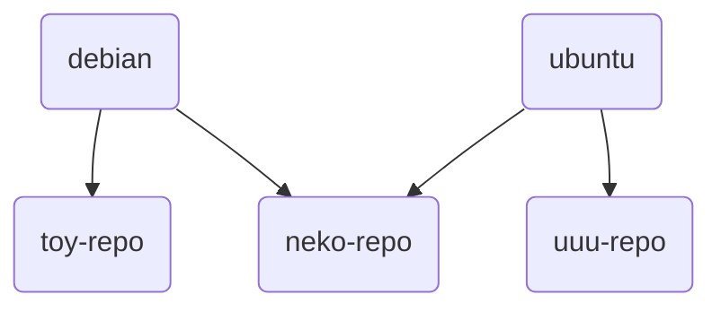

# 镜像源

- [1. 开发历程](#1-开发历程)
  - [1.1. 始端](#11-始端)
  - [1.2. 整理与分析源](#12-整理与分析源)
  - [1.3. 后续工作](#13-后续工作)
  - [1.4. 最终结果](#14-最终结果)
- [2. debian-based 镜像源](#2-debian-based-镜像源)
  - [2.1. 快速上手](#21-快速上手)
  - [2.2. 详细解析](#22-详细解析)
    - [2.2.1. set-src-list](#221-set-src-list)
    - [2.2.2. region-code-repo](#222-region-code-repo)
    - [2.2.3. 软件包解析](#223-软件包解析)
    - [2.2.4. set-src-link](#224-set-src-link)
      - [2.2.4.1. region & link](#2241-region--link)
      - [2.2.4.2. unlink](#2242-unlink)
    - [2.2.5. 源文件解析](#225-源文件解析)
    - [2.2.6. 手动安装](#226-手动安装)

---

“二萌”在写这个小功能前，开心地为“天萌”设计了“新”标语。

TMOE, More Optional Environments.

```rust,editable
pub enum Option<T> {
    Some(T),
    None,
}
```

> 上面那段代码是 rust 标准库中很经典的一段定义

“二萌” 在打完之后，暗自感叹：这段代码与 **TMOE** 的结合是多么巧妙呀！

在数日后，“二萌”以与预想完全不同的形式写完了这个功能，然后默默删掉了那段 rust 代码。

求“二萌”的心路历程？

## 1. 开发历程

### 1.1. 始端

在很久之前，曾经有人希望“天萌”能支持这个功能：在容器初始化前，手动配置软件源。  
二萌当初说：“如果只是加个 ustc 源的选项，那么不改也可以。 如果要考虑到德国、法国和英国等国家的镜像源，那就得要改了。”  
此处的“改”指的是修改逻辑。  
二萌当初就想要做个新的换源功能了。

### 1.2. 整理与分析源

二萌最开始打算用 rust 来写。  
不管用什么语言写，最开始的时候，都必须要有一份源列表。  
比如说，debian 官方的 [worldwide mirror list](https://www.debian.org/mirror/list)  
不过 debian 官方列表的源太少了，应该还有更多的源吧。  
于是，二萌开开心心地踏上了搜集和整理世界上各个国家和地区的软件源的旅途了 ~~,然后一去不复返了~~  
~~(想要我的宝藏吗？都给你吧！人们对此趋之若骛，二萌也踏上了征程，从此世界进入了新时代。)~~  
这么简单的事情只需要几个小时就能搞定了吧！  
然而，事情并没有那么简单。  
二萌只能告诉您，这件事花了很多天，尽是些脏活和累活。

如果一个源提供了 debian 镜像，那它不一定有 debian-security 镜像。  
如果一个源提供了 ubuntu 镜像，那它不一定有 debian 镜像。  
如果一个源支持 http， 那它不一定支持 https。  
二萌只是简单地举了几个例子，是不是让数据分析的工作变得麻烦起来了呢？

### 1.3. 后续工作

因为二萌已经把脏活和累活都干完了，所以接下来的工作就不难了。  
二萌可以用 rust 写一个 TUI 换源工具，然后通过解析外部的 **软件源.toml** 来实现换源， 也可以直接把源列表硬编码进程序内部。  
为了更广的适用性，这个工具应该还得要支持 CLI。  
可是二萌那时已经很累了，不想再做太多额外的工作了。

在换源过程中，可能要给软件源文件创建软链接。

```rust
use std::os::unix::fs;

fn main() -> std::io::Result<()> {
    fs::symlink("/etc/tmoe/repo/src/debian/xxyy.source", "/etc/apt/sources.list.d/mirror.source")?;
    Ok(())
}
```

如果只是 CLI, 使用上面那种方法创建软链接，真的会比 `ln -s` 更高效，更安全吗？

> 其实 rust 可以直接调用系统的 `ln`

不过这不是关键，关键是不同架构要用不同的包。  
这在极端情况下有点不太好。

> 什么是极端情况？  
> 您可以去回顾一下本书的“买口罩问题”。

二萌想了想，觉得这已经变成了为了用 rust 而用 rust 了。  
语言只是工具，我们在使用前应该考虑它的适用范围。

### 1.4. 最终结果

二萌最后为每一个源都打了一个包，并且每个源都依赖了一个用 dash 写的小脚本（`set-src-link`）。

> 对于 only for debian-based 的发行版来说，用 dash 写脚本还是挺好的。  
> 二萌在很久之前曾用过某个只有 `dash` ，没有 `bash` 的 debian-based 发行版。  
> `dash` 虽然会比 `bash` 更快， 但是不适合交互式操作  
> TUI 和 CLI 并不冲突，或许有一天，二萌会再给这个小功能写个前端。  
> 嗯，还是 rust, 用 rust 写 TUI 前端。

对于 debian 和 ubuntu 通用的源的 deb 包，二萌把它们放到了 neko 仓库。

<div style="display:none">

</div>


## 2. debian-based 镜像源

对于 debian，您在安装完 `neko-repo` 后，就可以通过 `apt` 来安装 debian 的镜像源了。  
其实这个功能还可以给 kali 和 mint 用。  
但是呢！ 并非所有镜像源都支持它们。  
提供 ubuntu 镜像源的网站不一定会同时提供 mint 源。

> 如果您正在使用其他 debian-based 的发行版，请告诉“二萌”，“二萌” 会为它适配。

### 2.1. 快速上手

如果您不明白下面的命令的具体意义，那么请不要直接运行。  
在下一小节中，我们将会对其进行解析。

```sh
sudo set-src-list dis
sudo apt update
sudo apt install ustc-linux-user-group-cn-repo
sudo apt update
```

### 2.2. 详细解析

#### 2.2.1. set-src-list

> `set-src-list` 由 `neko-repo` 提供

首先，运行 `set-src-list`  
它输出的内容为：

```sh
-d | dis | disable: disable src list
-e | en | enable: enable src list

Note: This is a dangerous operation.
If you run "set-src-list dis", then it will move your "/etc/apt/sources.list" to "/etc/apt/sources.list.bak"
If you run "set-src-list en", then it will move your "sources.list.bak" to "sources.list"
```

这个工具非常简单，简单到您会怀疑它是否能被称为“工具”。

以 root 身份执行 `set-src-list dis` , 它将 **/etc/apt/** 目录下的 "sources.list" 重命名为 "sources.list.bak"。  
`set-src-list en` 与上面执行相反的操作。

> 作用：在换源前禁用原来的软件源。

#### 2.2.2. region-code-repo

> 如果您不知道具体区域代号是什么，那么请翻阅“附录”中的“区域代号”章节。

使用 `apt` 搜索您所在国家或地区的镜像仓库。

"United States": US

```sh
apt search us-repo$
```

"Germany": DE

```sh
apt search de-repo$
```

"China": CN

```sh
apt search cn-repo$
```

```log,editable
opentuna-cn-repo/neko,now 0.0.1-2 all [已安装]
  OpenTUNA(China)

shanghai-jiaotong-university-cn-repo/neko,now 0.0.1-2 all [已安装]
  Shanghai Jiaotong University 上海交通大学镜像源(China)

sohu-cn-repo/neko 0.0.1-2 all
  搜狐镜像源(China)

tencent-cloud-cn-repo/neko 0.0.1-2 all
  Tencent Cloud 腾讯云镜像源(China)

ustc-linux-user-group-cn-repo/neko 0.0.1-2 all
  中国科学技术大学镜像源(China)
```

> 实际上，0.0.1-4 修复了 debian (old-stable) 的一些小细节问题，这里还是 0.0.1-2  
> 在下文介绍源文件时，将会提到相关内容，因此不更新也没关系。

然后我们以 root 权限运行 `apt` 来安装软件包。

```sh
apt install opentuna-cn-repo
```

#### 2.2.3. 软件包解析

先拆开来看看

```log,editable
├── control
│   ├── conffiles
│   ├── control
│   ├── md5sums
│   ├── postinst
│   └── postrm
└── data
    ├── etc
    │   └── tmoe
    │       └── repo
    │           └── src
    │               ├── debian
    │               │   ├── opentuna-cn-repo_old.sources
    │               │   ├── opentuna-cn-repo_sid.sources
    │               │   └── opentuna-cn-repo_stable.sources
    │               └── ubuntu
    │                   ├── opentuna-cn-repo_ports.sources
    │                   └── opentuna-cn-repo.sources
    └── usr
        └── share
            └── doc
                └── opentuna-cn-repo
                    └── changelog.Debian.gz
```

`postinst` 调用了 `set-src-link` 去创建软链接。  
`postrm` 调用了 `set-src-link` 的 `unlink` 子命令去删除软链接。  
假如您的系统是 ubuntu jammy (amd64), 那么它会将 **opentuna-cn-repo.sources** 修改为 jammy 的源，并将其软链接到 "/etc/apt/sources.list.d/cn-mirror.sources"。  
如果您用的是 linuxmint vanessa， 那么它会自动合并 ubuntu 和 vanessa 的源，并将源文件软链接到 "/etc/apt/sources.list.d/cn-mirror.sources"。

如果您使用的是 us-repo, 而不是 cn-repo, 那么它就会将源文件软链接到 "/etc/apt/sources.list.d/us-mirror.sources"。

相同区域的镜像包会被上一个安装的包覆盖掉，不同区域的不会。

比如说，您现在安装了 `mirrors-bfsu-edu-cn-repo`， 那么现在的 cn 源是 bfsu。  
您再安装了 `shanghai-jiaotong-university-cn-repo`，那么 cn 源就变成了 sjtu。  
此时，您再安装了 `xtom-de-repo`，**/etc/apt/sources.list.d/** 会多出一个 de 源，它跟 cn 源并不冲突。

在一般情况下，您只需要安装您的服务器/pc 所在区域的镜像源即可。  
除非您有充分的理由，否则请不要在一台设备上安装不同区域的镜像源。

#### 2.2.4. set-src-link

在上一小节中，我们提到了 `set-src-link`，在本小节中，我们将对其进行深入解析。

在您安装或卸载镜像源 的 deb 包时， `set-src-link` 会被自动调用，您无需手动去调用它。

简单来说，`set-src-link` 只做两件事。

- 1.创建软链接
  - 在创建前，它会自动判断您的发行版。对于 ubuntu, 它还会判断您的架构。
- 2.删除软链接

运行 `set-src-link -h`  
输出的内容是：

```sh,editable
set-src-link 0.0.1
Set the symbolic link for the mirror source.

Usage:
 set-src-link [flags]<string>
 set-src-link [flags] [flags]
 set-src-link <subcommand> [flags]<string>

Flags:
 -n, --name <mirror-name>      set the mirror name
 -r, --region <iso-code>       set the region <ISO 3166-1 Alpha-2 code>

 -h, --help                    display help information
 -V, --version                 display version

Subcommand:
    unlink

Example:
 set-src-link -n -h
 set-src-link --region --help
 set-src-link unlink -r us
```

> `set-src-link` 需要以 root 身份运行，否则将无法修改 `/etc/apt/sources.list.d/*-mirror.sources`

##### 2.2.4.1. region & link

获取 region 的帮助信息

```sh
set-src-link -r -h
```

`-n` 后面接的是 deb 包的包名。

创建软链接

```sh
set-src-link -r cn -n opentuna-cn-repo
# os: debian
# code: sid
# '/etc/apt/sources.list.d/cn-mirror.sources' -> '/etc/tmoe/repo/src/debian/opentuna-cn-repo_sid.sources'

set-src-link -r us -n opentuna-cn-repo
# os: debian
# code: sid
# '/etc/apt/sources.list.d/us-mirror.sources' -> '/etc/tmoe/repo/src/debian/opentuna-cn-repo_sid.sources'
```

##### 2.2.4.2. unlink

```sh
set-src-link unlink
```

输出了以下内容

```sh
Error, you should add "--region" to specify your region
```

只要指定区域就能解决了

```sh
set-src-link unlink -r cn
# unlink /etc/apt/sources.list.d/cn-mirror.sources

set-src-link unlink -r de
# unlink /etc/apt/sources.list.d/de-mirror.sources

set-src-link unlink -r us
# unlink /etc/apt/sources.list.d/us-mirror.sources
```

#### 2.2.5. 源文件解析

您如果之前曾有过手动更换 debian/ubuntu 源的经历，那么应该会知道 debian 传统的 one-line-style 源格式。

```list
deb http://mirrors.bfsu.edu.cn/debian/ sid main non-free contrib
```

与传统的 one-line-style 不同，天萌使用的是更现代化的 deb822-style。  
此格式要求 apt 的版本 >= 1.1.0。  
因此它在默认情况下不兼容 debian 8(Jessie)。

让我们来看看里面有什么吧！

以 debian buster （old-stable）为例。  
实际上，buster 的 suites 和 bullseye 是有区别的。  
除了 security 源的区别外，backports 也应该使用不同的源。  
不能简单地将 "stable-backports" 替换为 "old-stabe-backports"

此外，如果这个镜像源不包含 "debian-security" 镜像，那么它默认会启用官方的 security 源，并禁用镜像 security 源。  
如果它不支持 https, 那么 uris 那里显示的是 **http://** 开头的 uri 。  
在使用 neko-repo 的镜像源 deb 包的情况下，您不需要手动去判断它支不支持 `https` 等东西。

虽然这些只是小细节问题，不过说实话，“天萌”的开发者很羡慕“天萌”的用户。  
您真的很幸福，不需要去了解那些细节，就能用到这么好用的工具了。

```sh
cat /etc/apt/sources.list.d/cn-mirror.sources
```

```yaml
name: Debian
# yes or no
enabled: yes
# types: deb deb-src
types: deb
uris: https://mirrors.bfsu.edu.cn/debian/
suites: buster
components: main contrib non-free
# architectures: amd64 arm64 armhf i386 ppc64el s390x mipsel mips64el
# --------------------------------

name: Debian updates
enabled: yes
# types: deb deb-src
types: deb
uris: https://mirrors.bfsu.edu.cn/debian/
suites: buster-updates
components: main contrib non-free
# --------------------------------

name: Debian backports
enabled: yes
# types: deb deb-src
types: deb
uris: https://mirrors.bfsu.edu.cn/debian/
# For debian old-stable, you should use "old-stable-backports-sloppy", instead of "old-stable-backports".
# https://backports.debian.org/Instructions/#:~:text=Old-stable-sloppy
# suites: buster-backports
suites: buster-backports-sloppy
components: main contrib non-free
# --------------------------------

name: Debian security
enabled: yes
# types: deb deb-src
types: deb
uris: https://mirrors.bfsu.edu.cn/debian-security/
suites: buster/updates
components: main contrib non-free
# --------------------------------

name: Official security
enabled: no
# types: deb deb-src
types: deb
uris: https://deb.debian.org/debian-security/
suites: buster/updates
components: main contrib non-free
# --------------------------------

name: Proposed updates
enabled: no
# types: deb deb-src
types: deb
uris: https://mirrors.bfsu.edu.cn/debian/
suites: buster-proposed-updates
components: main contrib non-free
# --------------------------------
```

`enabled` ：是否需要启用这个源，可选 yes 或 no  
`types`: 类型，一般情况下用 **deb**, 若有获取源代码的要求，就用 **deb deb-src**

除了上面介绍到的内容外，deb822-style 还支持其他的 key 。

例如:

使用 signed-by 指定 OpenPGP 公钥。

```yaml
signed-by: /usr/share/keyrings/tmoe-archive-keyring.gpg
```

#### 2.2.6. 手动安装

这适用于极端情况。  
只有当您的环境同时满足以下三种情况时，才需要手动安装。

- 不支持 https（没有 ca 证书）
- 没有常规下载工具
- 访问官方源的速度很慢

首先，在一台已经安装 neko-repo 的设备上，手动下载相关的 deb 包。

> 您可以将 opentuna-cn-repo 替换为其他仓库

```sh
apt download set-src-link
apt download neko-repo
apt download opentuna-cn-repo
```

接着想办法将这三个 deb 包传输到处于极端环境下的设备中。  
然后，在那个环境中运行：

```sh
apt install --no-install-recommends ./neko*.deb
set-src-list dis
apt install ./set-src-link*.deb
apt install ./opentuna-cn-repo*.deb
apt purge -y neko-repo
apt update
```

您在哪种环境下会遇到这种极端情况呢？  
您使用了数个超精简版的容器： kali ,mint, lmde, ubuntu focal, ubuntu jammmy , debian 9, 10, 11, 12 & sid。  
您可以很方便地使用 docker 的 `-v` 绑定宿主的 deb 包所在的目录。

说实话，这种手动安装的方法太麻烦了，在一般情况下，“二萌”一点儿都不推荐您这么做。

---

至此，"repo" 篇正式完结。  
您如果之前从来没有使用过 “天萌”，那么看到此处就足够了。  
对于老用户，您可以继续看下一篇章。  
由于这是一个持续更新的项目，因此“二萌”之后可能还会续写，敬请期待吧！
