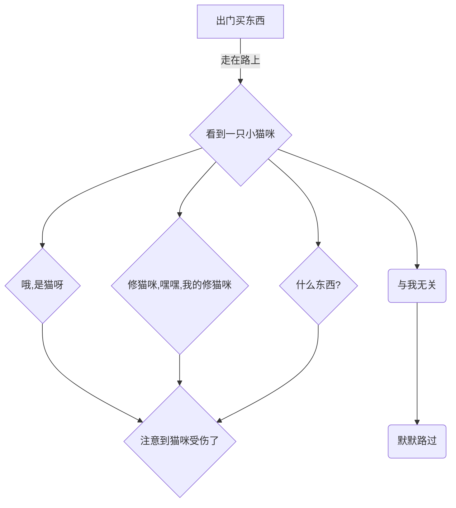

# 序章

中文 | [English](https://doc.tmoe.me/en/prologue.html)

- [声明](#声明)
- [如何阅读这本书](#如何阅读这本书)
- [使用场景](#使用场景)
  - [有意义与否](#有意义与否)
  - [android 、图书馆与 LaTex](#android-图书馆与-latex)
  - [iOS、旅馆与 manjaro+goland](#ios旅馆与-manjarogoland)
  - [其他场景](#其他场景)
- [题外话](#题外话)
  - [关于之前的文档](#关于之前的文档)

> 下文将用“本书”来代指“本手册”。

## 声明

对于普通用户来说，本项目自身没有任何价值。  
本书亦是如此。  
这里没有轻小说中“剑与魔法”的奇幻异世界冒险历程, 更没有《诗经》中“堕山乔岳，允犹翕河”般辽阔壮美的风景。  
有的只是无聊透顶的内容。

对于非普通用户来说，它的价值主要取决于使用场景。

> 在本章的“使用场景”中，我们将简单介绍相关内容。

若在同一场景下，存在更优的替代品，那么您不妨敞开胸怀，给本项目多提几个 issues。  
或许有一天，世界会变得更加美好呢！

<!--
我们在很久之前，就已经知道了：多肽链的盘曲、折叠方式及其形成的空间结构的千差万别，这是蛋白质多样性的原因之一。
而结构的多样性决定了功能的多样性。
类比本项目，由于本项目在架构设计上的不合理，因此对于 edition 2021，除了 android 外，开发者只建议您在容器环境中使用。
-->

除了 android 外，对于某些功能或工具，本项目的开发者若未将其打成包（例如 deb 包），并且未在本书中对其进行详细解析，那么只建议您在容器中使用。  
对于 android, 请翻阅 “容器/android”。

> old-version 的内容会被新版所替代，新版将会放在 dev 分支。  
> Trust us. 未来会更好的!

## 如何阅读这本书

在阅读本书时，您需要了解的内容。

> 本页面由 [mdbook](https://github.com/rust-lang/mdBook) 生成。

- 左上角的三条杠 "≡"
  - 点击三条杠打开目录
- 页面最下方的评论区
  - 您可以使用 github 帐号登录，您发表的内容将与 "github discussions" 保持同步。
  - 同理，如果您在 discussions 中找到当前章节的讨论页面，并在里面发表内容，那么相关内容也会同步到下方的评论区。
- 左上角的画笔 "🖌️"
  - 先点击画笔，再选择主题，最后完成切换
- 左下角的 "<" 符号
  - 点击 "<" 跳转到上一页
- 右下角的 ">" 符号
  - 点击 ">" 跳转到下一页

> 如果您的网页（屏幕）显示空间足够宽，那么"<" 和 ">" 将位于中间，而不是下方。

## 使用场景

本项目存在的意义:

- 在合适的场景下，您使用本项目去做一些有趣或有意义的事情。

对您来说有意义的事情，对本项目而言，亦是如此。

You can do something interesting or meaningful.

### 有意义与否

有意义与否并非如 `bool` 变量那般非 `true` 即 `false`。  
它是相对的，而非绝对。  
在这里我们并不想深入去探求哲学问题，简而言之，这个问题的答案因人而异，没有绝对的标准。

> 问题：什么是意义不大的事情呢？

假设存在以下两个场景：

- 1.您在 arm64 设备上模拟 x64 环境，然后在上面打！游！戏！
- 2.您在 arm64 设备上远程连接到 x64 windows 设备，然后运行 windows x64 平台的游戏。

前者花了一小时，而后者花了五分钟。

---

> 主观回答 1：
> 前者可能是有趣的，但是意义相较于后者而言，可能没有那么大。  
> 时间是很宝贵的，我希望大家能把时间花在更有意义的事情上，而不是浪费时间。

---

> 主观回答 2：
> 我既没有电脑，也租不起 x64 虚拟专用服务器，更玩不起云游戏，在手机上体验 windows 游戏让我感受到了快乐，我认为这是值得的，并且是有意义的。

---

在下文中，我们将会假设几个场景，您可以对其进行评价，判断其是否有意义。

### android 、图书馆与 LaTex

- 地点：图书馆
- 设备：android 手机/平板 (无 root)
- 条件：无网络，或网络状态不佳 (网速很慢)


- 描述：您在图书馆里，带着 android 手机/平板，在离线环境下，运行 gnome + LaTex 环境（texlive-full） + LaTex 编辑器，在上面用 LaTex 编辑器写文章/排版。

### iOS、旅馆与 manjaro+goland

- 地点：旅馆、酒店、餐厅、银行或电信营业厅（等网络良好的场所）
- 设备：iPhone/iPad (或其他带有浏览器的设备)
- 条件：网络环境优秀（至少要良好）
- 描述：您出门在外，只带了 ios 设备。可是您做梦都想要用 `idea`, `clion` 和 `goland`。  
  github 的 codespace (在线版 vscode) 可以运行不同的环境，于是您将 tmoe 的 gui 容器直接作为 codespace 的 devcontainer。
  在上面跑 gui (xfce), 再跑 goland。

> 在 vscode 上跑 jetbrains goland, 这何尝不是一种 PV 呢？关于 PV 的说明，详见本章的“题外话”。

- 教程：
  - 说明：
    - 截至 2022-06-15, github 官方并没有提供基于 manjaro 的 xfce 环境（容器镜像）。
    - 尽管 github 的 codespace （vscode）插件自带了生成配置的功能，但是之后本项目开发者可能会写个类似功能的小工具。从而让大家更省心一点。
  - 准备：
    - 您拥有一个支持 codespace 的 github 账号
    - 若显示区域不够宽，则您可能需要将浏览器（如 safari）切换为桌面版网站（视图）
  - 开始：
    - 成功连接到 codespace 后，打开 vscode 内置终端，并在项目目录下执行以下操作

```json
mkdir -p .devcontainer
cd .devcontainer
cat >devcontainer.json<<-'EOFJSON'
// For format details, see https://aka.ms/devcontainer.json.
{
    "name": "Manjaro",
    "dockerFile": "Dockerfile",
    "runArgs": [
        "--cap-add=SYS_PTRACE",
        "--security-opt",
        "seccomp=unconfined"
    ],
    // "mounts": [
    //     "source=dind-var-lib-docker,target=/var/lib/docker,type=volume"
    // ],
    "mounts": [
        "source=/var/run/docker.sock,target=/var/run/docker.sock,type=bind"
    ],
    "overrideCommand": false,
    // Configure tool-specific properties.
    "customizations": {
        // Configure properties specific to VS Code.
        "vscode": {
            // Add the IDs of extensions you want installed when the container is created.
            "extensions": [
                // "MS-CEINTL.vscode-language-pack-zh-hans",
                "ms-azuretools.vscode-docker"
            ]
        }
    },
    // Use 'forwardPorts' to make a list of ports inside the container available locally.
    "forwardPorts": [
        5902
    ],
    // Use 'postCreateCommand' to run commands after the container is created.
    // "postCreateCommand": "docker --version",
    // Comment out to connect as root instead. More info: https://aka.ms/vscode-remote/containers/non-root.
    // "build": {
    //     "args": {
    //         "ENABLE_NONROOT_DOCKER": "false"
    //     }
    // },
    "remoteUser": "ddk"
}
EOFJSON

cat > Dockerfile<<-'EOFDKF'
# syntax=docker/dockerfile:1
#---------------------------
# FROM cake233/manjaro-zsh-amd64

FROM cake233/manjaro-xfce-amd64

# set username & group
ARG USERNAME=ddk
ARG GROUPNAME=ddk
# ARG USER_UID=1001
# ARG USER_GID=$USER_UID

# rm cn mirrorlist
RUN sed -e '/bfsu.edu.cn/d' \
    -e '/tuna.tsinghua.edu.cn/d' \
    -e '/opentuna.cn/d' \
    -i /etc/pacman.conf

# install dependencies
# live server: https://docs.microsoft.com/en-us/visualstudio/liveshare/reference/linux#install-linux-prerequisites
RUN pacman -Syu \
    --noconfirm \
    --needed \
    base \
    base-devel \
    git \
    lib32-gcc-libs \
    lib32-glibc \
    gcr \
    liburcu \
    openssl-1.0 \
    krb5 \
    icu \
    zlib \
    gnome-keyring \
    libsecret \
    desktop-file-utils \
    xorg-xprop \
    xdg-utils

# locale: Chinese Simplified (China)
ENV LANG=zh_CN.UTF-8

# add new user
RUN groupadd --force ${GROUPNAME} \
    && useradd --create-home --gid ${GROUPNAME} ${USERNAME} \
    && mkdir -p /etc/sudoers.d \
    && echo "${USERNAME} ALL=(ALL) NOPASSWD:ALL" > /etc/sudoers.d/ddk \
    && chmod 400 /etc/sudoers.d/ddk

WORKDIR ["/home/$USERNAME"]

# clean cache
RUN yes | pacman -Scc; \
    rm -rf /var/cache/pacman/pkg/* \
    /tmp/* \
    2>/dev/null

# command: sleep infinity
CMD [ "sleep", "inf" ]
EOFDKF
```

rebuild：

- 1.按下 F1 或 Ctrl+Shift+P 或 cmd+shift+p
- 2.搜索 rebuild
- 3.选择 Codespaces: Rebuild container

> 您也可以手动选择“远程资源管理器”，再选择 Codespace, 最后点击 rebuild container 的 图标。

上面已经做了 docker in docker 的配置。  
如果需要在里面跑 docker 的话，那就执行以下操作：

- 安装 docker： `sudo pacman -Syu docker`
- 将 ddk 用户加入到 docker 用户组： `sudo usermod -aG docker ddk`

> `ddk` 可以修改为其他用户名。
> 关于上述命名的来源，详见“题外话”

关于 vnc

进入了 codespace 环境后，在内置终端里执行以下操作

- 运行 `tmoe`
- 先选择语言环境，再选择 tools
- 接着选 software， 然后选 dev
- 安装 goland, clion 或其他 IDEs
- 退出 tools

由于此容器镜像已经预装了 xfce, 因此您无需重复安装。

对于网页连接的 codespace:

- 运行 `novnc`，设置密码
- 打开端口转发处的 `36080` 对应的 local address

对于本地 vscode 连接的 codespace：

- 运行 `startvnc`
- 打开 vnc 客户端，输入本地 vnc 地址(默认是 127.0.0.1:5902)。

### 其他场景

序章中描述的内容是有限的，更多内容分布于本书的其他章节。  
对于其他场景，例如：您想要使用 github actions 来编译不同架构的软件，那么可以去看看 “容器/docker”。

## 题外话

注意：  
题外话对您来说，可能是**没有意义**的，甚至有可能会引起您的**反感**。  
开发者建议您打开目录，并跳转至其他章节。

---

Q: 为什么是 `ddk`

A: 有个叫 `ddk` 的用户，给本项目提了个与 `codespace` 相关的 issue, 于是他就“青史留名”了。  
(￣ ▽ ￣)
其实非本项目相关的 Issue 发在 discussions 里会更好。

Q: 什么是 `PV`

A: 这是理想气体状态方程。
`PV=nTR`

- 解析：
  - P: 压强
  - V: 气体体积
  - n: 物质的量
  - T: 热力学温度
  - R: 气体常数

您可能不知道的冷知识：
2moe 之前在某个漫画网站上，看到过一本漫画，它的标题是 <font style="background: black">~~《wo yb ww bw qm bw PV le, so yi ye yc PV qm bw de nv pg yz》~~</font>  

 哎呀，这孩子物理应该学得还不错吧！

> 这只是标题吸引人而已，好孩子不要去看。

### 关于之前的文档

之前的文档使用了下面这种风格来描述。  
现在正在逐步“改进”。

<div style="display:none">

</div>



上述流程图换成短篇漫画可能会更好。  
开发者只是希望用户不要冷眼旁观，有问题要及时反馈。

咱是知道有人在骂的，可是他并没有反馈。  
就像是这篇文档，写得不好也可以改呀！
