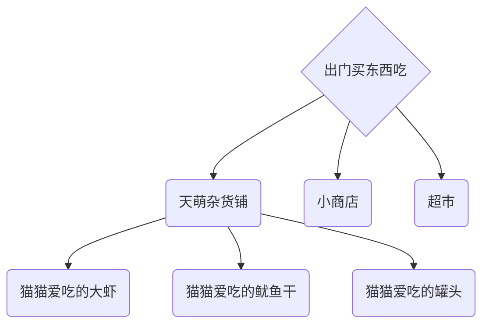

# 软件的分发

## 获取软件包的途径

获取软件包的最佳途径是什么？

对于某些人来说，可能是手动编译。  
因为他们需要高度的可自定义化。

> “二萌”见过有些人用编译安装只是为了那所谓的虚荣心。  
> 其实这对它来说可能不是最好的。

在没有高性能服务器或 pc 的情况下，对普通用户来说，“二萌” 认为使用各个发行版的支持“二进制分发”的包管理器是最佳方案。  
对于一些服务类软件，或者是特殊软件，“容器/沙盒化方案”也能在舞台上一展风采。

## 软件仓库

 -->

“天萌” 从 edition 2022 开始提供软件仓库。  
之后“天萌”的开发者可能会将 edition 2021 也迁移到仓库内。

在本篇中，我们 ~~将介绍如何来到天萌的杂货铺，以及小铺里有什么好吃的小零食。😋~~  
 将介绍如何安装天萌的仓库，并介绍一些包，以及它对应的功能。
